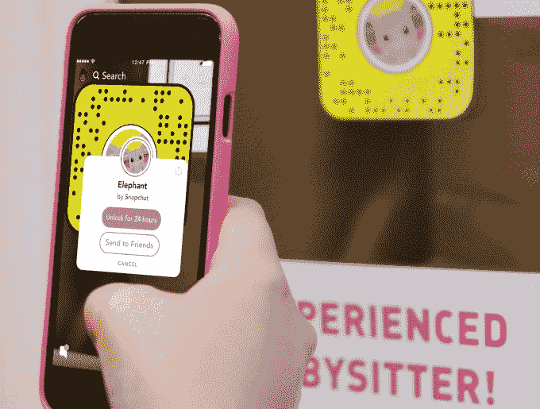
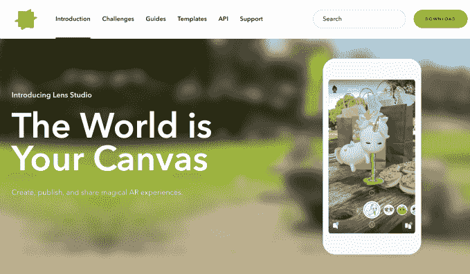
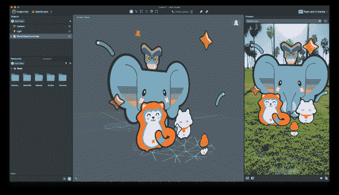
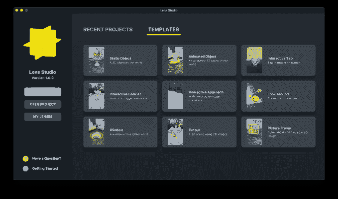

# Snapchat 推出增强现实开发者平台 Lens Studio 

> 原文：<https://web.archive.org/web/https://techcrunch.com/2017/12/14/snapchat-developer-platform/>

Snapchat 终于开放了，因此外部开发人员可以帮助它提供内部设计之外的无限增强现实体验。今天， [Snap 发布了](https://web.archive.org/web/20221210032605/https://www.snap.com/en-US/news/post/introducing-lens-studio/)Lens Studio AR[桌面开发工具](https://web.archive.org/web/20221210032605/https://lensstudio.snapchat.com/)，这样任何人都可以创建世界镜头，在你的照片和视频中放置互动的、想象的 3D 对象。

但品牌、新闻出版商和开发商将不得不通过营销他们的二维码来推广自己的镜头，用户扫描二维码可以在 24 小时内解锁 AR 效果。这是因为 Snapchat 不会在其相机中显示这些社区镜头，除非企业向合作创意机构支付费用，为它们制作特殊效果，然后从 Snap 购买赞助镜头广告。

此次发布可能会极大地拓宽 Snapchat 的 AR 娱乐价值，有助于其与[脸书自己的相机效果 AR 平台竞争，该平台于本周早些时候向所有开发者推出](https://web.archive.org/web/20221210032605/https://beta.techcrunch.com/2017/12/12/facebook-world-effects/)。虽然目前该平台只允许你制作世界镜头，而不是自拍面具，但在面临 Instagram 的竞争，用户增长放缓至涓涓细流的时候，更多的 AR 玩具将为 Snapchat 提供急需的分享和观看动力。

Snap 的 1.78 亿日常用户中有三分之一每天平均玩镜头 3 分钟，这加起来就是每天用 AR 玩 500 年。这还只是 Snap 自己制作的 3000 个镜头。随着平台的开放， Snap 的工程副总裁兼相机平台负责人 Eitan Pilipski 告诉我，“每天回来都会发现有一种新的体验，这是一种神奇的感觉。”

通过代理合作伙伴关系消除其内部 AR 设计团队的瓶颈，Snap 可以扩大增强现实广告的规模，这样它就不会再次错过季度收入目标。

这次发射是明智之举。早在 4 月份，我就写道“ [Snap 的反开发者态度是一个增加的责任，”](https://web.archive.org/web/20221210032605/https://beta.techcrunch.com/2017/04/19/no-snapplat/)讨论如何用 AR 填充现实世界对 Snap 来说是一个太艰巨的任务，无法独自解决。它需要一大批外部开发人员来协助它，现在它正在招募这支队伍。问题是，开发者是否认为 Snapchat 的受众规模是验证投资该平台的时间所必需的，以及 Snap 是否为这些受众提供了足够的免费访问。因为要推动增长，Snapchat 需要的不仅仅是黏糊糊的营销人员在虚拟世界上打品牌的 AR 头脑。

## 与 Lens Studio 一起创建、测试和共享

从今天开始，任何人都可以[下载英文版的 Lens Studio 桌面应用(Mac 或 Windows 】,并访问其网站获取示例和文档。Lens Studio 是 Snap 自己的团队用来构建 AR 体验的稍微精简的版本。它的设计非常简单，所以从 2D Photoshop 新手到经验丰富的 3D 动画师和编码员，任何人都可以直接制作基本的图像叠加或反应式 AR 角色。开发者](https://web.archive.org/web/20221210032605/https://lensstudio.snapchat.com/download)[保留他们创造的镜头的所有权](https://web.archive.org/web/20221210032605/https://lens-studio-web.appspot.com/support/)，尽管授予 Snapchat 使用它们的权利。

开发人员可以构建静态或动态对象、2D 剪纸、进入其他世界的窗口、浮动相框，甚至是当你点击、查看或接近它们时会做出反应的 3D 对象。开发者可以获得一个临时的 Snapcode 来测试他们在手机上的创作。在经历了一个快速审核过程以确保镜头不会引起异议后，开发者会获得一个有效期为一年的 Snapcode，他们可以通过社交媒体、网站、印刷材料或任何他们想发布的方式分享它。

Snapchat 的版主将强制规定，镜头不能描绘暴力、武器、裸体、性行为、亵渎、仇恨、刻板印象、非法活动、标签、用户名、威胁、欺凌或鼓励驾驶时抓拍。Snapchat 告诉我，它将为需要将镜头标记为有问题的用户提供一个报告按钮，一个人类审核团队将监控报告并停用有问题的镜头。然而，它必须保持警惕，因为如果孩子们开始玩一些图形的东西，AR 的生动性可能会导致一场大的公关丑闻。

Snapchat 还计划提供 Lens Studio Challenges，为开发人员创造符合提议主题或用例的镜头提供不明奖励。他们可能只是在新的 Lens Studio 网站上获得认可，但如果 Snapchat 聪明的话，它实际上会在其应用程序中发布获奖者，以提高开发者对该平台的兴趣。

## 扫描、解锁和增强镜头快照代码

虽然用户仍然可以在 Snapchat 相机中找到精选的各种镜头，但他们现在可以在其他地方发现社区镜头。通过在他们的相机中点击并按住镜头快照或上传截图，他们将获得镜头功能的缩略图预览和解锁选项。然后，他们会在摄像机中 24 小时看到旋转木马上的镜头。点击一个小小的“我”信息按钮，就会显示出是谁制造了这个镜头，用户可以通过私人聊天向朋友发送一个，这样镜头就可以像病毒一样传播开来。

[https://web.archive.org/web/20221210032605if_/https://www.youtube.com/embed/nggwIdAVxO4?feature=oembed](https://web.archive.org/web/20221210032605if_/https://www.youtube.com/embed/nggwIdAVxO4?feature=oembed)

视频

24 小时的限制可能会很烦人，因为用户可能不想每天重新扫描代码。另一方面，它可以阻止特定镜头的过度使用，防止创作者的朋友和观众筋疲力尽。皮利普斯基说，Snapchat 将听取社区的意见来改进体验。但是有一个好处是，开发人员可以更新代码以提供不同的视角，这样他们就可以随着时间的推移逐步发展它，或者提供不同的体验，而不必推广不同的代码。

总的来说，最初的 AR 体验看起来很可爱，符合 Snapchat 的傻乎乎的风格。我们将会看到被观看了 15 亿次的跳舞热狗是否因为 AR 的新奇而一鸣惊人，或者用户是否会持久地想要玩 3D 角色。

## 与镜头工作室合作伙伴一起付费、制作和发布广告

Snapchat 已经与七家镜头工作室公司合作，外包其 AR 体验的创作。Avatar Labs、Fisherman Labs、Haus、Media Monks、North Kingdom、Trigger Global 和 Vidmob 可以在短短几天内制作一个镜头，而不是像 Snapchat 的内部团队那样需要几周时间，后者还需要至少 30 万美元的广告支出。现在，品牌可以在相机应用的传送带上以 8 到 20 美元的 CPM 价格购买 Snapchat 镜头的 CPM 分销。

Snapchat 的内部设计团队仍将与广告商合作，但将专注于使用超越 Lens Studio 能力的最前沿技术选项的超级优质广告活动。

Snapchat 自成立以来一直是一家封闭的公司，依靠的是 CEO 埃文·斯皮格尔的直觉和管理。但在这里，Snapchat 正在改变策略，拥抱它无法完全控制的东西。这种不可预测性可能是保持应用程序新鲜的关键。尽管 Snapchat 在洛杉矶威尼斯海滩的办公室是酷的仲裁者，但它无法预见每一种怪异的青少年潮流或玩具，更不用说自己制造了。

通过开放平台，Snap 可以让社区为它做试错。Snapchat 应该学习哪些社区镜头被证明是受欢迎的，并建立更多类似的镜头，但也应该推广那些热门的镜头，而不是强迫开发者自己增加观众。正是潜在病毒式传播的承诺，让脸书在 10 年前成为了一个平台强国，催生了 Zynga 这样的巨头。现在 Snapchat 的前进道路取决于它是否愿意分享用户和娱乐用户的功劳。