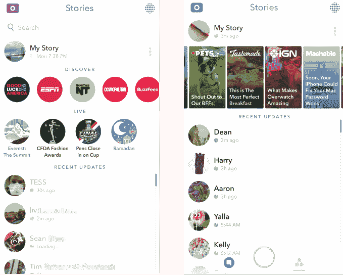
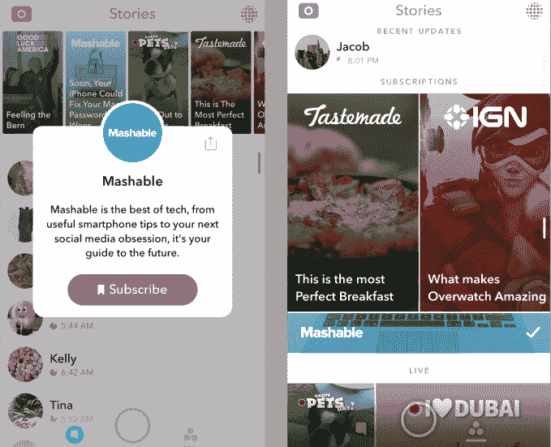
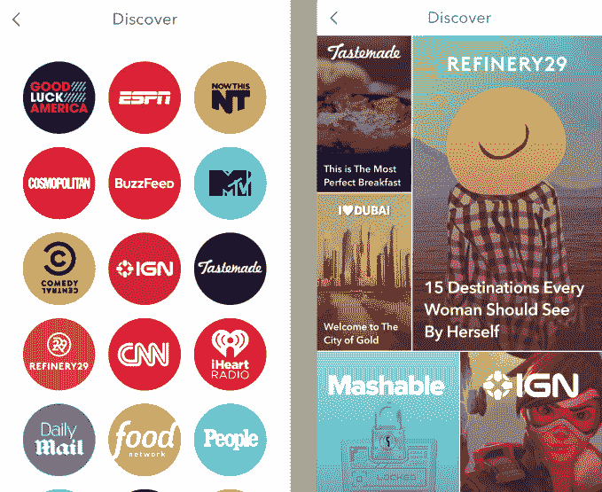

# Snapchat 发现发现 

> 原文：<https://web.archive.org/web/https://techcrunch.com/2016/06/07/snapchat-discover-previews/>

Snapchat 结合了社交网络、杂志和电视的精华，重新设计了它的全娱乐应用。

现在，您将在“发现频道”和“故事”页面上看到内容的图像和标题预览，而不仅仅是他们捕捉的出版商或事件的徽标。Discover 页面现在具有 Pinterest 风格的 mason 平铺网格，而 Stories 页面现在将两行静态 Discover 频道和实时故事合并为一行非好友内容。

Snapchat 的 Stories 页面，左边是旧版本，右边是新版本

此外，你不必从整个列表中找出你最喜欢的探索频道，现在你可以点击并按住来订阅它们，这样它们就总是出现在你添加的帐户的最近故事中，除非你后来取消订阅。这给了像 Tastemade 和 IGN 这样的出版商一个额外的行动号召，以进入他们的发现渠道和营销。

我们的目标是让专业制作和社区策划的内容像朋友在应用程序上分享的内容一样有吸引力。以前，探索频道感觉被捆绑在体验上，与《老友记》中尽管有缺陷但仍引人入胜的故事相比，可能显得过于精致。之前，VentureBeat 和 [Recode](https://web.archive.org/web/20221025223256/http://www.recode.net/2016/2/12/11587814/snapchat-wants-to-let-users-subscribe-to-their-favorite-discover) 报道称，Discover 页面即将发生变化。

点击并按住探索频道，你就可以订阅，这样你就可以在你的故事页面上看到它

Discover 的重新设计应该会让建立频道对出版商来说更有利可图。没有任何动态预览，频道按钮每天看起来都一样，没有什么吸引力。这可能会减少这些频道的潜在观众，这些频道让品牌花费了大量成本来制作和租赁 Snapchat 的空间。

但是，通过引人注目地查看内容，用户可能更愿意点击并观看 Discover 频道中的视频、文本文章、图像和广告的组合。

Snapchat 的发现页面，左边是旧版本，右边是新版本

由于 Snapchat 将 Discover 频道内部的广告收入与出版商分成，因此它可以通过提高观众数量来赚钱。但如果不小心，它可能会通过自上而下的发现频道淹没用户生成的内容，使应用程序感觉更像一个广告牌，而不是一个社区。