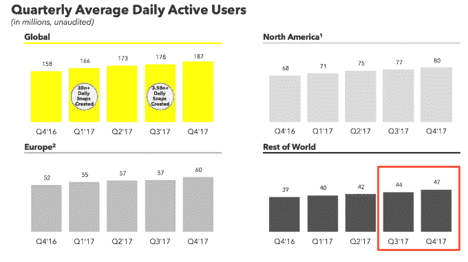
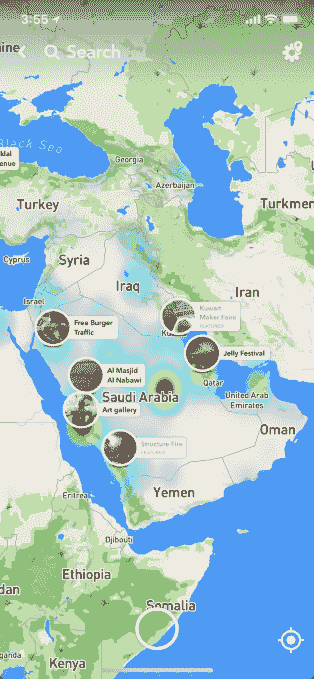
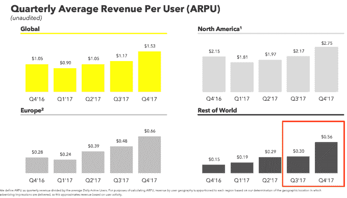

# 被忽视多年后，Snapchat 在发展中国家胜出 

> 原文：<https://web.archive.org/web/https://techcrunch.com/2018/02/06/snapchat-international/>

本季度，Snapchat 的全球其他地区收入翻了一番。这令人惊讶，因为除了美国青少年，首席执行官埃文·斯皮格尔似乎从不关心任何人。Snapchat 的安卓应用漏洞百出。它的视频在弱连接下加载太慢。Spiegel 甚至承认“从历史上看，我们确实把精力集中在有(高端手机和宽带移动网络)的市场上。”

这为 Instagram Stories 和 WhatsApp Status 在 Snap 到来之前窃取国际市场敞开了大门。2016 年第四季度，Snapchat 在世界其他地区的总用户数保持在 3900 万，令人担忧。

但是斯皮格尔今年改变了他的论调，推出了一套大规模的战略人字拖[。三个月前，他承认“为了进一步扩大我们的用户群，我们需要加快我们的产品在 Android 用户中的采用。。。和世界其他市场的用户。”这种认识认为，不仅仅是像他这样的加州酷孩子很重要，这似乎有助于 Snapchat 的第二次到来。](https://web.archive.org/web/20221221130320/https://techcrunch.com/2017/11/13/time-to-snap-into-action/)

今天， [Snap Inc .记录了一个惊人的季度](https://web.archive.org/web/20221221130320/https://techcrunch.com/2018/02/06/snap-inc-earnings-q4-2017/)，其增长率从 2.9%恢复到 5%，日用户达到 1.87 亿。收入超出预期，亏损减少。作为回应，股价飙升了 21%。

不过，再深究一下，就清楚 Snapchat 的新生力量来自哪里了。发展中国家。

世界其他地区的每日用户增加了 300 万，达到 4700 万，与欧洲和北美市场一样多，尽管它们的规模更大。这比自 Q1 2016 年泡沫增长以来的任何一个季度增加的用户都多。

中东是 Snap Inc .本季度收入的主要来源

它是如何在南美和亚洲的国家增加这么多人口的？首先，Snapchat 开始认真改善其 Android 应用的性能。在 IPO 申请文件中，Snap 写道“虽然我们的产品可以在 Android 移动设备上运行，但我们已经优先开发了可以在 iOS 上运行的产品。”但是工程技术的进步使得 Android 用户保持率增加了 20 %,因为更少的 bug 让用户继续使用。Spiegel 表示，Snapchat 现在的崩溃率是有史以来最低的。

与此同时，Snapchat 与十几个市场的无线运营商建立了合作关系，以降低 Snapchat 积累的所有数据的成本。“这很重要，因为 Snapchat 在世界上使用比在家里使用 Wi-Fi 更有趣，”Spiegel 说。尽管这些“零评级”交易因为网络中立的原因可能会引起争议，但它们可以让招募用户变得容易得多。工程上的改进也使得视频快照和广告更容易传输。

发展中国家所有这些额外的使用都伴随着更强的货币化。发展中国家每个用户的平均收入几乎翻了一番，从 0.30 美元增加到 0.56 美元，该地区的总收入每季度翻了一番，从 1300 万美元增加到 2600 万美元。与去年同期相比，Snap 在全球其他地区的收入增长了惊人的 333%。

这部分是因为 Snapchat 现在 90%的广告是通过程序化广告 API 和自助广告管理器界面购买的，而不是通过销售人员，而一年前只有 10%。这消除了语言障碍。

首席运营官·伊姆兰·汗解释说，“我们的自助服务工具也使我们能够在国际市场上快速扩展。例如，在中东，我们做出了战略决策，完全依赖我们的自助式广告工具。。。在我们所有的国际办事处中，这个地区是我们第四季度总收入增长的最大贡献者。”毕竟，代码是通用语言。

我们看到的是 Snapchat International。虽然美国青少年的赚钱能力可能仍比海外青少年强，但他们分散在世界各地的数量要比国内多得多。事实证明，世界各地的孩子都想在没有永久记录的情况下聊天和分享。他们并不反对 Snapchat。他们只是想让它正常工作。

Snap 度过了美好的一天，这一切都归功于它的明天。