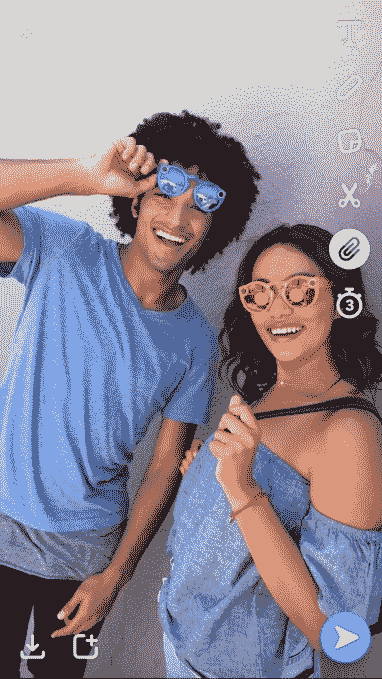

# Snapchat 允许您向快照添加链接、语音过滤器和背景

> 原文：<https://web.archive.org/web/https://techcrunch.com/2017/07/05/snapchat-links-backdrops-voice-filters/>

# Snapchat 允许你在快照上添加链接、语音过滤器和背景

Snapchat 正在打破其长期以来的“无链接”规则，同时还提供了一些新颖的新创意工具，以保持其领先 Instagram 一步。Snap Inc .告诉 TechCrunch，由于今天的更新，这些新功能正在全球范围内推出。

这里有一个关于这些创造性工具如何工作的演示，以及如何使用它们的描述。

*   **回形针**可以让你将网站附加到快照上，朋友可以在 Snapchat 的内部浏览器中滑动打开。以前只有广告活动和发现内容可以包含链接。只需点击垂直工具包中的回形针按钮，并输入您的链接。这可以让你在 Snap 上分享一个事件链接或有趣的模因，但也使一些快照乍一看不完整，需要额外的时间来理解。Snapchat 告诉 TechCrunch，所有共享链接都必须遵守其服务条款、社区指南和隐私政策。Snap 将使用自己的自动信任和安全工具，以及来自[谷歌安全浏览](https://web.archive.org/web/20230326024529/https://support.snapchat.com/en-US/a/safe-browsing)服务的信息，警告用户潜在的网络钓鱼欺诈、恶意软件或其他危险网站。为了帮助用户避免打开令人反感的链接，向上滑动箭头旁边会显示一个预览，Snap 鼓励用户报告不适当的内容。

*   **背景**让你从你的快照中剪下一个物体，并在它后面放上一个彩色或艺术图案，使它突出来。首先点击垂直工具包中的剪刀，然后点击背景图标。围绕物体，选择一个每天旋转的背景设计，你就可以让你的快照的某个部分成为焦点。在物体和真实背景之间插入图像层的能力给了人们一种创造性的方法来增强他们身后的世界，而不仅仅是他们的脸。
*   **声音过滤器**可以让你重新混合照片中的声音。以前，声音过滤器只是视觉增强现实镜头的一部分，就像一个让你看起来和听起来像大黄蜂的镜头。现在，你可以点击屏幕底部的扬声器图标，从一系列人物声音中进行选择，为你的照片增添一些额外的幽默或风格。其中一些声音过滤器可能会令人讨厌，但它们将为讲故事开辟新的机会。

现在的问题是 Instagram 还要多久才能复制这些。 [Instagram 已经允许验证过的个人资料附加故事链接](https://web.archive.org/web/20230326024529/https://techcrunch.com/2016/11/10/instagram-will-now-let-creators-add-url-links-tag-friends-and-create-boomerangs-in-stories/)，但不是所有人。Snap 将不得不希望链接不会通过诱惑人们刷出故事并进入内部网络浏览器来破坏无缝观看体验。我们最不需要的就是另一个分享新闻文章的地方。