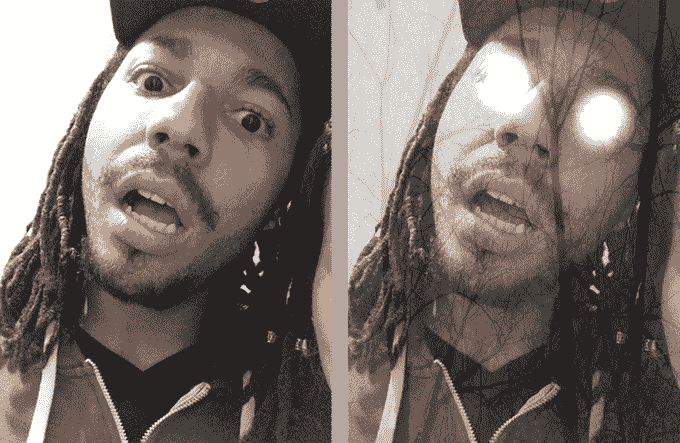
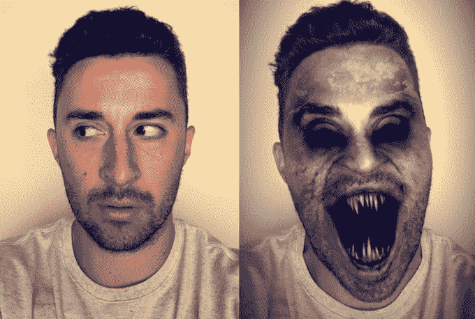
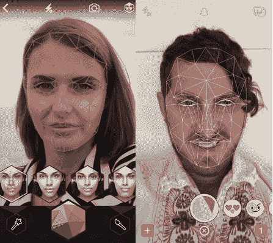
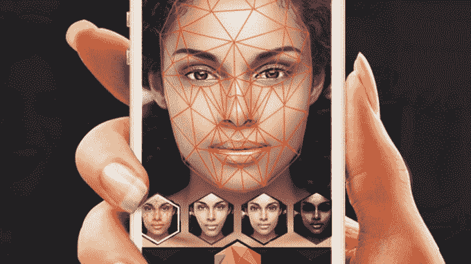

# Snapchat 收购 Looksery 为其动画镜头提供动力

> 原文：<https://web.archive.org/web/https://techcrunch.com/2015/09/15/snapchat-looksery/>

Snapchat 的新动画自拍镜头来自一项新的收购: [Looksery](https://web.archive.org/web/20230404053300/http://looksery.com/) 。

事情发生了一个可疑的转变，自拍动画应用 Looksery [今天早上从应用商店消失](https://web.archive.org/web/20230404053300/https://itunes.apple.com/us/app/looksery-fine-tune-your-video/id904962326?mt=8)，就在 [Snapchat 推出 Lenses](https://web.archive.org/web/20230404053300/https://techcrunch.com/2015/09/15/snapchat-starts-charging-0-99-for-3-replays-adds-face-effect-lenses/) 的时候。Meme 艺术家 [Ronen V](https://web.archive.org/web/20230404053300/http://ronenv.com/) 告诉我，镜片看起来与 Looksery 的技术相同。在我询问后，Snapchat 向我证实，它实际上已经收购了 Looksery，Looksery 团队也加入了 Snapchat 的。

一家乌克兰新闻媒体 [Ain.ua](https://web.archive.org/web/20230404053300/http://ain.ua/2015/09/15/603453) 没有得到官方证实，但报道称 Snapchat 为 Looksery 支付了 1.5 亿美元。TechCrunch 无法独立证实这一点。当我询问时，Snapchat 拒绝就收购价格或 Ain.ua 的数字是否准确发表评论。

Looksery 的恐怖镜头

Snapchat 的恐怖镜头…看起来和 Looksery 的一模一样

Looksery 成立于 2013 年，随后在 Kickstarter 上为其[面部修饰应用筹集资金。成功众筹后，](https://web.archive.org/web/20230404053300/https://techcrunch.com/2014/06/04/looksery-launches-on-kickstarter-with-an-app-that-makes-you-look-better-or-just-funnier-on-video-chat/) [Looksery 于 2014 年 10 月推出](https://web.archive.org/web/20230404053300/https://techcrunch.com/2014/10/24/looksery-launches-a-video-chatting-app-that-makes-you-look-more-attractive/)。

这款应用可以让你通过一种特殊的面部滤镜与人视频聊天，这种滤镜可以让你看起来像一只熊猫、暴躁的猫或怪物，或者也可以修剪你自己的脸以消除瑕疵，平滑你的肤色，看起来更瘦，或者改变你眼睛的颜色。虽然有其他改善自拍的应用程序，如 [FaceTune](https://web.archive.org/web/20230404053300/http://www.facetuneapp.com/) 和 [Perfect365](https://web.archive.org/web/20230404053300/https://itunes.apple.com/us/app/perfect365-one-tap-makeover/id475976577?mt=8) ，但它们只处理照片，不像 Looksery 那样处理实时视频。

左边是 Looksery 的面部识别，右边是 Snapchat 看似相同的面部识别

问题是，虽然 Looksery 拥有强大的技术，但鉴于市场竞争激烈，推广新的视频聊天网络极其困难。看起来，Looksery 认为最好是给一个已经很受欢迎的聊天应用增加面部表情模块。

镜头功能使用起来非常有趣。由于 Snapchat 表示将不断更换新镜头，它应该保持新鲜，给人们一个回头检查的理由。

此次收购证明了 Snapchat 有能力挑选优秀的技术应用到它的应用中。去年它花了[5000 万美元收购二维码初创公司 Scan.me](https://web.archive.org/web/20230404053300/https://techcrunch.com/2014/12/16/snapchat-emails-not-so-ephemeral/) 。自那以后，Snapchat 使用 Scan 的技术来构建 Snapcodes，这是[个性化的个人资料二维码](https://web.archive.org/web/20230404053300/https://techcrunch.com/2015/01/28/snaptags/)，用户可以用 Snapchat 摄像头扫描，开始在应用程序中关注那个人。 [Snapcodes 从此变得非常受欢迎](https://web.archive.org/web/20230404053300/https://techcrunch.com/2015/05/04/snapcode/)，并帮助 Snapchat 在朋友群体和名人观众中发展壮大。

面对如此年轻的用户群，Snapchat 不得不不断重塑自己，以抓住人们的注意力。现在多亏了 Looksery，它让用户可以重塑自己的面孔。【更新:例如，Snapchat 刚刚添加了新的[慢动作、快进和倒带视频滤镜](https://web.archive.org/web/20230404053300/https://techcrunch.com/2015/10/28/snapchat-slow-motion/)。]

