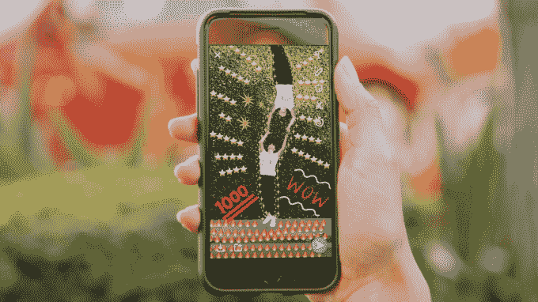
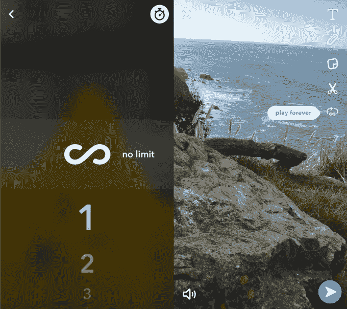

# Snapchat 的新橡皮擦可以让你用 Photoshop 处理照片

> 原文：<https://web.archive.org/web/https://techcrunch.com/2017/05/09/snapchat-magic-eraser/>

# Snapchat 的新橡皮擦可以让你用 Photoshop 处理照片

轮到 Snapchat 复制 Instagram，同时也领先竞争对手一步。今天，Snapchat 推出了一系列新的创意工具，其中几个模仿了 Instagram 的功能，包括取消 10 秒钟的时间限制，照片在关闭后仍然会消失。但是 Snapchat 允许用户从照片中删除现实世界中的物体的新选项表明，它仍然是视觉交流格式的先驱。

随着 Snap 增加了更多的创意工具，它现在将它们都组织在屏幕的右侧，以便于访问。

以下是 Snapchat 的每一项新创意功能:

**无限快照**–现在你可以选择快照定时器中的无限图标，这样朋友们就可以想看多久就看多久。不过，一旦关闭，它还是会消失。这对于通过照片分享地址等重要信息可能很有用。Instagram 已经允许无限制地浏览短暂的故事和直接信息。

**循环播放视频**–您可以点击 Snap composer 右侧的循环图标，让您的视频一遍又一遍地循环播放，这对于短视频或突出显示特定时刻非常有用。这给了 Snap 一个动画 GIF 风格的功能，与 Instagram 的回旋镖竞争。

**用表情符号**画画——你现在可以用表情符号作为画笔了。从右边的创意工具中选择一个，当你画画时，你会看到一个表情符号的轨迹，而不是笔尖的颜色。这通过一个接一个地粘贴表情符号来消除用表情符号画画的痛苦。 [Instagram 实际上早在 12 月就尝试过类似的东西](https://web.archive.org/web/20230329062723/https://techcrunch.com/2016/12/20/instagram-stickers/)，推出了 Candy Cane 假日画笔，但目前只提供更传统的马克笔、荧光笔和霓虹灯画笔。

**魔法橡皮擦**–你现在可以从你的快照中选择和移除对象，模糊它们的周围以覆盖空白区域。只需选择魔法橡皮擦图标，在你想要移除的对象上绘画，Snap 就会自动将其“Photoshop”出来。

现在的问题是 Instagram 提供自己的魔法橡皮擦和表情画笔还要多久。

TechCrunch 收集的新研究和调查显示，现有的

[Snapchat users are staying loyal](https://web.archive.org/web/20230329062723/https://techcrunch.com/2017/05/09/snapchat-survives/)

尽管推出了 Instagram Stories。但如果 Instagram 能够继续克隆 Snapchat 的最佳功能，并将其推广给国际和老年受众，它可能会阻碍 Snap 的增长前景。Snap 将需要稳定的创新流来吸引新用户，他们可能没有那么大的社交图，但可以首先提供最酷的新创意工具。