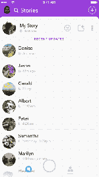
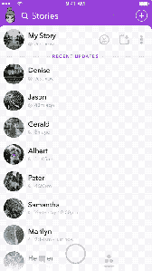

# Snapchat 现在允许您为朋友和家人创建自定义故事

> 原文：<https://web.archive.org/web/https://techcrunch.com/2017/05/23/snapchat-now-lets-you-create-custom-stories-for-groups-of-friends-and-family/>

# Snapchat 现在允许您为朋友和家人创建自定义故事

【YouTube https://www.youtube.com/watch?v=ohN8cv7nUmA&w=680&h=383]

Snapchat 增加了创建自定义故事的功能，仅限于特定的朋友，或直接联系地理围栏区域内的联系人及其朋友。这些新的自定义故事在其他方面的操作就像普通的 Snapchat 故事一样，但如果群组内没有人在 24 小时内添加任何更新，这些故事就会完全消失。

自定义故事功能非常适合特殊场合，如生日或婚礼，可以设置为一种远距离共享的方式，也可以设置为一种让实际位于同一地点的人向同一组快照池投稿的方式。用户可以创建最多三个自己的自定义故事，但可以参与不限数量的其他人创建的故事。

对于非地理围栏自定义故事，当您创建一个故事时，您会邀请您希望能够看到并为其做出贡献的特定人员。但是，如果你想让一些人能够观看，但不能贡献他们自己的照片，你也可以选择其他朋友来查看这些自定义故事。

在 geofenced story 方面，你可以选择只让指定区域内的任何朋友贡献内容，或者你可以设置它，以便朋友的朋友也可以加入，这在婚礼等场合非常有用，在婚礼上，与你一起出去的人可能不是你实际的 Snapchat 朋友群的一部分。Geofenced 故事不允许您指定仅具有查看权限的单独组，因此 geofence 中属于这些类别的任何人(取决于您选择的类别)也可以添加到故事中。

 要制作自己的自定义故事，只需进入故事页面，点击页面右上角附近的“创建故事”加号图标。若要在加入自定义故事后投稿，请在朋友列表中的“我的故事”行项目下查找。

鉴于 Snapchat 在公路旅行和特殊活动中的使用情况，这是一个非常有意义的功能，它为整体应用体验增加了另一个维度，也有助于随着 Snapchat 用户群的增长而留住人们。此外，它比克隆竞争对手领先了一步——尽管谁知道会持续多久。

定制故事今天在 iOS 上推出，应该会在一天左右的时间内面向 Android 上的 Snapchat 用户推出。