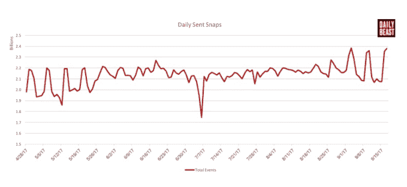

# Snapchat 的重大重新设计遭到 83%用户评论的抨击

> 原文：<https://web.archive.org/web/https://techcrunch.com/2018/01/11/snapchat-redesign-uninstall/>

令人困惑的将故事夹在私人信息之间的做法在 Snapchat 全面重新设计的第一批用户中引发了强烈反对。根据移动分析公司 [Sensor Tower](https://web.archive.org/web/20230307142248/https://sensortower.com/) 提供给 TechCrunch 的数据，在包括英国、澳大利亚和加拿大在内的少数几个重新设计广泛可用的国家，83%的应用商店评论(1941 条)对此次更新持一星或两星的负面看法。只有 17%，或者说 391 条评论，给了它 3 到 5 颗星。

负面评论中被引用最多的关键词包括“新更新”、“故事”、“请修复”。与此同时，Snapchat 的支持 Twitter 账户[一直在忙着回复那些讨厌更新](https://web.archive.org/web/20230307142248/https://twitter.com/snapchatsupport/with_replies)并要求卸载它的人，指出“不可能恢复到 Snapchat 的以前版本”，并试图向困惑的用户解释故事在哪里。

人们希望重新设计可以提振 Snapchat 低迷的收入，Snapchat 第三季度的收入低于华尔街的预期，导致亏损 4.43 亿美元。重新设计将故事混合在一起，Snapchat 在其中显示广告，但在 Instagram 故事的竞争中分享率停滞不前，而 Snapchat 的短消息收件箱更受欢迎，Snapchat 的短消息更加差异化和根深蒂固。

Snapchats 重新设计的截图

## 收件箱里零散的故事

《每日野兽》的 Taylor Lorenz 最近发布的 Snapchat 用户统计数据[显示，从 4 月下旬到 9 月中旬，](https://web.archive.org/web/20230307142248/https://www.thedailybeast.com/this-is-the-data-snapchat-doesnt-want-you-to-see) [Snapchat 发布故事的用户数量为零增长](https://web.archive.org/web/20230307142248/https://techcrunch.com/2018/01/09/the-ever-ending-story/)。相比之下，该应用的总用户群增长了约 7%，这已经被视为是一款令人失望的热门青少年社交应用。

每日发送的快照增长更快，用户平均每天发送 34 张快照，这更有希望。但是，很难在不被打断的情况下利用广告赚钱，所以 Snap 的策略似乎是将充满广告的故事混合到收件箱中。用户开始反抗。

故事分享已经停止增长…

…但是用户不断发送更多的消息，所以 Snap 开始将它们混合在一起

Snapchat 聪明地开始用算法对故事进行排序，首先显示你最喜欢的人和最亲密的朋友的故事，而不是完全按照时间顺序排列。 [TechCrunch 早在 4 月份就强烈支持这种算法排序](https://web.archive.org/web/20230307142248/https://techcrunch.com/2017/04/29/sortchat/)，因为类似的举措被证明可以更容易地从打开应用程序中快速获得价值，从而显著提高 Twitter 和 Instagram 的参与度。

但令用户感到恼火的是，关注你的朋友的故事现在分散在收件箱中，中间有信息线索，而不是全部放在一起。Snapchat 还从社交媒体明星、品牌和其他不关注你的人那里提取故事，并将其与专业发现内容一起推送到应用程序的另一边。对于喜欢偷窥的用户，或者在学校不受欢迎的用户来说，这可能很难知道谁在过去 24 小时内发布了一个故事。

Snapchat 的重新设计也阻止了用户自动前进以连续观看许多人的故事。相反，它强迫用户在下一个人的故事播放前点击预览。

虽然这可能会确保你不会观看你不关心的任何人的故事，并最终出现在他们的观看列表中，但这也使该应用程序不像 Instagram 的自动推进故事那样长时间观看。也许 Snapchat 想确保你仍在寻找，这样它就可以向广告商推销专注的概念。但这进一步激怒了用户。

Snapchat 对负面评论的回应是，“像这样大的更新可能需要一点时间来适应，但我们希望社区在他们安顿下来后会喜欢它。”

变化肯定会引发情绪反应，正如我们在 2006 年看到的用户抗议脸书新闻推送的推出……在它成为世界上最受欢迎和最常用的产品之一之前。

但对 Snapchat 重新设计的反应似乎更有道理，因为它没有增加新功能，他们只是需要时间来习惯。它混淆了现有的功能，似乎更受 Snapchat 的驱动，Snapchat 试图通过搭载消息来增加故事的使用，以此作为对脸书竞争加剧的回应。

算法故事列表？太好了。将所有专业内容创作者分组在一起？好吧。用赚钱故事的追加销售来混淆其核心用例？与善变的青少年打交道时的冒险赌注。