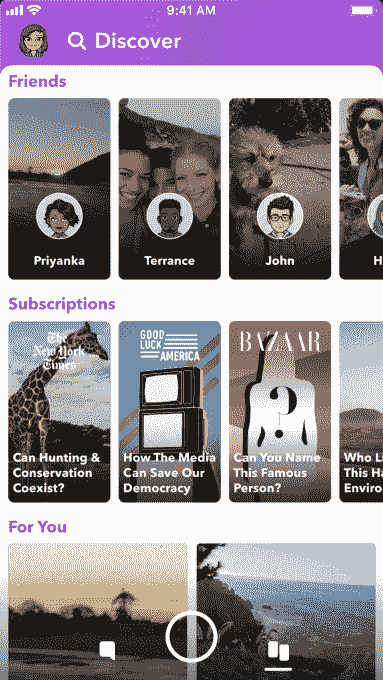

# Snapchat 紧急修复失败的重新设计，移动故事以发现 

> 原文：<https://web.archive.org/web/https://techcrunch.com/2018/05/01/snapchat-reredesign/>

# Snapchat 匆忙修复失败的重新设计，移动故事进行探索

Snapchat 的重新设计是一场灾难。它降低了广告浏览量和收入，并导致 Snapchat 的用户数量在 3 月份实际下降。这就是为什么首席执行官埃文·斯皮格尔刚刚宣布对重新设计的最糟糕的部分进行大逆转:

> 我们了解到，将观看故事和与朋友交流结合到同一个地方会使这两种竞争行为更难优化。我们目前正在推出一个更新来解决这一问题，方法是按新近度对通信进行排序，并将朋友的故事移动到应用程序的右侧，同时保持我们围绕将朋友与创建者分开以及按关系对朋友的故事进行排序所做的结构性改变。

Spiegel 表示，iOS 上的用户行为开始稳定，但 Android 上与重新设计相关的“性能退化”导致了应用程序的整体增长问题。

Snap 之前已经测试了这一变化，并尝试在应用程序左侧的朋友部分为聊天和按时间排序的故事创建单独的标签。下面你可以看到新版本的 Discover，它在顶部显示朋友故事的预览，按照你互动最多的人排序。这让人想起 Instagram Stories，它也使用了一个水平滚动的故事行。

我觉得这个设计还是一塌糊涂。它采用 Snapchat 的开创性故事产品，并将其隐藏在 Discover 的所有专业内容中。本质上，Snapchat 的重新设计理念走得太远了。最初，它将品牌和社交媒体明星从故事列表中抽出来，放在 Discover 中，因为它不想让你朋友的故事与专业人士竞争。但现在这些故事和专业内容都被塞进了一个屏幕。

Snap 需要做的是在应用程序的朋友端为相关性排序的故事和按时间顺序排序的消息创建标签，并在发现部分保留所有专业内容，但可以选择订阅您最喜欢的创作者，以将它们移到朋友的故事列表中。

斯皮格尔说，他预计随着人们习惯重新设计，用户指标会稳定下来。但是 Snapchat 没有时间耐心等待。它的亏损正在增加，WhatsApp 的地位也在爆炸性增长。脸书旗下的 Stories clone 现在拥有 4.5 亿每日用户。Snapchat 需要填充自己的骄傲和理念，深入了解用户真正想要的东西。斯皮格尔一向凭直觉行事，但这份糟糕的收益报告应该会让他消化不良。