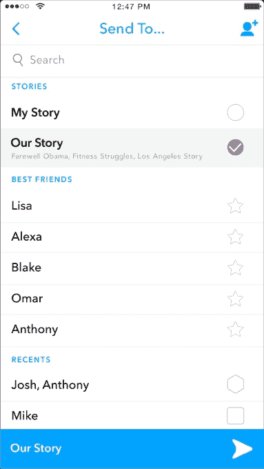

# Snapchat 推出通用搜索以简化导航 

> 原文：<https://web.archive.org/web/https://techcrunch.com/2017/01/12/snapchat-search/>

Snapchat 通过一个位于应用顶部的通用搜索栏，让导航应用、查找朋友、群组、发现出版商和我们的故事变得更加容易。搜索栏今天为 Android 上的一些人推出，很快将推广到所有 iOS 和 Android 用户，让你从 Snapchat 中挖掘出最好的内容和对话。

该公司告诉 TechCrunch，该界面旨在提高速度，所以你可以找到你正在寻找的东西，并继续拍摄。据说 Snapchat 去年收购了移动搜索初创公司 Vurb，这可能不是巧合，该公司最近神秘地关闭了。

首先也是最重要的，视觉风格和“快速聊天”建议会让你更快地跳转到某个朋友的信息主题或故事。Snapchat 被嘲笑为令人困惑，因为它独特的布局以及它最初是如何依赖用户知道如何滑动。它在 2016 年 6 月才添加了导航按钮，但现在用户将能够通过搜索四处走动。

对于希望建立 Snapchat 受众的品牌、企业和有影响力的人来说，改进的搜索可能是一个巨大的福音。此前，Snapchat 只提供了一个分散的搜索界面，用于查找特定对话、关注账户和故事或发现频道的框分散在三个不同的地方。

通用搜索也带来了新的收入机会。Snapchat 可能会让广告商为搜索结果顶部的赞助商位置付费，或者作为搜索界面中的建议。这可以让 Snapchat 直接利用品牌在其网络上建立受众的愿望来赚钱。当被问及广告是否会出现在搜索中时，该公司拒绝对未来的计划发表评论。Snap Inc .将于 2017 年进行 IPO，预计估值约为 250 亿美元，它需要证明自己有很多不同的方式可以在未来赚更多的钱。

有了新的搜索栏，你可以通过点击左边的 Bitmoji 跳转到你自己的个人资料。如果您轻按朋友的自动建议卡或搜索结果，您将开始与他们聊天，或者您可以轻按他们的故事缩略图，立即开始全屏观看。轻按并按住某人的名片会显示他们的迷你个人资料。除了帐户，您还可以通过搜索标题来找到探索频道的特定每日版本或特定的我们的故事。你现在还可以在你的个人资料中看到你经常拍照的“最好的朋友”。

[https://web.archive.org/web/20230122055031if_/https://www.youtube.com/embed/0EFGrJE6NTo?feature=oembed](https://web.archive.org/web/20230122055031if_/https://www.youtube.com/embed/0EFGrJE6NTo?feature=oembed)

视频

 Snapchat 现在也允许人们随时随地提交给我们的故事，这是该应用为假期、事件等精心策划和主题化的幻灯片。用户不必选择一个特定的“我们的故事”来提交，而只需选择 Snapchat，就可以随意使用他们的帖子。Snapchat 然后可以弄清楚它希望如何聚合内容，允许它根据提交趋势创建我们的故事。Snap Inc .告诉 TechCrunch，现在它将不再局限于只从预先选定的事件或它预计会发生特殊事情的地点来制作我们的故事。

Snapchat 长期以来一直受到批评，因为它缺乏任何建议或推荐用户列表，很难找到新的账号。它坚持“我们不会告诉你什么是酷”的理念。但至少现在人们不必拿出以前埋在地下的工具，让搜索框持续可见可能会激发人们去寻找更多可以观看的账户。

尽管如此，如果 Snapchat 想避免人们的故事列表因为同样无聊的老朋友而变得陈旧，它可能需要一种方法来突出你应该添加的好账户。它已经提供了个人资料二维码，并能够发送帐户或发现内容给朋友。但是，一种更自上而下的方法来查找与您的兴趣相关的帐户会更直接地解决问题。

虽然五个月前 Snap 的首次公开募股看起来不错，但 Snapchat Stories 克隆 Instagram Stories [出人意料的迅速成功现在构成了威胁](https://web.archive.org/web/20230122055031/https://techcrunch.com/2016/08/09/the-good-enough-strategy/)。Instagram 的版本刚刚达到[1.5 亿日活用户](https://web.archive.org/web/20230122055031/https://techcrunch.com/2017/01/11/instagram-stories-hits-150m-daily-users-launches-skippable-ads/)——与 Snapchat 宣传的数字相同——并且已经开始全屏显示类似于 Snapchat 的照片和视频后置广告。为了保持创作者和普通用户对其平台的忠诚，Snapchat 需要帮助他们不断建立自己的受众。与此同时，它必须展示出 Instagram 复制之外的潜在赚钱能力。通用搜索可以为这两个问题提供答案。