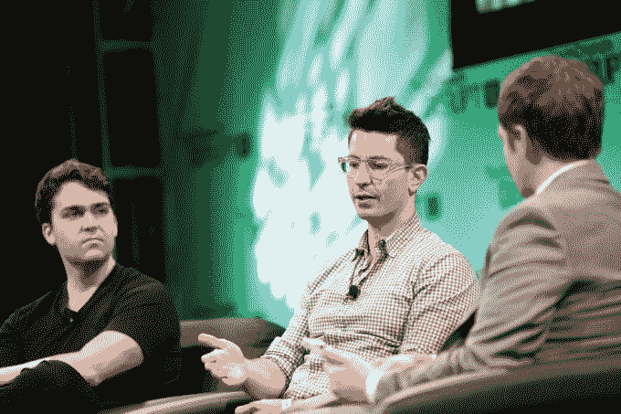
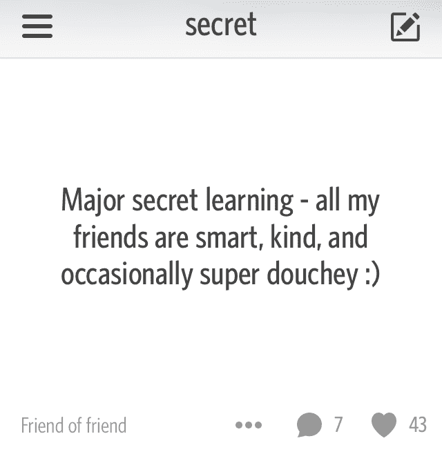
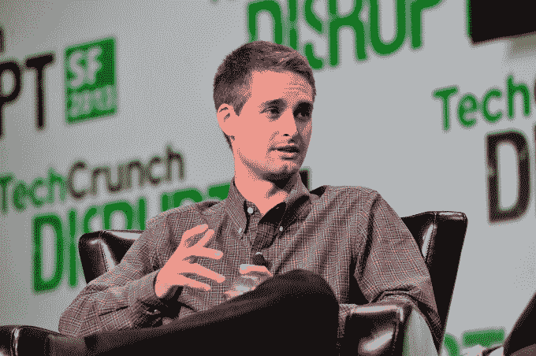
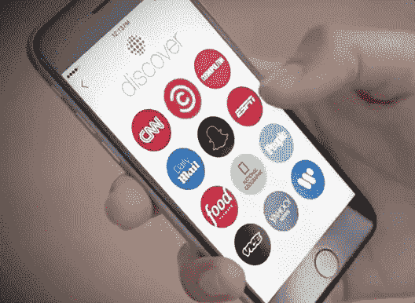

# Snapchat 几乎获得了匿名应用程序 Secret 

> 原文：<https://web.archive.org/web/https://techcrunch.com/2018/02/09/snapchat-secret/>

埃文·斯皮格尔秘密地试图把球队租走，但是价格太高了。这是根据三位知情人士向 TechCrunch 透露的消息。这些信息扩展并澄清了前 TechCrunch 作家比利·加拉格尔的新书《如何拒绝十亿美元》中的一篇报道，该书是关于 Snapchat 的起源故事，将于下周出版，名为《T2》。

TechCrunch 提前看到了这本书，其中包括 Snapchat 如何起步的重磅炸弹。[我将在 2 月 12 日晚上 7 点在旧金山的图书公司的发布会和签售会上采访加拉格尔。](https://web.archive.org/web/20230323141144/https://www.booksinc.net/event/billy-gallagher-books-inc-marina)

在 2013 年和 2014 年，Snapchat 筹集了超过 6.5 亿美元的资金，为其收购其他初创公司提供了坚实的资金来源。它最终以 3000 万美元收购了 AddLive，以支持视频通话；以 5000 万美元收购了 Scan.me，以创建其 QR 码；以 1500 万美元收购了 Vergence Labs，以开发其 Spectacles 相机眼镜。

Secret 联合创始人 David Byttow(左)和 Chrys Bader-Wechseler(中)在 TechCrunch Disrupt NY 2014 上接受采访

一笔潜在的大交易告吹，这可能对 Snap Inc .有利。2014 年末，Secret 展翅高飞。它的匿名分享应用受到了大量的炒作，因为人们用它来谈论朋友、工作和社会，而没有任何后果。这家初创公司在不到一年的时间里从零开始筹集了 3500 万美元。消息人士证实，这包括 2014 年 7 月 Index Ventures 的 2500 万美元 B 轮融资，对这家年轻公司的估值为 1.2 亿美元。

但是用户在社交网络中来去匆匆，在一次有争议的二次出售中，每个人都获得了 300 万美元，Secret 的创始人已经感到成功了。因此，在 2014 年秋天，一位消息人士称，一位共同的朋友将 Spiegel 介绍给了 Secret 首席执行官大卫·拜托。Spiegel 在旧金山湾区的办公室悄悄会见了 Secret，后来在这家规模较小的公司撤退到拉斯维加斯期间。随着 Whisper 和 Yik Yak 等应用的兴起，匿名网络看起来是一个重要的趋势，Snapchat 有兴趣从中分一杯羹。

与此同时，一名消息人士称，Secret 首席执行官大卫·拜托(David Byttow)已经“痴迷于 Snapchat 和埃文，并希望让产品更像 Snapchat。”公司的一些人开始怀疑 Byttow 对 Secret 当前方向的承诺。“他筹集资金，买了一辆法拉利，并开始试图出售公司，消息人士说，并指出 Byttow 接受收购兴趣。Secret 当时与脸书和谷歌进行了初步的 M&A 通话。

Spiegel 有兴趣收购 Byttow、Secret 联合创始人 Chrys Bader-Wechseler 和产品工程团队，成为 Snapchat 的“特别行动”团队。问题是，并不是所有的团队成员都想搬到 Snapchat 所在的洛杉矶，或者放弃这个秘密产品。

据两个消息来源称，Secret 从 Snapchat 获得了 5000 万至 6000 万美元的条款清单。Snap Inc .拒绝对此事置评。

由于出价仅为 Secret 估值的一半，其投资者想要更多。一位消息人士称，该报价“不会涵盖一切，因为 Secret 已经筹集了太多资金”。斯皮格尔不肯让步。“埃文不想为 Secret 支付超过 6000 万美元的价格，该公司的估值为 1.2 亿美元，因此交易从未达成，”加拉格尔在书中写道。 [Recode](https://web.archive.org/web/20230323141144/https://www.recode.net/2016/5/9/11594144/evan-spiegel-snapchat) 之前报道 Snap 考虑收购 Secret 的整个公司，但我们的消息来源证实，交易谈判仅针对人才，而非技术。

加利福尼亚州旧金山——9 月 9 日:Snapchat 的埃文·斯皮格尔于 2013 年 9 月 9 日在加利福尼亚州旧金山的旧金山设计中心参加 TechCrunch Disrupt SF 2013。(图片由史蒂夫·詹宁斯/Getty Images 为 TechCrunch 提供)

“这是秘密终结的开始，”一位消息人士说。当这家初创公司仍有资金时，一项公然抄袭竞争对手 Yik Yak 的大规模重新设计失败了。用户溜走了。到 2015 年 4 月，[秘密关闭了](https://web.archive.org/web/20230323141144/https://techcrunch.com/2015/04/29/psst/)，并将剩余现金返还给投资者。

不过，Snapchat 确实带来了一件事。在讨论期间，Secret 向 Spiegel 展示了他们的侧边应用 Ping 的设计，当用户点击一个圆形图标时，这个圆形会扩展到吞没屏幕，作为到下一个界面的过渡。2015 年 1 月，当 Snapchat 推出 Discover 时，点击不同的圆形出版商标志会调用一个可疑的相似动画过渡。

2 月 12 日(周一)晚上 7 点，我采访了《如何拒绝十亿美元》(How to Turn Down a 亿美元)作者比利·加拉格尔，在他的新书发布会和旧金山图书公司(San Francisco's Books Inc .)的签售会上，来听听关于 Snapchat 早期的更多信息吧。