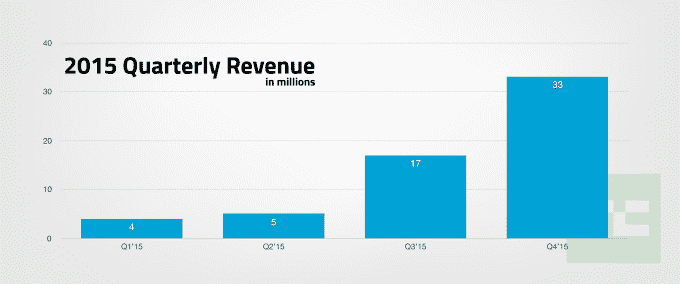
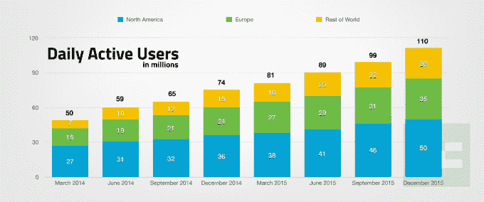

# Snapchat 在 F 轮融资中融资 18 亿美元；泄露的数据揭示了收入和用户数量

> 原文：<https://web.archive.org/web/https://techcrunch.com/2016/05/26/snapchat-series-f/>

本周早些时候，我们[报道了](https://web.archive.org/web/20230227035558/https://techcrunch.com/2016/05/23/sources-snapchat-is-raising-more-money-at-about-a-20-billion-valuation/)消息应用初创公司 Snapchat 正在筹集更多资金。现在我们有更多的更新给你。

今天，一份关于 Snapchat 最新一轮 F 轮融资信息的 [SEC 文件已经提交](https://web.archive.org/web/20230227035558/https://www.sec.gov/Archives/edgar/data/1564408/000156440816000001/xslFormDX01/primary_doc.xml)，在该轮融资中，Snapchat 融资 18 亿美元。另外，我们还获得了一份泄露的宣传资料，披露了 Snapchat 的收入和预测。

根据 deck 的数据，这家总部位于洛杉矶的公司最近开始了其货币化努力，2015 年仅带来 5900 万美元的收入。但现在，随着资金的匹配，它正认真地扩大业务。

可靠消息人士告诉 TechCrunch，在最近一轮 18 亿美元的融资中，其中 11.58 亿美元是在 1 月份以来的过去五个月中筹集的。

根据我们的消息来源，这一轮的投资者包括通用大西洋、红杉资本、T. Rowe Price、Lone Pine、Glade Brook Capital、IVP、Coatue Management 和 Fidelity 等。

表格 D 并没有揭示公司是如何被估值的，我们听到的估值对话也各不相同。消息人士告诉我们，一些投资以大约 175 亿美元的投资前估值进行。当你加上 18 亿美元时，它更接近我们本周早些时候报道的 200 亿美元左右的目标后估值。

但是——同样——我们对这个数字有矛盾的信息，它可能更低。在我们第一次发表这篇文章的几个小时后，一位消息人士联系了我们，公司的估值不到 180 亿美元，计算得出本轮的估值为 160 亿美元+18 亿美元。

尽管不常见，但也有可能一些投资者以不同的估值买入。我们听说还有一种特殊目的工具，大量投资者通过这种方式获得 Snapchat 股票。

我们被告知，该公司在滚动的基础上筹集资金，最近几个月来自许多投资者的持续融资。这轮融资似乎已经完成了几笔。

如果你还记得的话，去年有报道称 Snapchat 正处于以 160 亿美元的估值筹集 6.5 亿美元的过程中，监管机构[提交的文件](https://web.archive.org/web/20230227035558/http://www.techmeme.com/150529/p11#a150529p11)显示已经筹集了约 5.37 亿美元。事实证明，Snapchat 确实筹集到了 6.5 亿美元的剩余资金，这成为了其 f 轮融资的第一部分。今年 3 月《华尔街日报》从[发来的一篇报道指出，富达(Fidelity)(这是本轮融资的一部分)筹集的 1.75 亿美元也是 160 亿美元的估值。](https://web.archive.org/web/20230227035558/http://www.wsj.com/article_email/snapchat-raises-175-million-from-fidelity-at-flat-valuation-1457053070-lMyQjAxMTE2MjA2NDgwODQ3Wj)

特拉华州 5 月 13 日提交的文件基本上指出，如果 F 系列(包括 FP 系列)的所有授权股票都发行，根据富达在本轮早些时候支付的每股价格，估值将高达 227 亿美元，尽管这不太可能生效。

## 更多的钱，更多的增长

其他人声称 Snapchat 的估值在这一轮中持平，尽管该公司本身似乎没有这样做。(这也是我们碰巧相信消息人士告诉我们的更高估值数字的一个原因。)

一位被接洽投资的消息人士向我们提供了一份 Snapchat 演示文稿，其中披露了该公司一些此前未披露的数据。

这份可以追溯到 2015 年底的文件指出，Snapchat 在 2015 年的收入为 5900 万美元(回想一下，今年上半年没有真正的货币化努力，只是在下半年才开始)。

它还指出，该公司估计 2016 年的收入将在 2.5 亿美元至 3.5 亿美元之间，2017 年将在 5 亿美元至 10 亿美元之间。

根据数据，这些区间的高端不是内部收入数据:它们是基于该公司乐观的销售目标。你应该半信半疑地看待它们，还有另一个原因:它们是在公司开始通过广告和发现等方式增加收入之前发表的，这也是品牌的价格。

该报告还指出，截至 2015 年 12 月，Snapchat 的日活跃用户数为 1.1 亿，高于一年前的 7400 万，增长了近 50%，前几个月的增长率甚至更高。

当然，现在已经是 2016 年 5 月了，所以不清楚那些 dau 现在的立场。但在此期间，该公司推出了一系列产品，继续拓展你对自己制作并发送给朋友的图片和视频的处理能力。

像[在你的相机胶卷中用另一张脸交换你的脸](https://web.archive.org/web/20230227035558/https://techcrunch.com/2016/04/21/face-swap-camera-roll/)，[在视频中给一个移动的物体附上表情符号](https://web.archive.org/web/20230227035558/https://techcrunch.com/2016/04/13/how-to-use-snapchat-3d-stickers/)，或者[用一系列新功能升级它的整个聊天体验](https://web.archive.org/web/20230227035558/https://techcrunch.com/2016/03/29/snapphone/)无论你想以什么方式交流，这不仅表明该公司愿意尝试各种疯狂的事情来看看什么是热门，而且他们给用户提供了一系列新颖的方法来保持他们使用该产品。这种想法认为，当用户有一些有趣的工具可以使用时，内容创作变得更有可能——这有助于应用程序总是直接对着相机打开。

这还不包括 Snapchat 与其他制作商合作为该平台开发的其他内容，比如 Stories 和它自己的广告——这也可能有助于该公司扩大其核心年轻用户基础之外的更多人口统计数据。

Snapchat 过去曾表示，去年服务上的视频浏览量增长了 350%以上，每天超过 100 亿次，超过三分之二使用 Snapchat 的人每天都在创作内容。

我们采访的投资者告诉我们，这种参与是公司最吸引人的地方之一。“在 T4，一周只有 168 个小时，”一位投资者说。“如果你看看消费者互联网，这意味着一个人使用的大规模产品不会超过 5-7 个，因为你没有足够的带宽。”他说，Snapchat 已经是许多现有用户的产品，而这才刚刚开始。

马修·林利补充报道