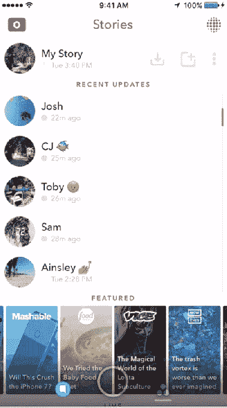
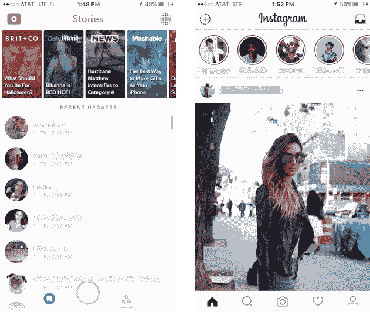

# Snapchat 推出后滚动广告，故事播放列表，批量加载收藏夹

> 原文：<https://web.archive.org/web/https://techcrunch.com/2016/10/07/snapchat-story-playlist/>

# Snapchat 推出后滚动广告，故事播放列表，批量加载收藏夹

Snapchat 正在反击 Instagram Stories，insta gram Stories 通过在 feed 顶部突出克隆的功能，飙升至 [1 亿日活用户](https://web.archive.org/web/20230326024943/https://techcrunch.com/2016/10/06/instagram-stories-has-100-million-daily-active-users-after-just-2-months/)。为了让 Snapchat 更加“朋友优先”，它将朋友的故事移动到“发现他们曾经在哪里”之上，以确保您不会错过您关心的人。

为了更容易地观看所有你最喜欢的朋友的故事，而不会被无聊的人夹在中间，Snapchat 取消了自动前进功能，当你看完上一个故事时，会自动转到下一个倒序故事。

 [自动前进将被故事播放列表](https://web.archive.org/web/20230326024943/https://www.snap.com/news/)取代，这是一个新功能，可以让你点击你想要加载的多个故事旁边的缩略图，然后通过点击底部的大“播放”按钮连续观看它们。这实质上正式形成了一种紧急行为，用户将向下滚动点击故事开始加载，然后一旦加载完毕，再次滚动观看每个故事，一次一个。

今天，这些更新将面向部分 Android 用户，很快将面向所有 iOS 和 Android 用户。

那么 Snapchat 在 auto-advance 故事之间插入的 Snap 广告会怎么样呢？那些中间插播广告现在会混合出现在你观看的故事播放列表中。但是也有一个新的广告位置。如果你决定一次只看一个故事，Snapchat 可能会在结尾添加一个后滚动 Snap 广告。

这样无论你怎么看故事，Snapchat 都能赚到钱，不管是单个看还是批量看。这一点很重要，因为据报道，该公司正计划最早于 3 月份以 250 亿美元或更高的估值进行 IPO。Snapchat 需要证明它有大量不同的收入来源，以让华尔街相信它的财务安全。

Snapchat 的旧故事页面设计将朋友推至下方发现频道，而 Instagram Stories 则在顶部突出朋友的故事

尽管 Instagram 承认其故事是对 Snapchat 故事的公然抄袭，但该产品的快速崛起[可能会阻碍 Snapchat 的增长](https://web.archive.org/web/20230326024943/https://techcrunch.com/2016/08/09/the-good-enough-strategy/)。Instagram 将该功能直接放在主页面的顶部中央，而不是隐藏在一个单独的标签中，从而使其不可错过。相比之下，这使得 Snapchat 的故事列表在你关注的人上方显示专业制作的探索频道，看起来不太像朋友，更麻烦。

两年后，Discover 不再需要在故事之上进行显著的交叉推广。它在 Snapchat 中已经有了自己的页面。这一举动可能会让那些投入巨资制作独特的 Snapchat Discover 内容的出版商感到不安，因为这一举动表明 Snapchat 不怕降级。此举让人想起脸书最近的新闻订阅变化，将“朋友第一”排在出版商之上。Discover 很好，但大多数人打开 Snapchat 是为了查看他们认识的人，而该产品并没有恰当地反映这一点。

现在 Snapchat 的优先事项很明确:抵挡 Instagram，并在上市前证明其赚钱潜力。