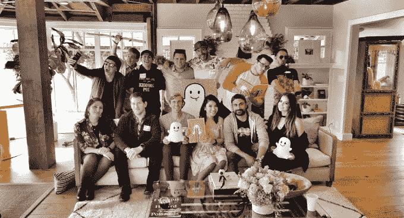
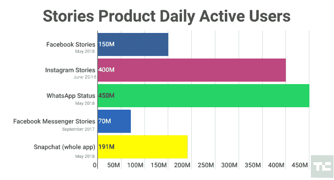

# Snapchat 的“故事讲述者”最终将创作者与广告商配对

> 原文：<https://web.archive.org/web/https://techcrunch.com/2018/07/26/snapchat-storytellers/>

Snapchat 在追求有影响力的人的游戏中姗姗来迟。现在，它希望通过将企业与其顶级独立创作者联系起来来增加广告支出，但它不会从它帮助安排的交易中提成。今天，Snap Inc .推出了“Snapchat Storytellers”试点项目，将向五家最受欢迎的应用内容制造商介绍品牌，包括 Mplatco、Cyrene Q 和 Shonduras。他们将在故事广告中担任主角，用他们的专业知识发现品牌或为品牌提供创意方向，这些专业知识是过去几年从数百万观众中收集来的，以此换取现金。顶级创作者往往可以从与品牌的交易中赚取数万美元或更多。

该计划姗姗来迟，但对 Snapchat 来说是明智之举，因为它需要教育企业如何制作精彩的故事广告。这些往往需要时尚的垂直视频，这是从许多人习惯的微小照片、链接和文本广告，甚至是他们学会为 YouTube 或脸书制作的简洁的风景视频中的一大创意跳跃。如果创作者能够帮助品牌制作出好看且表现良好的广告，这些企业将更有可能在 Snapchat 上投入更多资金。

这对这家上市公司来说至关重要，该公司上个季度亏损 3.85 亿美元，收入 2.3 亿美元，比预期收入少 1400 万美元。随着脸书从 Instagram 和 WhatsApp 克隆的 Snapchat Stories 将 Snap 的用户增长率降至微不足道的 2.9%(有史以来的最低水平)，该公司将不得不考虑如何从每个用户身上榨取更多的美元。如果它不能通过更好的广告创意和表现做到这一点，它将被迫依赖令人讨厌的不可错过的故事广告，昨天它向更多企业推出了这种广告。

与此同时，如果 Snap 将该计划扩展到更多的创作者，这可能是一个帮助他们赚钱并保持对平台忠诚的好方法。YouTube 长期以来一直提供广告收入分成，脸书的广告时段允许创作者在视频中插入商业广告，收取一定的费用。两家公司都在尝试订阅赞助和小费选项，以帮助创作者赚钱。脸书最近推出了它的[品牌协作管理器](https://web.archive.org/web/20230304111346/https://techcrunch.com/2018/06/19/facebook-brand-collabs/)，它提供了一个创作者的完整搜索引擎，品牌可以根据受众人口统计进行排序。

但是 Snapchat 仍然没有这些选项，相比之下，它的 Storytellers 程序看起来三心二意。随着社交媒体影响者空间的成熟，许多创作者厌倦了免费提供他们的内容，并将他们最好的作品带到任何有助于他们获得报酬的网络。

不过，在品牌和创作者之间的交易如何达成方面，Snap 将采取相对不干涉的方式。它不会收取分成，创作者也不会与 Snap 或其他企业签订排他性合同。基本上，Snap 正在将包括吉欧 Snap 和T2·乔治·科普特在内的五位创作者加入到其[创意合作伙伴名单](https://web.archive.org/web/20230304111346/https://forbusiness.snapchat.com/partners)中，此外还有广告公司和创意工作室。如果广告商对某个创作者表示兴趣，Snap 会进行介绍，然后让他们去达成交易。

令人哭笑不得的是，Snapchat 等了这么久才推出这个程序，它甚至都没想出来。正是这位可爱怪异的前 Vine 明星 Shonduras 在五月份的第一次[创作者峰会](https://web.archive.org/web/20230304111346/https://techcrunch.com/2018/05/08/snapchat-creators-summit/)上建议 Snapchat 建立这个程序。这显示了 Snap 与创作者社区的脱节程度。如果它不能快速增加用户数量，它应该尽一切可能阻止创作者和广告商转向用户数量更多的脸书故事平台。

*【更正:尼古拉斯·梅加利斯制作的是“巨美货币”，而不是肖恩度拉斯。]*