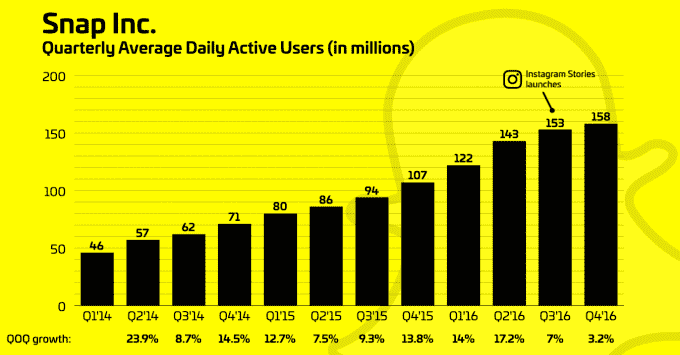
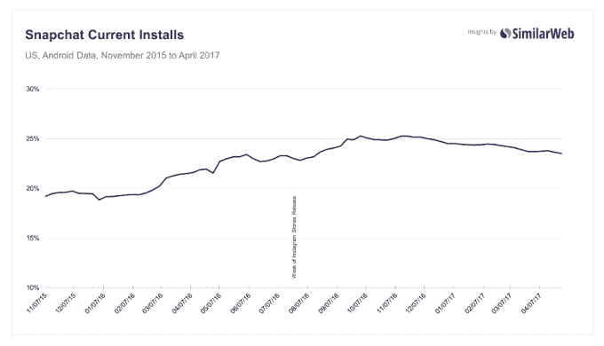
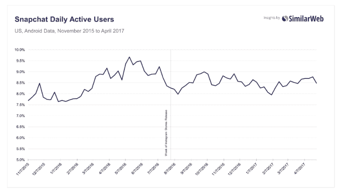
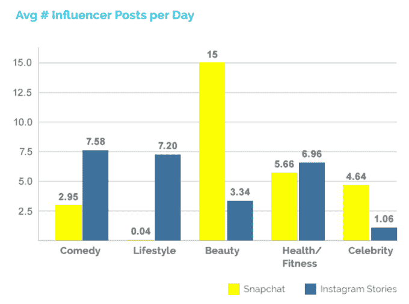
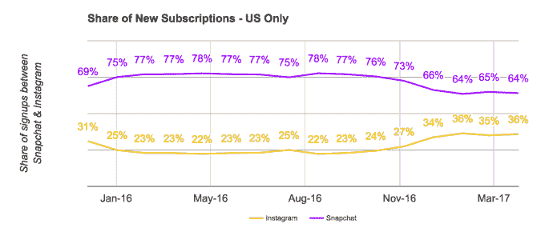
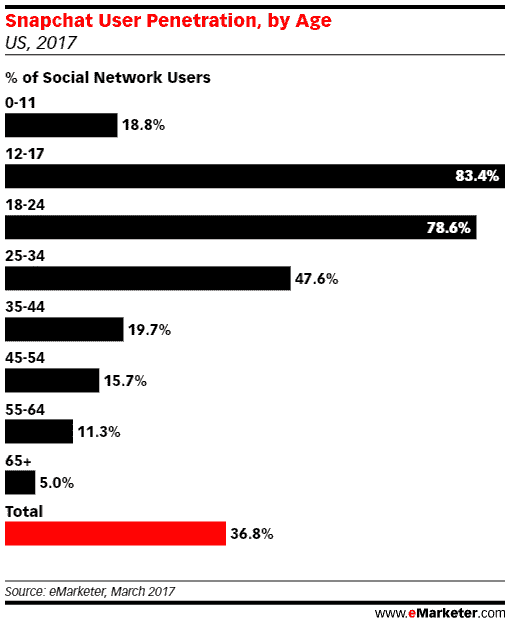
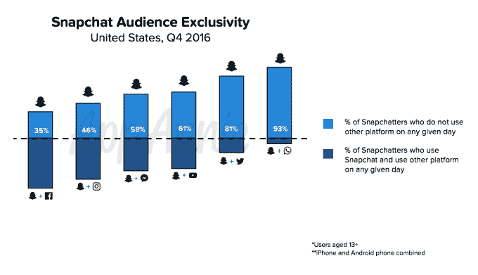
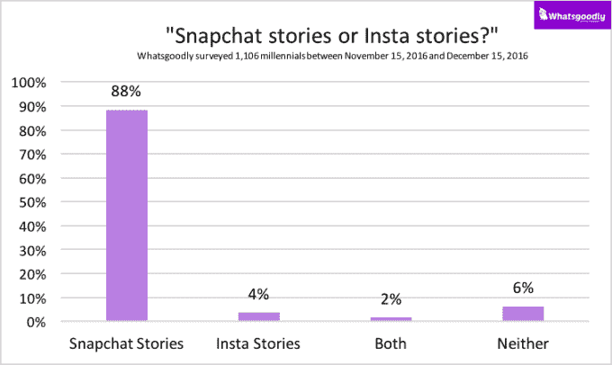

# Snapchat 用户保持忠诚，但 Instagram 可能会阻碍其增长 

> 原文：<https://web.archive.org/web/https://techcrunch.com/2017/05/09/snapchat-survives/>

根据 TechCrunch 委托或收集的十几项研究和调查，美国千禧一代和 z 一代并没有完全用 Instagram 故事取代他们的 Snapchat 瘾。

然而，insta gram 80%的用户都在美国以外，这一事实帮助推动 Instagram Stories 上个月的日活跃用户数迅速上升至 2 亿，超过了 Snapchat 自 2016 年第四季度以来的 1.58 亿用户。这可能会使 Snapchat 很难大幅扭转其用户增长率下降的趋势，因为世界各地尚未使用它的青少年可能会在 Instagram 上满足他们讲故事的需求。

脸书的应用程序系列未能对 Snapchat 造成致命打击，但仍可能阻碍其用户增长，迫使 Snap 专注于增加其应用程序的使用时间和每用户平均收入，以扩大业务。

## 经受 Instagram 风暴

今年 8 月，脸书在 Snapchat 上打响了全面战争的第一枪，当时 Instagram 在其 feed 上方显著增加了一个新功能。 [Instagram Stories](https://web.archive.org/web/20221218050428/https://techcrunch.com/2016/08/02/instagram-stories/) 是 Snapchat 的 24 小时短暂幻灯片故事功能的精确克隆。当时，[我们预测 Snapchat 的忠实用户将保持坚定](https://web.archive.org/web/20221218050428/https://techcrunch.com/2016/08/09/the-good-enough-strategy/)，但 Instagram Stories 在一个已经很受欢迎的应用程序中的便捷设计以及人们在那里建立的现有社交图足以阻止新用户加入 Snapchat。

今年 1 月，我们发布了一份报告，称由于 Instagram Stories 的推出和 Snapchat 自动链接朋友故事的自动推进功能的取消，分析公司和社交媒体名人的 Snapchat Stories 浏览量[显著下降](https://web.archive.org/web/20221218050428/https://techcrunch.com/2017/01/30/attack-of-the-clone/)。竞争和产品变化似乎有可能导致 Snapchat 增长率下降。

一周后，当 Snap Inc .申请 IPO 时，我们得知自 Instagram Stories 推出以来, [Snapchat 的增长率下降了 82%](https://web.archive.org/web/20221218050428/https://techcrunch.com/2017/02/02/slowchat/)。它在 2016 年第四季度仅增加了 500 万用户，达到 1.58 亿用户。

很明显，Instagram 对 Snapchat 的未来产生了影响，但问题是它是否会严重抢走 Snap 在美国的核心千禧一代用户群。这就是我们试图通过今天收集的数据来确定的。

## Snapchat 磕磕绊绊

数据显示，Instagram 导致 Snapchat 的使用量下降，但这家初创公司远未死亡。

分析公司 [SimilarWeb](https://web.archive.org/web/20221218050428/https://www.similarweb.com/) 发现，在 Instagram Stories 于 8 月推出后不久，安装 Snapchat 的所有 Android 设备的比例在 10 月达到 25.29%的峰值。这一比例略有下降，约为 23.5%。

在 Instagram Stories 推出之前，美国 Android 用户中每日活跃 Snapchat 用户的比例在 2016 年 5 月达到峰值，此后下降了约 11%。在过去的 18 个月里，Snapchat 已经成功地将花在应用上的时间增加了 7 分钟，即 45%。但在 Instagram Stories 推出后，其快速增长速度变成了下降，从之前的约 22 分钟跌至 19 分 27 秒后的低点。Snapchat 现在再次增长，目前大约为 24 分钟。

[7Park](https://web.archive.org/web/20221218050428/https://www.7parkdata.com/) 数据发现，在开始使用 Instagram Stories 的用户中，Snapchat 用户会话数量显著下降。根据对 1.4 万人的研究，该公司还发现，在 Instagram Stories 用户中，Snapchat 日活跃用户数量下降得更快。Facebook Messenger Day 的推出并没有对 Snapchat 产生同样的影响。

营销分析平台 [Captiv8](https://web.archive.org/web/20221218050428/https://captiv8.io/) 发现，57%的社交媒体影响者每天在 Instagram 上发布的内容比在 Snapchat 上发布的多。Snap 在美容和传统名人类别中看到了更多有影响力的帖子，而 Instagram 在喜剧和生活方式有影响力的人中更受欢迎。

分析公司 [Jumpshot](https://web.archive.org/web/20221218050428/https://www.jumpshot.com/) 发现，Instagram Stories 的推出起初并没有显著影响 Instagram 和 Snapchat 之间的电子邮件注册份额，Snapchat 稳定在 76%左右。但随着 Instagram 故事在 2016 年底获得更多关注，Snapchat 的比例降至 64%。

媒体创业公司 [The Relish](https://web.archive.org/web/20221218050428/https://www.therelish.com/) 发现 Instagram 的故事增加了其整体印象、reach 目标和参与度。与此同时，它从未在 Snapchat 故事上看到重大增长或参与，因此 Instagram 版本的推出使它“在我们有更多员工之前，保持我们(在 Snapchat 上)的努力是显而易见的。”

移动视频平台 [dubdub](https://web.archive.org/web/20221218050428/https://dubdub.com/) 发现，Instagram 故事为品牌创造的观看次数比 Snapchat 故事平均多 35%。然而，Snapchat 对千禧一代的影响更深，其赞助的镜头自拍滤镜“可以在 24 小时内产生数百万次游戏化的互动，有助于转移品牌意识和购买意图。”

[eMarketer](https://web.archive.org/web/20221218050428/https://www.emarketer.com/) 估计 Snapchat 的营收增长将在 2017 年和 2018 年大幅下滑。从 2015 年到 2016 年，它增长了 492%，广告收入达到 3.4 亿美元。随着增长率降至 163.3%，预计 2017 年收入将达到 8.955 亿美元，2018 年将达到 17 亿美元，增长率降至 90%。尽管如此，90%是一个稳定的增长率，随着 Snapchat 业务的成熟，下降是可以预料的。eMarketer 确实发现 Snapchat 在美国 12 至 17 岁青少年中的渗透率高达 83.4%。

这一数据表明，Instagram 已经对 Snapchat 造成了影响，放缓了其增长速度，并使其成为一些品牌在 Instagram 之后的第二选择。但对 Snapchat 忠实用户的调查显示，相比脸书的收购，他们更喜欢这家酷初创公司。

## Snapchat 幸存下来

手机故事游戏制造商[剧集](https://web.archive.org/web/20221218050428/https://www.episodeinteractive.com/)调查了 10，000 名用户，其中大部分是 13 至 25 岁的女性，发现 69%的人说自从 Instagram Stories 推出以来，他们的 Snapchat 使用量没有丝毫下降，而 22%的人说他们的使用量略有下降，只有 9%的人说显著下降。

分析提供商 [App Annie](https://web.archive.org/web/20221218050428/https://www.appannie.com/en/insights/mobile-strategy/snapchat-cross-app-usage-us-uk/) 发现，Snapchat 拥有一批独家受众，这些受众通常无法通过其他平台上的广告获得，正如[彭博](https://web.archive.org/web/20221218050428/http://www.bloomberg.com/news/articles/2017-05-03/snapchat-keeps-unique-daily-audience-against-instagram-challenge)之前报道的那样。在美国，每天有 35%的 Snapchat 用户无法通过脸书联系到，46%的用户无法通过 Instagram 联系到，58%的用户无法通过 Messenger 联系到。

品牌大使网络[心跳](https://web.archive.org/web/20221218050428/http://www.getheartbeat.co/)在其 10.3 万用户中调查了 1700 名 13 至 20 岁的青少年；74%的人表示，他们仍然在 Snapchat 上发布更多内容，60%的人表示，他们每天都在 Snapchat 上发布自己的故事，相比之下，只有 18%的人在 Instagram 上发布。然而，他们表示，他们在 Instagram 故事上的平均浏览量是 Snapchat 的 2.5 倍。当被问及如果只能拥有一个应用程序，他们会选择哪一个时，51%的人选择 Snapchat，49%的人选择 Instagram。77%的人表示广告在 Instagram 上更具相关性，但只有 19%的人认为自 Instagram 推出以来，他们的 Snapchat Stories 浏览量有所下降。

Heartbeat 的创始人凯特·爱德华兹(Kate Edwards)告诉我，“我们已经看到询问 Snapchat 活动的品牌数量显著减少，尽管我们确实为一些品牌开展 Snapchat 活动，但我们几乎总是建议他们转而开展 Instagram 和 Instagram Stories 活动，原因很简单，因为跟踪更加可靠。”她总结道，“老实说，我们认为 Snapchat 正在失去一些潜在的收入机会，如果我们是任何例子的话，这只是因为他们不理解数据对品牌和建议他们如何分配媒体支出的企业的价值。”

消费者洞察平台 [Whatsgoodly](https://web.archive.org/web/20221218050428/https://whatsgoodly.com/) 在 4 月份调查了 1991 名千禧一代，在 11 月份调查了 1106 名。它发现 Snapchat 比 Instagram 故事更受欢迎，但选择它的比例从 11 月的 88%下降到 4 月的 78%。

移动广告公司 [Kiip](https://web.archive.org/web/20221218050428/http://www.kiip.me/) 调查了 1 万名用户；37%的人表示，自从 Instagram Stories 推出以来，他们对 Snapchat 的使用有所下降，59.6%的人表示，与 Snapchat Stories 相比，他们更喜欢 Instagram Stories。然而，当被问及他们认为故事的哪个功能最重要时，Snapchat 的动画自拍滤镜最受欢迎，占 38.2%，其次是 Instagram 的直播功能，占 31%。

调查显示，千禧一代和 Z 世代千禧一代可能仍会忠诚于 Snapchat。他们可能在 Instagram 上有一个更大的网络，他们可能已经在使用 Instagram 的永久订阅了。但这些 Snapchat 的早期用户养成了一种根深蒂固的习惯，即每天打开 Snapchat 并向其发布内容。

随着 Snap Inc 报告上市后的第一份财报，预计它将强调显示这种忠诚度的指标，如每天花费的分钟数、视频浏览量、每用户收入和发布故事的用户百分比——除了 DAU 以外，任何可能看起来较弱的指标。

虽然不熟悉故事格式的人可能会发现 Instagram 更方便，但 Instagram 并没有为死忠的 Snapchatters 用户提供足够令人信服的理由。