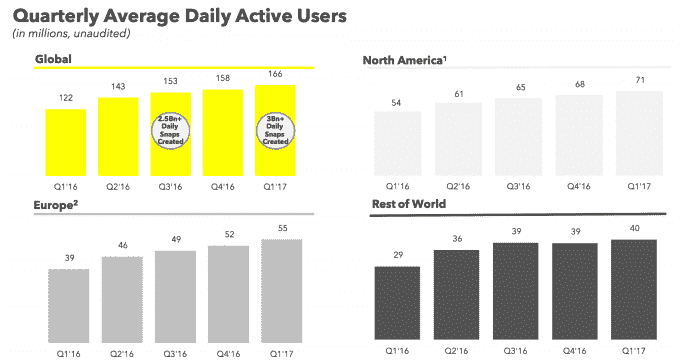
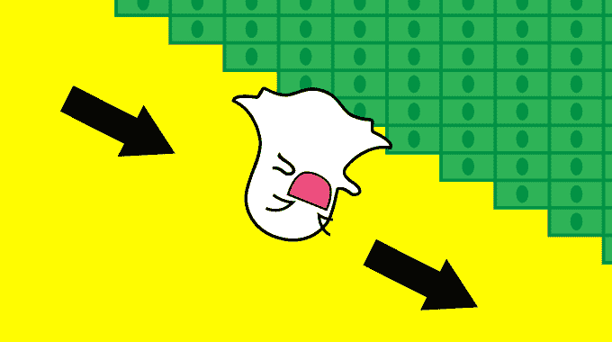

# Snapchat 的日活用户达到了令人失望的 1.66 亿，增长速度仅略快

> 原文：<https://web.archive.org/web/https://techcrunch.com/2017/05/10/snapchat-user-count/>

Snap 在 2017 年 Q1 的增长率仅略有上升，这是其上市以来第一份季度财报的糟糕开局。Snap 的日活跃用户数达到 1.66 亿，增长率为 5%，而第四季度的日活跃用户数为 1.58 亿，增长率为 3.2%。Snap 的同比增长率继续下滑，从第四季度的 48%降至 36%。

随着投资者逃离，Snap 股价在盘后交易中立即下跌超过 24 %,看到其长期潜在规模因当前的增长困境而缩小。它现在的交易价格约为 18.19 美元，是上市以来的最低水平。

Snap 在北美 Q1 仅增加了 300 万新用户，dau 达到 7100 万，与第四季度持平。因为它依靠国内市场来推动收入，这种缓慢的增长尤其令人担忧。Snap 在欧洲增加了 300 万部，在 DAU 达到 5500 万部。在世界其他地区，它仅增加了 100 万用户，达到 4000 万 DAU，这实际上是一个进步，因为它在第三季度和第四季度保持在 3900 万。

很明显，Snap 希望淡化用户增长缓慢的问题，因为它在 DAU 图表上贴了一个大大的“每日创建 30 亿以上的快照”的标签。正如 TechCrunch 所预测的那样，在 DAU 增长疲软的情况下，Snap 正竭力凸显其参与的深度。

竞争对手 Instagram Stories 的日活跃人数为 2 亿，仍然大于 Snap 的整个应用程序，这与 Instagram Direct 的 3.75 亿月用户和整个 Instagram 应用程序的 7 亿月用户相比进一步相形见绌。

[Snap 正在成为新的顽固、增长缓慢的 Twitter](https://web.archive.org/web/20230326023920/https://techcrunch.com/2017/05/10/snicker/) ,面临类似的脸书竞争，不愿意过滤 Twitter 四年前展示的内容。

## 收益电话

在第一次财报电话会议上，首席执行官埃文·斯皮格尔听起来很沮丧，只说了几分钟。他重点强调了该公司在 Android 开发方面的进展。Spiegel 表示，Android 应用程序性能的改善使 Snapchat 网络上的 Android 设备数量增加了一倍，Android 占本季度净增用户的 30%。

首席战略官伊姆兰·汗表示，Android 的改进使 Snapchat 现在每个用户每天平均“超过 30 分钟”，高于 IPO 前的 25 分钟至 30 分钟。

Snapchat 确实爆出了一个有趣的新数字。2016 年第四季度，它在眼镜及其“其他收入”类别上赚了[450 万美元，在 Q1 赚了超过 830 万美元](https://web.archive.org/web/20230326023920/https://techcrunch.com/2017/05/10/snap-earned-8m-on-spectacles-and-other-revenue-in-q1-4-5m-in-q4/)。这意味着它可能售出了多达 98，000 副眼镜，尽管由于这里包括了其他收入来源，这一数字可能略低。

在回答 Snap 如何提高增长率的问题时，Spiegel 驳斥了“增长黑客”技术，比如让用户邀请他们的整个通讯录加入 Snapchat 或跟随他们。这位首席执行官认为这些技术不能长期持续，如果人们添加了他们所有的朋友，而不是几个，他们可能会对分享更真实的个人内容感到不安。

至于 Snap 将如何处理脸书抄袭的问题，Spiegel 宣称“创造力对 Snap 的业务至关重要”。他说你必须预料到人们会模仿你。就像谷歌迫使公司制定自己的搜索策略一样，Snapchat 正在迫使竞争对手制定相机策略。但这种对“创造力”这一模糊概念的依赖，并没有为 Snapchat 如何战胜规模更大、资金更充足的脸书竞争对手提供多少真知灼见。

## 增长低迷仍在继续

Snapchat 从早期开始快速增长，在 2015 年末和 2016 年初达到了大步流星。它在 2015 年第四季度增长了 13.8%，在 2016 年 Q1 增长了 14%，在 2016 年 Q2 增长了 17.2%，达到 143 名每日活跃用户。但在 2016 年 8 月，竞争对手 Instagram Stories 的推出以及将朋友的故事链接在一起的自动推进功能的删除发生了。TechCrunch 预测 Instagram 的克隆版可能不会吸引忠实的 Snapchatters 用户，但可能会严重阻碍其发展。分析公司和社交媒体名人告诉 TechCrunch，他们看到 Snapchat 的浏览量下降了 15%至 40%，而一些用户开始优先在 Instagram 上分享和观看。

Snap Inc .今年 2 月提交 IPO 申请时，披露的数据显示增长大幅下滑。Snapchat 在 2016 年第三季度仅增长 7%，第四季度增长 3.2%。这意味着 [Snap 的增长率下降了近 82%](https://web.archive.org/web/20230326023920/https://techcrunch.com/2017/02/02/slowchat/),仅为 Instagram Stories 推出前的五分之一。

自 IPO 以来，脸书在抄袭 Snapchat 方面变得更加激进。它推出了 Messenger Day、WhatsApp Status 和脸书故事——这些都是 Snapchat 故事的翻版。与此同时，Instagram Stories 的日活跃用户达到 2 亿，超过了 Snapchat 的整个应用程序。此外，它还推出了经过改进的直接消息功能，将 Snapchat 风格的短暂聊天与传统的永久消息相结合。

Snap 试图领先 Instagram 和脸书一步。它为自己的探索栏目开发了更多的电视网络“节目”。它开始推出故事搜索功能，用于查看公开提交的关于某些主题的帖子。它还推出了新的创意工具，如剪刀剪贴功能、用于从图像中 ps 出物体的魔法橡皮擦，以及将虚拟 3D 物体插入照片的增强现实世界镜头。

现在增长仍然步履维艰，问题是 Snapchat 能否继续在脸书的冲击下生存，尤其是这家科技巨头向国际市场推出 Snap 的最佳功能，这可能会阻碍 Snapchat 的未来增长。

如果 Snap 不能证明自己可以达到大规模，它将不得不讲述一个更艰难的故事，即通过提高每用户平均收入和延长应用程序使用时间来发展业务。但问题是 ARPU 的增长也不够快。虽然在 Q1 挣得比第四季度假期少很正常，但 Snap 的 ARPU 自 2016 年第三季度以来仅增长了 7.1%。

由于用户数量或每用户收入没有快速增长，Snap 投资者正在重新考虑其之前过高的估值。