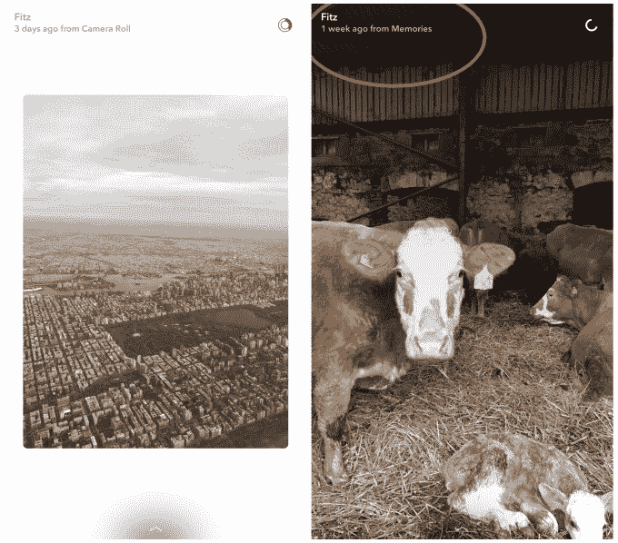

# Snapchat 将不再显示旧记忆的白色边框

> 原文：<https://web.archive.org/web/https://techcrunch.com/2017/04/27/snapchat-will-no-longer-show-a-white-border-around-old-memories/>

# Snapchat 将不再显示旧记忆的白色边框

Snapchat 将[不再向](https://web.archive.org/web/20230326024431/https://twitter.com/TaylorLorenz/status/857660071932825600)显示你从记忆中分享的老照片周围恼人的白色边框。

以前，如果你分享一张超过 24 小时前的照片，照片周围会有白色边框。

虽然 Snapchat 的目标是提醒观众，这些旧内容并不是真正短暂的，但丑陋的边框最终让不想修改照片的用户感到恼火，有时他们会决定根本不分享旧内容。

阻碍用户分享内容是任何社交平台的问题，尤其是 Snapchat，它现在正试图跟上 Instagram 故事的快速增长。

因此，这一变化应该有助于增加用户决定发送给朋友并发布他们故事的旧记忆的数量，因为他们不再担心它看起来丑陋或不酷。虽然共享的记忆仍然会在顶部有一个小说明，说明图像有多旧，但它比边框少得多。

值得注意的是，这不会改变 Snapchat 处理从相机胶卷共享的照片的方式。

左:从“相机胶卷”共享的照片是如何显示的。右图:现在会出现多老的记忆。

该应用程序仍然会将记忆(从 Snapchat 应用程序中捕捉并保存的图像)与相机胶卷图像(在手机的原生相机应用程序中拍摄的图像)区别对待。因此，从“相机胶卷”上传的任何图像仍然会在图像周围有白色边框。

所以 Snapchat 用户只能分享没有边框的旧内容，如果他们最初在 Snapchat 的应用程序中捕捉这些内容的话。

这种变化本质上是迫使用户选择他们更看重哪个——在 Snapchat 中分享旧的无边框图像并拥有好看的故事的能力，或者使用 iPhone 原生相机应用程序的能力(因为它不依赖于公共 API，所以可以拍摄更高质量的照片和视频)。这也是另一个信号，Snap 确实[将自己视为一家相机公司](https://web.archive.org/web/20230326024431/https://techcrunch.com/2016/04/30/according-to-its-cofounder-and-ceo-snapchat-is-mainly-a-camera-company/)，并希望成为人们在拍摄照片或视频时打开的默认应用。

这与 Instagram 在故事中处理老照片的方式不同:该应用程序允许你将任何不到 24 小时的照片发布到你的故事中，没有任何难看的边框或注释，无论照片是在哪里拍摄的。这一举措受到了用户的欢迎，因为它本质上是两个世界的最佳选择——你可以使用原生相机应用程序，同时仍然可以分享旧内容。24 小时的限制在 Instagram 故事上并不重要，因为如果你非常喜欢一张旧图片，你可能只会把它作为一张普通的旧 Instagram 发布。