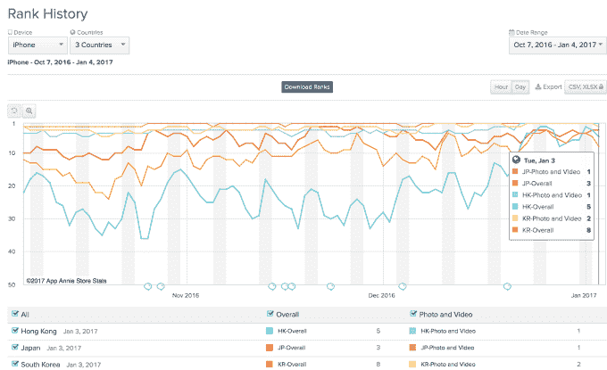

# 脸书试图收购的亚洲 Snapchat 克隆版 Snow 声称每月拥有 4000 万至 5000 万用户 

> 原文：<https://web.archive.org/web/https://techcrunch.com/2017/01/04/snow-the-asian-snapchat-clone-facebook-tried-to-buy-claims-40-50m-monthly-users/>

# 脸书试图收购的亚洲 Snapchat 克隆版 Snow 号称每月拥有 4000 万至 5000 万用户

亚洲 Snapchat 的克隆产品 Snow 引起了脸书首席执行官马克·扎克伯格的注意，他去年试图收购该公司，但没有成功，现在它仍在稳步增长。该应用的韩国母公司 Naver 今天证实，它在 12 月份的下载量突破了 1 亿次，每月有 40-50%的用户群活跃在该应用上。

对于一个一年前的项目来说，这些数字相当可观，但仍落后于 Snapchat(美国公司[计划以 40 亿美元的 IPO](https://web.archive.org/web/20221208095825/https://beta.techcrunch.com/2016/11/15/snapchat-has-reportedly-filed-confidentially-for-its-massive-ipo/) 上市，拥有 1.5 亿日活跃用户)。不过，Snow 瞄准了与其竞争对手截然不同的地理区域。就用户数量而言，中国是最大的市场，日本和韩国紧随其后，不过该公司没有披露这两个国家用户群的原始数据。

这些官方数据与我们 10 月份报道的数据相当，当时一位消息人士告诉我们，Snow 的下载量已经超过 8000 万次，并且每月增加 1000 万次。早在七月，[《纽约时报》报道称](https://web.archive.org/web/20221208095825/http://www.nytimes.com/2016/07/06/technology/snapchat-snow-korea.html?_r=0)该应用的下载量约为 3000 万次。

> [App Annie 数据](https://web.archive.org/web/20221208095825/https://www.appannie.com/apps/ios/app/seunou-snow/rank-history/#vtype=day&countries=KR,JP,HK&start_date=2016-10-07&end_date=2017-01-04&device=iphone&view=rank&lm=3f)显示斯诺在日本、韩国和香港的受欢迎程度(中国数据不详)

像许多其他西方服务一样，Snapchat 在中国被屏蔽。Snow 模仿了美国的应用程序，但提供了更多面部过滤器和贴纸的选择，在某些方面填补了这一空白，但它仍只是皮毛。[中国政府估计](https://web.archive.org/web/20221208095825/http://news.xinhuanet.com/english/2016-08/03/c_135561296.htm)中国有超过 7 亿互联网用户，所以即使是对中国降雪最乐观的数据——比如说，这 1 亿次下载中有一半来自中国——也只是沧海一粟。

但是，毫无疑问这是有潜力的。Naver 认为拒绝脸书首席执行官马克·扎克伯格的提议是合适的，因为它认为自己已经成功了。聊天应用 LINE 是 Naver 迄今为止最大的成功，7 月份在日本和美国的 IPO 中筹集了超过 10 亿美元的资金，该公司认为 Snow 也有类似的可能性。事实上，Naver 在 9 月份加强了两家公司的联系，当时 [LINE 以 1.8 亿美元的估值对 Snow 进行了 4500 万美元的投资。你可能会怀疑后一个数字在过去的几个月里上升了几个等级。](https://web.archive.org/web/20221208095825/https://beta.techcrunch.com/2016/09/29/line-investment-snow-45-million/)

> 雪地上众多过滤器中的三种