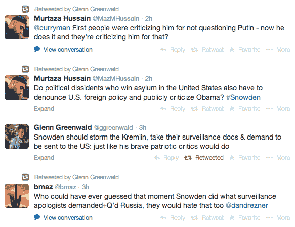

# 斯诺登问普京关于俄罗斯电视监控的问题，所有人都立刻失去了理智

> 原文：<https://web.archive.org/web/https://techcrunch.com/2014/04/17/snowden-asks-putin-about-surveillance-on-russian-tv-everyone-promptly-loses-their-minds/>

# 斯诺登问普京关于俄罗斯电视监控的问题，所有人都立刻失去了理智

今天早些时候，在俄罗斯电视台的一个热线节目中，臭名昭著的美国国家安全局泄密者爱德华·斯诺登就俄罗斯政府的监控活动向该国总统弗拉基米尔·普京提问。斯诺登在美国吊销了他的护照后，在俄罗斯机场呆了几个星期，直到他在目前居住的国家获得临时庇护。

值得记住的是，本质上斯诺登并没有选择俄罗斯，而是他或多或少被自己的政府困在了那里。

鉴于斯诺登的背景，他的问题并不令人惊讶:“俄国是否以任何方式拦截、存储或分析数百万个人的通信。”普京的回应是——不，我们遵守法律。与其他否认政府官员的人相似，他们喜欢依靠自己监视活动的合法性作为道德掩护，这很幽默。

普京直言不讳:“(T4)我们没有这样的大规模拦截系统，根据我们的法律，它不能存在。”他还试图对自己国家的监控设备表现出谦逊:“我们没有美国那么多钱，也没有他们在那里的技术能力。”

不管是假装的还是其他方式，愤怒很快就被煽动起来。斯诺登的录音问题似乎证实了他的对手长期以来的担忧，即持不同政见者实际上一直是俄罗斯的走狗。媒体称之为[公关噱头](https://web.archive.org/web/20221224084752/http://www.businessinsider.com/edward-snowden-putin-q-a-surveillance-2014-4)、[斯诺登马前卒](https://web.archive.org/web/20221224084752/http://www.thedailybeast.com/articles/2014/04/17/sorry-snowden-putin-lied-to-you-about-his-surveillance-state-and-made-you-a-pawn-of-it.html)等等。

那些认为斯诺登是值得终身监禁甚至更糟的叛徒的人是这么看的，就像斯诺登的最大支持者是这么看的一样。以下是格伦·格林沃尔德的推特信息，供参考:

这就归结为一个语气问题。斯诺登的问题提供了一个错误信息的平台，还是他的出现引发了对俄罗斯监控的讨论，让该国总统因为提供了一个几乎被普遍认为是错误的答案而显得愚蠢？我认为两个问题的答案都是肯定的。

简单了解一下俄罗斯的能力，每日野兽[引用了](https://web.archive.org/web/20221224084752/http://www.thedailybeast.com/articles/2014/04/17/sorry-snowden-putin-lied-to-you-about-his-surveillance-state-and-made-you-a-pawn-of-it.html):的原话，但是联邦安全局比联邦调查局或国家安全局拥有更多窃听俄罗斯和外国公民的权力。索尔达托夫称，实际上，俄罗斯联邦安全局对俄罗斯电信公司和互联网服务提供商的每一台服务器都有后门。

我将把细微的差别留给你去整理。这是片段:

[https://web.archive.org/web/20221224084752if_/https://www.youtube.com/embed/w1yH554emkY?feature=oembed](https://web.archive.org/web/20221224084752if_/https://www.youtube.com/embed/w1yH554emkY?feature=oembed)

视频

图片由 FLICKR 用户[大韩民国](https://web.archive.org/web/20221224084752/https://www.flickr.com/photos/koreanet/ "Go to Republic of  Korea's photostream")根据 [CC BY 2.0](https://web.archive.org/web/20221224084752/http://creativecommons.org/licenses/by/2.0/) 许可(图片已被裁剪)