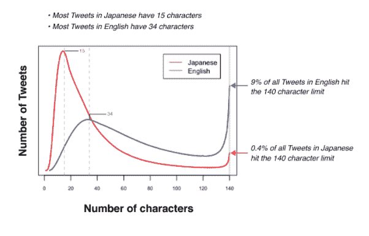

# 那么，为什么推特会排在第 280 位呢？

> 原文：<https://web.archive.org/web/https://techcrunch.com/2017/09/27/so-why-oh-why-is-twitter-doing-280/>

昨天晚些时候，Twitter [宣布](https://web.archive.org/web/20221207082731/https://beta.techcrunch.com/2017/09/26/twitter-trials-an-expansion-beyond-140-characters/)这对于各地时间紧迫的记者来说是不可想象的，因为它透露正在测试将推文的字符长度增加一倍。

告别甜蜜短暂的 140 查尔。你好，毫无意义的额外废话连篇#280。

但是为什么 Twitter 要这么做呢？

“在所有市场，当人们不必把他们的想法塞进 140 个字符，实际上还有多余的时候，我们会看到更多的人发微博，”产品经理艾丽莎·罗森在一篇相当罗嗦的[博客文章中解释了这一举动——甚至包括一张图表！](https://web.archive.org/web/20221207082731/https://blog.twitter.com/official/en_us/topics/product/2017/Giving-you-more-characters-to-express-yourself.html)

虽然不是 Twitter 用户增长的图表。

(在这里，我修改了罗森的解释，使之包含更少的字符:“我们正试图解决[我们的增长问题](https://web.archive.org/web/20221207082731/https://beta.techcrunch.com/2017/07/27/twitters-user-growth-went-nowhere-and-the-stock-is-diving/)。))

虽然罗森谈到 Twitter 希望“世界上的每个人都能在 Twitter 上轻松表达自己”，但没有具体讨论 Twitter 的 140 限制可能会加剧公共领域的问题言论。

比如，把微妙的讨论变成两极化的争论和暴躁的谩骂。或者一位同事更简洁地称之为“大喊大叫的废话”。

(同样不在罗森的帖子中:任何详细描述推特在其平台上滥用行为的图表。)

但是，即使 Twitter 不想*明确*讨论其平台上的流氓和恶霸问题，它可能希望扩展到 280 个字符会鼓励人们少发推特，嗯，“大喊大叫的废话”。

这确实是一种可能性。尽管也有另一面的可能性，例如，美国现任总统将获得两倍于[的有新闻价值的](https://web.archive.org/web/20221207082731/https://beta.techcrunch.com/2017/09/25/twitter-says-it-hasnt-deleted-trumps-provocative-north-korea-tweet-because-of-newsworthiness/)推特空间来威胁核毁灭。

或者，换句话说…

尽管如此，拥有 280 个锁定和加载字符的特朗普是否会突然失去在“火箭男孩”(10 个字符)上发推文的冲动，转而对“朝鲜劳动党主席和朝鲜民主主义人民共和国最高领导人”(103 个字符)发表讲话，似乎不太可能。

所以可以肯定的是， 280 的案例*假定至少有机会在一条(双倍大小的)推文中存在细微差别。但是反对者说这真的取决于谁在发微博。*

(或“ttwweeeettiinngg”，因为它现在应该真正被称为。)

我的 TC 同事 Josh Constine 演示了如何在 Twitter 现有的 140 个字符限制内容纳大量高质量的信息，而不大喊大叫和/或不策略/不礼貌。

因此，推特的大小并不重要，重要的是你对人物做了什么。

但不管 280 个字符是否会导致推特上更广泛的语气演变——就特朗普而言，当/如果他把核密码交给#280，外交上的新协议和一个不那么不稳定的地缘政治世界(我们只能希望！)— [@Jack](https://web.archive.org/web/20221207082731/https://twitter.com/jack/status/912890220609028096) [& co](https://web.archive.org/web/20221207082731/https://twitter.com/biz/status/912802942008254464) 至少可以安慰自己，广告客户会发现 Twitter 将给予他们的所有额外营销地产有很多用途。

参见例如

因此，至少从 Twitter 的角度来看，有相当多的潜在支持者站在“让我们扼杀推特”这一核选项的一边，他们的主要担忧是:试图安抚投资者。

专业人士喜欢不太可能因为过于简洁的推文引发核战争而受到指责。

而在一个日益充斥着错误信息和算法控制的世界里，扰乱依赖 Twitter 成为一个可靠密集且在很大程度上自我管理的数字信息网络的(小)核心用户的工作流程，显然是一个次要的考虑因素。

在社交媒体对民主和社会的影响迅速升级的过程中，谁又能责怪他们呢？

即使更多的社交媒体听起来不一定是解决社交媒体加剧的问题的好办法。无论 T2 社交媒体巨头们怎么说。

## #280 上的技术推文

以下是科技领域对 Twitter 第 280 号实验的各种看法——对大型推文的看法相当全面——从支持(和/或讽刺)到漠不关心到兴奋到震惊到尖刻到有创意到批判到自我反省，到希望这种变化最终能打破 Twitter 的上瘾魔咒…

等不及#bringback140 了。