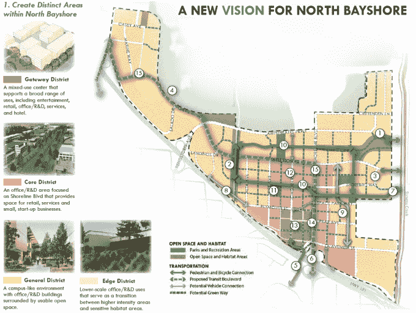
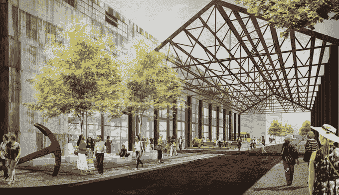

# 所以你想解决住房危机

> 原文：<https://web.archive.org/web/https://techcrunch.com/2014/11/02/so-you-want-to-fix-the-housing-crisis/>

因此，根据上周来自可爱的 T4 的可爱报告，全国房租最高的 30 个城市中有 15 个都在旧金山湾区，其中帕洛阿尔托名列榜首。

部分原因是周期性的。我们不知道我们在这个循环中处于什么位置，也不知道什么时候它会最终转向。然而，过去 40 年积累的许多结构性力量让我们走到了今天，包括上世纪 60 年代和 70 年代的增长控制，科技行业作为经济强国的崛起，以及经常使湾区 101 个市政府相互争斗的分散治理。这是我在春天写的概述。这些力量几乎肯定会持续到下一个经济周期。

不幸的是，没有一家初创公司或一项技术能够解决住房危机，除非 Oculus Rift 如此之好，以至于我们都决定搬到人口稀少的农村地区，在我们的虚拟 t 恤中“通勤”工作。(哈，甚至谷歌首席执行官拉里·佩奇似乎也认为帕洛阿尔托的房子应该值 5 万美元。)

实际上，不是。除了地理因素，更多住房的限制主要是政治因素。

除非有一个基础广泛的区域人民运动，持续投票支持包容性的填充式发展和对公共交通的深度投资，否则这些问题不会得到解决。旧金山市政府不会解决看似显而易见的事情，如房地产开发的[上诉程序](https://web.archive.org/web/20230405165213/http://sf.curbed.com/archives/2013/04/17/what_the_heck_is_discretionary_review.php)，这导致了像这样的[荒谬情况，原因是因为它担心来自遍布全市的](https://web.archive.org/web/20230405165213/http://bernalwood.wordpress.com/2014/05/19/neighbor-attends-design-review-meeting-gets-depressed-sees-dark-heart-of-san-francisco-housing-problem/)[数百个社区协会](https://web.archive.org/web/20230405165213/http://www.sfweekly.com/sanfrancisco/welcome-home/Content?oid=2136819)的强烈反对，这些社区协会能够可靠地将人们带到投票站。另一方面，在旧金山拥有 5.6 万人的科技行业却没有。

如果你需要一个例子来说明这有多激烈，在整个夏天，71，421 人，或者说 8%的旧金山人决定，我们应该通过投票的方式，对每个超过滨水区现有高度限制的项目进行投票。它主要是由一对不想失去自己观点的富有夫妇资助的，他们在城市历史上投票率最低的选举中通过了它。

这意味着森林城市 70 号码头的综合用途开发项目必须在本周进行投票，该项目将创造多达 2000 个住房单元，并在与 10，000 名社区成员合作并经历了三年的设计过程后，在 T2 保留一个艺术家仓库。旧金山巨人队对 T 公园附近的很多地方都有自己的计划，他们正在密切关注这次选举，他们已经[降低了他们建造几栋住宅楼的雄心](https://web.archive.org/web/20230405165213/http://www.sfgate.com/bayarea/matier-ross/article/Giants-watching-election-with-waterfront-5846899.php)。任何延误和所有这些政治营销活动的成本都会转嫁到买家身上。

另一项反增长措施正在门洛帕克投票表决，这里是脸书和大多数行业主要风险投资公司的总部。虽然它将现有的住宅上限保持在市中心的 680 套潜在住房，但它将挑战两个包括住宅公寓的混合用途项目。(值得注意的是，其中一封来自马克·安德森的岳父、房地产开发商约翰·阿里拉加(John Arrillaga)。)

请记住，门洛帕克同时允许脸书扩大其校园，以支持一个新的弗兰克盖里设计的复杂的 10 至 11，000 名工人。脸书也在夏天悄悄购买了另外 59 英亩土地。嗯，那些脸书的员工住在哪里？！)

那你是做什么的？

你需要在周二投票。如果你已经在截止日期前注册了，那对你有好处。

如果你还没有，现在就去做吧。整个过程只需两分钟。截止日期已经过了，但是你将会参加明年非常精彩的旧金山市长竞选。

这些问题都不简单。到 2050 年，75%的世界人口将是城市人口，包括纽约、旧金山、西雅图和波士顿在内的许多美国城市的人口在 1980 年左右达到低谷后，在过去的 30 年里有所反弹。随着人口增长和收入不平等的扩大，国内外每一个经济和文化活跃的城市都面临着现有基础设施和住房存量的压力。

虽然我肯定有自己的观点，但我鼓励你阅读一系列的观点，从上个月不幸绝版的[海湾卫报](https://web.archive.org/web/20230405165213/http://sfletterpress.com/wp-content/uploads/2014/10/sfbg-slate-bw.pdf)的左派观点，到[地区发展智库 SPUR](https://web.archive.org/web/20230405165213/http://www.spur.org/publications/voter-guide/2014-10-01/november-2014-voter-guide) 的观点，到[编年史](https://web.archive.org/web/20230405165213/http://www.sfgate.com/endorsements/)的观点，以及其他观点。

**本周值得关注的重要比赛**

**山景城市议会竞选:**

谷歌多年来一直想在其山景城总部附近建造 5000 个单元，但市议会多年来一直阻止这一计划。令人困惑的是，早在 2012 年，他们就批准了在没有任何住房的情况下为北海岸另外 10，500 名工人进行分区。

这一点很重要，因为如果脸书、谷歌、苹果和雅虎的总部所在地南湾的城市不能建造足够的住房来满足这些公司创造的就业岗位数量，就会导致这种奇怪的反向通勤，即技术工人住在旧金山，但在南方的郊区工作。多年来第一次，山景城的[辩论终于将](https://web.archive.org/web/20230405165213/http://sf.streetsblog.org/2014/09/08/mountain-view-city-candidates-split-on-housing-in-north-bayshore/)转向了一个更加支持住房的立场。

以下是支持在北海岸建造房屋的候选人:

*   兰尼·西格尔
*   帕特·肖沃尔特
*   吉姆·尼尔
*   格雷格·乌南斯特
*   肯·罗森伯格

以下是反对的观点:

*   玛格丽特·卡普里莱斯
*   丽莎·马蒂切克
*   梅赛德斯·塞勒姆
*   埃伦·卡米

**三藩市与邱芳全和甘大为的州议会竞选:**这是本周最值得关注的竞选。虽然没有明确涉及住房，但这将是对该市日益高涨的反科技情绪的广泛政治考验，也是市长李爱德(Ed Lee)明年可能竞选连任的前兆。

邱和坎波斯都是哈佛毕业的律师，名叫大卫，在该市的立法机构担任监督人，他们在州议会代表该市进行斗争。

如果你是一名技术工人，投票给坎波斯可能不太符合逻辑。在过去几年的关键投票中，他站在了科技一边[，包括中端市场工资税豁免](https://web.archive.org/web/20230405165213/http://blog.sfgate.com/cityinsider/2014/04/17/progressives-try-to-have-it-both-ways-on-tax-breaks/)，这使得 Twitter 留在了市中心，没有搬到布里斯班或南旧金山，以及管理科技通勤班车的试点。这并不是说我不十分同情 Campos 自己主张的一些选区，或者认为他为保护租金受控制的租户(T4)或长期存在的当地企业(T6)所做的努力不重要。他迎合他的基础，不跨越过道，并且倾向于与技术人员对抗。事实上，我们邀请他在 Disrupt 演讲，因为我们确实想进行一次涵盖一系列观点的对话，但他拒绝了。

与此同时，作为一个非常关心住房供应的人，我发现邱先生主持的 Airbnb 和短期租赁立法有许多不足之处。

邱腾华将自己定位为一个有能力让艰难的立法获得通过的人，并在这项政治风险很高的短期居留合法化和监管努力上下了很大的赌注。事实上，在一个长期存在难以置信的土地使用争议的城市，监管 Airbnb 完全是一个老鼠仓。Chiu 的立法[使短期租赁](https://web.archive.org/web/20230405165213/https://techcrunch.com/2014/10/07/san-francisco-airbnb/)合法化，但 caps 停留在每年 90 天主人不在的地方，要求 Airbnb 等平台代表主人和客人纳税，并创建主人登记册。

坎波斯大吵大闹，要求 Airbnb 补缴 2500 万美元的税款，否则新规定就无法实施。

这是纯粹的政治。实际上，这将是一个令人头疼的法律和后勤问题，可能需要几个月或几年的时间，通过法院系统才能确定是个人房东还是 Airbnb 应该补缴税款。与此同时，该市每年将放弃 1200 万至 1500 万美元的现有交通占用税收入，Airbnb 将继续像今天一样成为不受监管、不受强制和不受跟踪的黑洞。

我个人认为，欠税远没有数据重要。不幸的是，在目前的市场条件下，2500 万美元可能会支付 50 套永久廉价住房。如果没有一个适当的可执行和可跟踪的短期居留监管方法，这个城市可能会失去更多的住宅单元。如果像 Airbnb 这样的平台被要求提交汇总的匿名季度或月度数据，表明有多少单元可能会永久退出市场，我们就可以更快地了解住房存量是否正在被蚕食。规划部门实际上建议进行监管，要求更多的数据共享，但 Airbnb 显然认为，你必须[单独传唤每台主机](https://web.archive.org/web/20230405165213/http://www.sfweekly.com/sanfrancisco/your-humble-narrator-airbnb-board-of-supervisors-housing/Content?oid=3202389)上的数据。

Chiu 认为，有了一个公共注册表，在那里主人将不得不自我报告，否则将受到伪证罪的惩罚，纽约市将能够在大约一年的时间内创建自己版本的数据。监督员简·金(Jane Kim)和市长还成功地推动了私人诉讼权，以便一些长期的住房非营利组织可以直接起诉违反新规定的人。

从更广的层面来看，我认为这两种政治手段都存在这样或那样的缺陷。市长李爱德(Ed Lee)领导下的更支持发展的温和派在吸引企业和技术工人方面非常出色，但对于我们如何在收入日益平等的情况下保持社会经济流动性，却没有一套非常令人信服的计划或政策。有一些项目，比如“T2 一城倡议”T3，概念上很好，但看起来基本上是装饰性的。

与此同时，进步左派擅长于向现有的、非常有组织的长期、低收入和更脆弱的居民以及富有的、有很多保护措施的反开发房主征收什一税。但是，除了大力保护那些碰巧先到达这里的人之外，我看不到一个长期的愿景，如何让这个地区在几十年内对中产阶级或下层阶级开放。

**三藩市的 G 提案，“反投机”税:**

提案 G 是所谓的“反投机”税，该税对在不到五年内转手的特定类型的住宅进行处罚。它的定义非常狭窄，不包括业主自住的房屋和大型住宅建筑，因此[它实际上只影响每年约 60 笔交易](https://web.archive.org/web/20230405165213/http://www.sfcontroller.org/modules/showdocument.aspx?documentid=5620)。它旨在阻止一种特定的策略，即人们将购买充满租户的租金控制建筑，驱逐所有人，然后再出售现在空置的房产以获利。

下面是一些背景。旧金山市的法律受到非常有组织的租户运动的强烈影响，该运动在过去 30 年里赢得并加强了租金控制，而加利福尼亚州的法律则更多地受到房地产利益的影响。这两者的交叉产生了一些非常奇怪和不幸的动机。

如果你想了解这座城市的租赁市场*实际上*是如何运作的，这座城市不到一半的住房存量[或 172，000 个单元是租金控制的](https://web.archive.org/web/20230405165213/http://www.spur.org/publications/article/2014-02-11/how-make-san-francisco-affordable-again)。根据该市的租金控制条例，这些单元的租金只能上涨 CPI 的 60%，因此这些租金在实际经济中正在下降。与此同时，该市约有 10%或 3.7 万套住房是市场价租金，房东只要发出适当通知，就可以随心所欲地提高租金。大多数新来的技术人员都在争夺市场价格的单元，或者任何租金控制的单元，这些单元都以当前的价格重新在网上流通。

在过去的四年里，这座城市每年增加 10，000 名新居民，但在同一时期，每年只建造大约 1，000 套住房。这导致市场租金和长期租金管制租户支付的价格之间的差价失控。这为房东驱逐租金控制的租户创造了巨大的经济激励，并将这些单元变成了完全不受监管的共同租赁。

时间最长的租户往往年龄较大，风险最大，因为他们的租金远远低于市场租金。有一些相当令人心碎的故事，比如这个关于 Gum Gee Lee 的故事，她和她的丈夫以及残疾的女儿被赶出了他们生活了 34 年的公寓。李开复以前的公寓最近进行了改造，[以 759，000 美元](https://web.archive.org/web/20230405165213/http://www.sfexaminer.com/sanfrancisco/evictee-tours-renovated-former-sf-apartment/Content?oid=2910555)的价格重返市场，是 2012 年购买价格的五倍。

道具的支持者。g 表示，该法案设计得非常严密，可以像外科手术一样防止最糟糕的投机案例，这也是备受尊敬的监管者哈维·米尔克在 1978 年惨遭暗杀前所致力的最后一项立法。如果房主在一年内转手，税收从房产销售价格的 24%开始，之后每年递减一点，直到五年后达到 14%。反对者说，它没有给业主足够的灵活性来应对紧急情况，而且牛奶的反投机努力征税的是利润，而不是整体销售价格。

**命题 K，经济适用房承诺:**

这是一个在未来 6 年内建造 3 万套住房的承诺，其中三分之一是中低收入的旧金山人可以负担得起的，一半是中产阶级居民可以负担得起的。这原本是一项措施，如果该市未能实现让三分之一的住房成为负担得起的目标，那么[会在开发过程中设置额外的障碍](https://web.archive.org/web/20230405165213/http://www.sfgate.com/bayarea/article/Supervisor-Jane-Kim-seeks-30-threshold-for-5557375.php)，但后来[被削弱了](https://web.archive.org/web/20230405165213/http://www.sfgate.com/bayarea/article/City-Hall-compromise-on-housing-ballot-measures-5645554.php)。有人担心，这座城市的开发过程已经很艰难，许多项目需要两到四年时间才能获得许可。增加另一层要求会增加一年的成本和延迟。

现代美国城市化进程中一个奇怪的悖论是，这个国家最进步的城市[有着最严重的负担能力问题](https://web.archive.org/web/20230405165213/http://www.trulia.com/trends/2014/10/blue-red-markets-housing-challenges/)。像休斯顿这样建造大量住房的城市，[也是蓬勃发展的能源产业](https://web.archive.org/web/20230405165213/http://www.thedailybeast.com/articles/2014/10/05/battle-of-the-upstarts-houston-vs-san-francisco-bay.html)的所在地，但不可否认的是，它不像三藩市那样被海洋环绕，这些城市为中产阶级提供了比旧金山湾区更多的拥有住房的机会。在今年的部分时间里，休斯顿一直批准的新住房单元数量超过了整个加州。

与此同时，旧金山目前建设经济适用房的方法包括让开发变得如此谨慎和政治上不可预测，以至于需要几年时间才能获得任何权利，而且仅仅建造一个住房单元就需要大约 50 万美元的原始土地、建设和营销成本。然后，住房维权人士去抱怨说，每年通过这一挑战的 1000 或 2000 套住房都是“奢侈品”。然后，这些单元被有效征税，并通过包容性的住房要求变得更加昂贵，然后为低收入居民补贴少量单元。虽然保留一个社会经济多元化的城市真的很重要，但目前的方法并没有真正为任何人提供大量住房。

包容性分区是我们和纽约市选择的方法，因为联邦和州政府为经济适用房提供的资金来源在过去几年里几乎消失了。实际上，要建造几千套永久可负担的住房，你需要的补贴金额将达到 10 亿美元。我们还不知道这些钱将从哪里来。

无论如何，这项措施很大程度上是象征性的。感觉很好，但是没有任何作用。

**旧金山的 F 命题和 70 号码头:**

70 号码头是一个项目，它将把一个旧号码头变成一个多用途项目，有多达 2000 套住房和 600 套经济适用房。它保留了一个长期以来艺术家经常出没的地方，名为[努南建筑](https://web.archive.org/web/20230405165213/http://www.noonanbuildingartists.com/)，并修复了码头上的一些历史建筑。该项目经历了三年的设计过程，得到了从斯普尔到塞拉俱乐部等政界的广泛支持。

由于 B 提案，该项目必须经过全市范围内的单独投票，B 提案于今年夏天通过，要求任何超过现有高度限制的滨水区开发都必须经过投票测试。

**巴特棋盘竞赛:**

另一位在政界获得广泛支持的候选人是 Nicholas Josefowitz，他代表旧金山竞选 BART 董事会的两个席位之一。

他的竞争对手是长期在任的詹姆斯·方，他来自三藩市的一个政治权贵家庭，而的关键选票被视频曝光。虽然 Josefowitz 从许多科技行业名人那里筹集了竞选资金，但他也获得了从汤姆·拉杜洛维奇(Tom Radulovich)到几乎所有城市监管机构的支持，汤姆·拉杜洛维奇拥有该市另一个 BART 董事会席位。

在我与他的交谈中，他希望在巴特的 44 个公交站旁边的土地上建造住房，这可能是建造更多经济适用房的一个关键途径，可以支持中产阶级或低收入湾区居民，即使这些单元不在旧金山市内。

至于通宵巴特？这就更复杂了，因为跨湾管道没有内置冗余。这实际上需要花费数十亿美元、数年(甚至数十年的努力)来升级。

**奥克兰市长竞选:**

奥克兰是旧金山和[的居民的主要溢出社区，鉴于目前奥克兰和帕洛阿尔托等热门城市的半岛地区都缺乏商业办公空间，高科技产业可能会在奥克兰扩展到](https://web.archive.org/web/20230405165213/https://techcrunch.com/2014/10/20/oakland/)。旧金山办公空间的市场租金接近网络泡沫时期的水平，有迹象表明今年年底 T3 商业空置率可能达到 5%。

领先的利比·沙夫(Libby Schaaf)和丽贝卡·卡普兰(Rebecca Kaplan)都希望吸引科技公司占据奥克兰市中心部分空置的 B 级办公空间，两人都支持建设大量住房。我从奥克兰商业界听到的一致反馈与东湾快递公司、州长杰里·布朗和参议员芭芭拉·博克瑟在沙夫已经认可的观点相呼应。

**门洛帕克&命题 M:**

门洛帕克是沙丘路和脸书风险投资公司的所在地，[有一项正在投票表决的增长控制措施](https://web.archive.org/web/20230405165213/http://www.mercurynews.com/peninsula/ci_26843308/measure-m-shapes-menlo-park-city-council-campaign)，该措施将把新办公楼开发的最大面积限制在 10 万平方英尺，住宅面积上限保持不变。

从概念上来说，我认为放慢办公空间的增长速度，让住宅市场赶上来，并不是一个坏主意。门洛帕克允许脸书建立一个能容纳 10，000 多名工人的园区，除了给三藩市带来额外压力或依靠红木城(相当支持发展)之外，我没有看到一个非常明确的计划来安置这些员工。

然而，这[危及了两个多用途开发项目](https://web.archive.org/web/20230405165213/http://www.mercurynews.com/peninsula/ci_26707518/measure-m-drives-debate-among-menlo-park-council),这两个项目可能会让这座城市死气沉沉的闹市区对科技工作者更具吸引力。这也是“投票箱规划”，[在花了数年时间](https://web.archive.org/web/20230405165213/http://www.mercurynews.com/opinion/ci_26742944/mercury-news-editorial-menlo-park-measure-m-is)在城市的 Caltrain 站附近设计一个有吸引力的城市空间后，它没有给这个城市很多灵活性。

**帕洛阿尔托市议会:**

令人惊讶的是，帕洛阿尔托这座最初孕育了硅谷、也是斯坦福大学所在地的城市似乎并不认为自己有住房问题。它陷入了通常反对增长的“居民主义者”和“当权派”之间的古老争论[，尽管中位房价](https://web.archive.org/web/20230405165213/http://www.paloaltoonline.com/print/story/2014/07/25/more-residentialists-declare-candidacies-for-palo-alto-council)[已经飙升到 200 万美元](https://web.archive.org/web/20230405165213/http://www.zillow.com/palo-alto-ca/home-values/)以上，租金[现在显然是全国最高的](blog.livelovely.com/2014/10/22/lovely-q3-rental-market-report/)。

如果你关注那里的市议会辩论，你会发现几乎所有人都厌恶高铁，但讨论的却是埃隆·马斯克的 hyperloop。去年否决了一个经济适用房项目的同一批邻避主义者也在竞选市议会。

那里的住房短缺如此严重，以至于帕兰蒂尔公司(一家私人估值超过 90 亿美元的公司)的一群员工在夏天出席市议会会议，要求提供更多的经济适用房。几周前，这座被几根杆子支撑着的[不适合居住的房子以 180 万美元的价格卖给了一个投资团体。与此同时，这座城市的顶级房地产经纪人肯·德里昂(Ken DeLeon)开着一辆奔驰巴士带着外国中国房地产买家参观硅谷最繁华的街区，](https://web.archive.org/web/20230405165213/http://sanfrancisco.cbslocal.com/2014/10/21/uninhabitable-palo-alto-home-on-market-for-1-8m/)[说，他预计今年 15%的销售额](https://web.archive.org/web/20230405165213/http://www.paloaltoonline.com/news/2013/09/04/chinese-homebuyers-hone-in-on-palo-alto)将流向海外华人。

在办公空间方面，这座城市的整个创业场景几乎都已经定价过高。由于容量很小，Palantir 消耗市场上的可用资源，每平方英尺的价格可能[达到每平方英尺 100 美元](https://web.archive.org/web/20230405165213/http://numeratechoir.com/how-to-bring-innovative-not-insanely-wealthy-people-back-to-palo-alto/)，这实际上比您在 SOMA 中找到的价格高出约 40 美元。

虽然我在这里没有太明确的建议，但有一个新的团体正在形成，他们倡导建造更多的住房，名为帕洛阿尔托前进，其中包括老年人和年轻人。**更新:**Quora 上有更多关于各候选人在住房问题上立场的细节。

VMWare 律师凯特·弗瑟夫·唐宁(Kate Vershov Downing)在她联合创立该集团之前的一个夏天的谈话中告诉我，“我确实喜欢住在这里。我不想离开。年轻人和科技工作者都是短暂的。但现实是我们不想去。我们要离开帕洛阿尔托，因为无处可住。”

更广泛地说，从地区和种族公正的角度来看，门洛帕克和帕洛阿尔托的缓慢增长政策是不负责任的。因为这两个城市都没有建设住房，他们正在离开邻近的东帕洛阿尔托，这是硅谷最后一个廉价住房区，也是历史上的黑人和拉丁裔社区，非常容易受到中产阶级化的影响。东帕洛阿尔托是一块 2.8 平方英里的土地，位于帕洛阿尔托的门洛帕克和新兴的脸书校园之间。

由于帕洛阿尔托和门洛帕克的房价中值在 200 万美元左右，大多数上市后的脸书员工都负担不起，这就给人们带来了搬到东帕洛阿尔托的压力，那里的房价中值为 50 万美元，租金也低得多。

东帕洛阿尔托社区形成于 20 世纪 50 年代，当时非裔美国人作为大迁移的一部分迁移到加利福尼亚，在后来成为硅谷的其他地方被避开住房。通过排他性的土地使用政策，非洲裔美国人基本上被排除在过去 30 至 40 年中一些最引人注目的美国财富、技术和文化创造之外，而这些创造就发生在几英里之外的斯坦福大学和硅谷的中心。在 20 世纪 90 年代初商业互联网出现之初，东帕洛阿尔托被称为美国的[【谋杀之都】](https://web.archive.org/web/20230405165213/http://articles.latimes.com/1993-01-05/local/me-833_1_east-palo-alto)，因为年轻一代的黑人和拉丁美洲人在硅谷基本上被排除在经济和工作机会之外，成为毒品和帮派暴力的牺牲品。

在过去的十年里，这个社区已经恢复并繁荣起来。然而，如果没有包括门洛帕克和帕洛阿尔托的住房开发在内的协调一致的区域努力，这个社区可能会被完全抹去或被中产阶级化。这反映了湾区其他地方正在发生的情况，因为较富裕的主要是白人和亚裔的郊区拒绝建造与当地人口和就业增长相称的住房，给该地区历史上的黑人、拉丁裔和弱势社区带来了面临流离失所的压力。

事实上，旧金山和圣何塞大都市地区[去年增加了 114，000 个工作岗位，但只有 7，000 套住房。](https://web.archive.org/web/20230405165213/http://www.bizjournals.com/sanfrancisco/blog/2014/10/bay-area-housing-growth-crisis-jobs-affordable.html?page=all)