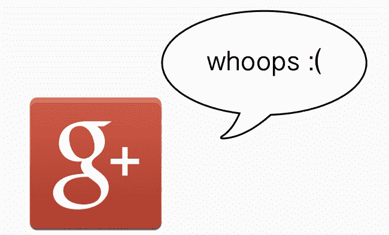

# 3 年后，Google+放弃了愚蠢的实名制，并向 TechCrunch 道歉

> 原文：<https://web.archive.org/web/http://techcrunch.com/2014/07/15/3-years-later-google-drops-its-dumb-real-name-rule-and-apologizes/?ncid=rss&utm_source=feedburner&utm_medium=feed&utm_campaign=Feed:+techcrunch/social+(TechCrunch+%C2%BB+Social>)

# 3 年后，Google+放弃了愚蠢的实名制并道歉

自从谷歌+ 推出以来，许多人抱怨这项服务要求用户使用真实姓名。当谷歌开始推动用户使用 Google+在 YouTube 上发表评论时，抱怨声越来越大。

不喜欢你的法名？出于安全或个人原因使用另一个名字？只是不想让互联网知道你的名字，但仍然想用你在 YouTube 上的机智让世界震惊？太糟糕了。据报道，如果不能使用真名，埃里克·施密特建议寻找另一个社交网络。

这个想法是人们不太愿意用真名留下糟糕的评论。相反，许多合法的评论者停止了评论，而许多混蛋只是用了他们的真名(或者任何谷歌认为是他们真名的名字)。)

三年后，谷歌放弃了这场战斗。你现在可以随意使用任何名字。如果你使用“屁股脸麦基”这样的词，他们可能会有一些问题，但谷歌的官方说法是“对你可以使用的名称不再有任何限制。”

谷歌在 2012 年 1 月首次开始取消实名制，开放规则，包括婚前姓名和选择昵称。但即便如此，你最初的真名还是会显示在你选择的名字旁边——如果你试图选择谷歌不喜欢的名字，他们会马上退回去。

谷歌宣布了今天的变化通过(还有哪里？)他们的 [Google+页面](https://web.archive.org/web/20230129062830/https://plus.google.com/u/0/+googleplus/posts/V5XkYQYYJqy)，并道歉说他们花了这么长时间才做出这个决定。直接引用 m 的话:

> 我们知道你呼吁这种改变已经有一段时间了。我们知道我们的名称政策不明确，这给我们的一些用户带来了一些不必要的困难。对此我们深表歉意，我们希望今天的改变是朝着让 Google+成为我们所希望的欢迎和包容的地方迈出的一步。