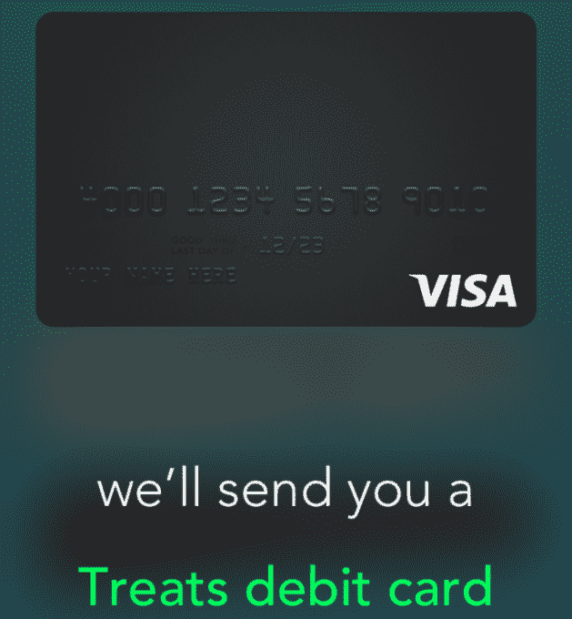
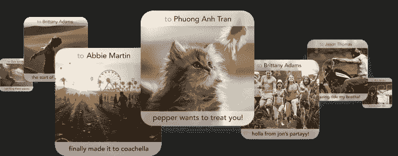
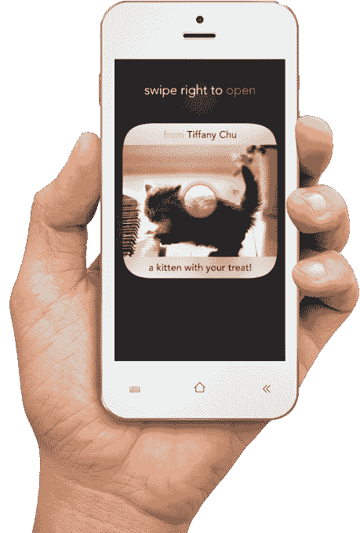
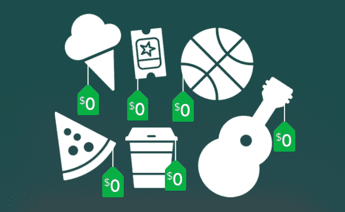

# Clinkle 从其变质的品牌转向分享折扣的“款待”

> 原文：<https://web.archive.org/web/https://techcrunch.com/2015/01/13/social-slot-machine/>

自 Color 以来，还没有一家初创公司像陷入困境的斯坦福支付初创公司 Clinkle 一样受到如此广泛的嘲笑。因此，该公司将其应用程序的名称和方向都改为“Treats”也就不足为奇了。在看到该公司的网站更名后，我与 23 岁的首席执行官卢卡斯·杜普兰进行了交谈，以了解 Treats 将如何运作。

现在，私人测试产品的中心是你用 Treats 借记卡支付物品，以赚取“奖励”——本质上是你发给朋友的彩票，如果他们“赢”了，就支付他们下次购买的全部费用。

 Clinkle 的网站仍然提到点对点支付，但它被弱化了，并被排除在移动端的“了解它如何工作”流程之外。这种转变让 Treats 避开了来自 Venmo、Square 和 Snapcash 的竞争，专注于对早期用户来说有些独特和有吸引力的东西:奖励。

该公司(仍称为 Clinkle)实际上是一家发卡银行，通过每次你用 Treats 卡购物时从收单银行收取的交换费来赚钱。你不用付那些费用。

问题是，一个你自己都用不上而不得不送给朋友的折扣机会，是否会说服大学生去办一张新的借记卡。面向 iOS 系统和安卓系统[的零食正在“面向大学生”进行私人测试，大约有 140，000 人在等待名单上，所以可能还需要一段时间才能有人尝试。](https://web.archive.org/web/20230325225016/https://play.google.com/store/apps/details?id=com.clinkle&hl=en)

## 离开贝宝的方式

早在 9 月份，[这家隐秘的初创公司意外地推出了](https://web.archive.org/web/20230325225016/https://techcrunch.com/2014/09/23/clinkle/),在网站上详细介绍了 Clinkle 的运作方式。在因为[筹集了 3000 万美元](https://web.archive.org/web/20230325225016/http://www.crunchbase.com/organization/clinkle)而被指责了 17 个月后，只能被称为 vaporware，并看到它的[高管跳槽](https://web.archive.org/web/20230325225016/https://techcrunch.com/2014/03/13/more-dramz-at-clinkle/)，至少我们知道 Clinkle 的存在，即使许多人认为这是一个愚蠢的想法。

该公司自己的[设计总监 Rob Ryan](https://web.archive.org/web/20230325225016/http://valleywag.gawker.com/clinkle-is-bribing-college-students-with-a-vending-mach-1663325836) 在[产品搜索](https://web.archive.org/web/20230325225016/http://www.producthunt.com/posts/clinkle)上承认“当然，这是 Venmo”，但有能力赚取和发送奖励。用牵引力和贝宝的支持复制一个五年前的“偿还你的朋友”创业公司可能不会奏效。所以现在 Clinkle 正在加倍开发测试版中流行的更古怪的功能。

## Treats 如何工作

对 Clinkle 的模糊描述越来越多，但杜普兰给了我他的新应用 Treats 实际功能的细节:

1.  你注册了 Treats，订购了它的借记卡，并向其中添加了钱。
2.  你像平常一样刷你的 Treats 卡购物，没有额外的费用，[尽管使用 ATM 要收费，等等](https://web.archive.org/web/20230325225016/https://www.clinkle.com/legal/bancorp-cardholder-agreement)。
3.  每七次购买后，您将获得一份奖励。
4.  你拍一张照片来创建一个虚拟礼品卡，然后把礼物送给朋友。你不能自己赎回。
5.  你的朋友得到通知，他们有一个等待解锁的礼物。
6.  其他朋友可以看到锁定的零食和它的照片，并可以“提升”aka Like the Treat 以增加它成为赢家的机会。
7.  收到奖励的朋友刷他们的奖励卡进行购买，打开奖励。
8.  如果请客是赢家，他们会立即得到他们刚刚购买的全部价格的退款。
9.  无论他们是否中奖，他们都会看到你寄给他们的照片礼品卡。

是的，这是一个相当复杂的序列，有很多失败点。在你从零食中获得任何真正的价值之前，一个朋友必须购买七次，选择你得到零食，你必须用零食买东西，你必须运气好并且赢。

但是，嘿，至少它不仅仅是一个文莫克隆体。Treats 将与 Apple Pay 和其他移动支付系统合作，而不是与之对抗。最终，Treats 希望手机钱包将成为主流，它可以开始简单地发行数字借记卡。它从实体卡片开始，就像网飞从 DVD 开始一样——因为目前它们的使用范围更广

## 社交老虎机

通过游戏化交易，Treats 希望让人们更频繁地购买，这可能会受到商家的青睐。有一天，它希望他们在应用程序中有更多的存在，并帮助当地的商业发现。

然而，游戏化行业充斥着尸体。围绕忠诚度计划有一大堆，还有一些仍在运行，如 [LevelUp](https://web.archive.org/web/20230325225016/http://www.crunchbase.com/organization/levelup) 。

Treats 唯一吸引人的地方是它的赌博方面。众所周知，可变奖励会刺激上瘾，这款应用是名副其实的社交老虎机。零食将不得不依靠中奖的诱惑来吸引人们刷卡。但是也许，仅仅是也许，如果大赢家的故事成为病毒，Treats 可以清除 Clinkle 的名字。

