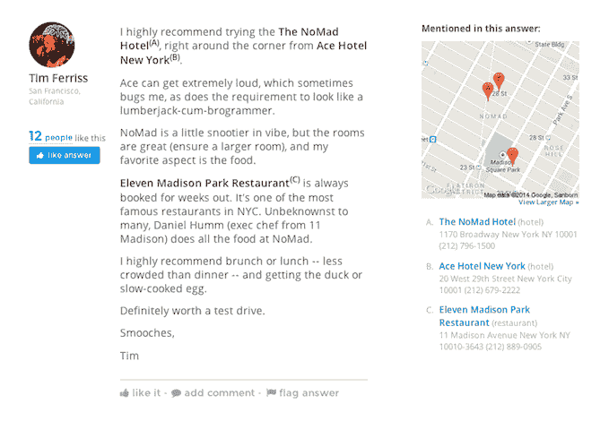
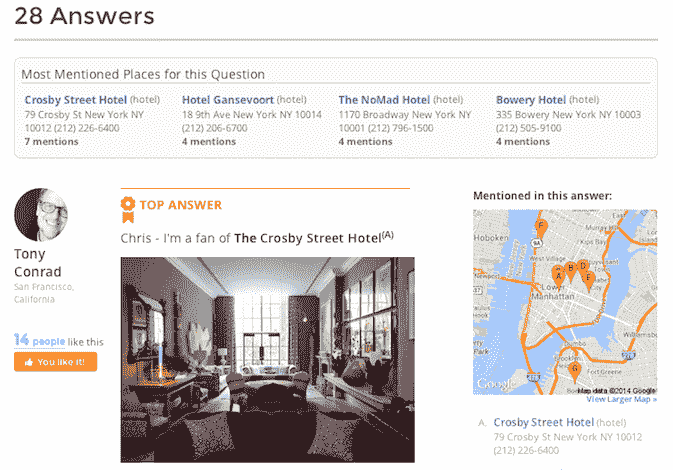
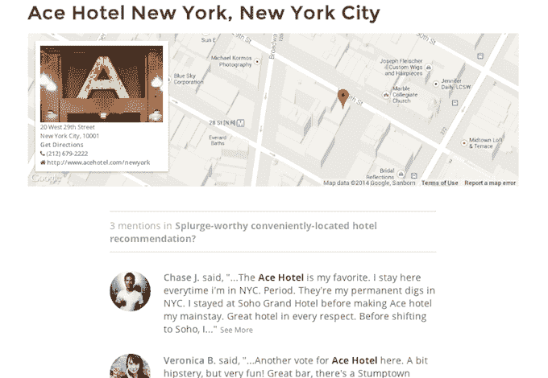

# 社交旅行规划师 Trippy 重新推出问答服务，再筹集 350 万美元 

> 原文：<https://web.archive.org/web/https://techcrunch.com/2014/04/29/social-travel-planner-trippy-relaunches-as-qa-service-raises-3-5-million-more/>

2011 年在[TechCrunch Disrupt](https://web.archive.org/web/20221208133717/https://beta.techcrunch.com/2011/09/13/trippy-bringing-your-friends-and-social-recommendations-to-travel-planning/)首次亮相的社交旅行规划师 Trippy ，今天正式推出新的专注于 Q & A 的旅行规划服务，改变了仅限朋友的模式。这项新服务让当地人和其他熟悉某个地区的人发现并回答其他游客和潜在游客的问题。

该公司还宣布在去年结束的一轮 A 轮融资中追加 350 万美元的融资，由 eVentures 牵头。True Ventures 和红杉资本也参加了。

Trippy 创始人 J.R. Johnson 解释说，该公司之前提供的社交旅行服务一直在挣扎，没有增长。“我们最初走的纯朋友路线——不太自然，”他说。“这不是我们的用户告诉我们他们想要的。他们想浏览更多内容，他们想在朋友圈之外获得更多信息。”

约翰逊拒绝提供用户数据来说明变化前后 Trippy 社区的规模。

新产品是一个基于问答的社区，在 1 月份向更广泛的群体试运行之前，已经进行了大约 6 到 9 个月的私人测试。改版后的网站设计引人入胜且易于使用，因为它是一个更熟悉的类似搜索引擎的界面，然后引导你进入关于地点或其他主题的页面。

Trippy 还会在注册过程中向你提出几个问题，让你说出几个你知道的地方或你住过的地方。这有助于网站按照你的方式将相关问题引导给其他旅行者。而且这些问题也不必简单到“纽约有哪些好酒店？，“例如，但可以更会话化，如“[现在纽约的酷孩子住在哪里](https://web.archive.org/web/20221208133717/http://www.trippy.com/question/New-York-City-Where-do-the-cool-kids-stay-in-NYC-these-days)？”

当你回答问题时，在你的回答中引用地点和场所，这些项目被标绘在屏幕一侧的地图上。你也可以添加照片，从你的电脑或社交网络，或通过知识共享(公开许可的图片)从其他来源挑选。

虽然这个版本的 Trippy 是新的，但有一点需要注意的是，该网站已经有了很多优质内容，这要归功于该公司已经花了很多时间来建立其社交社区。例如，查看关于"[看纽西兰](https://web.archive.org/web/20221208133717/http://www.trippy.com/question/New-Zealand-What-is-the-best-way-to-travel-in-and-around-New-Zealand)、" "[七月哥本哈根](https://web.archive.org/web/20221208133717/http://www.trippy.com/question/Copenhagen-Design-enthusiast-spending-5-days-in-July)、"[开普顿两天半](https://web.archive.org/web/20221208133717/http://www.trippy.com/question/Cape-Town-How-to-spent-2-5-days-if-first-time-in-Cape-Town)"的问题

例如，Trippy 和更通用的问答网站如 Yahoo Answers 或 Quora 之间有一些重叠，但前者往往提供低质量或过时的回答，而后者可能偶尔有答案，但没有照片或地图。与此同时，Trippy 更大的竞争对手是像旅游巨头[猫途鹰](https://web.archive.org/web/20221208133717/http://www.tripadvisor.com/)这样的地方，它们在过去 12 个月里发表了 5000 万条评论。

“评论很好，但它们缺乏大量的背景…你在谈论与你去过的某个地方相关的经历，”约翰逊谈到猫途鹰这样的地方时说。然后，最终用户必须尝试确定评论的可信度，并尝试挑选出与他们相关的内容。他继续说道，问答环节是不同的，因为你可以询问一条非常具体的信息，然后得到一系列的回答。

虽然 Trippy 现在不再只是一项仅限朋友的服务，但它并不限制你带朋友来体验。您的问答可以通过与脸书和 Twitter 的集成分享到您的个人网络，或者您可以通过电子邮件、即时消息或您选择的其他方式直接分享链接。

约翰逊说，这种分享是他希望 Trippy 在短期内解决分销问题的方式，但他承认 SEO 是这里的长期玩法。“很多旅游研究仍然是通过搜索引擎优化完成的，”他说。“这将是我们前进的重要一环。”

图片鸣谢:TrippyFlickr 用户 [Kuster & Wildhaber 摄影](https://web.archive.org/web/20221208133717/https://www.flickr.com/photos/wildhaber/5976264120/in/photolist-a76V7y-akMbDF-6Ug5aQ-8mjP2t-eyGNSc-bqoaSu-Epu8J-9ZZ7Ta-cR5um-cR5uk-2fKeRs-4t1z5J-E5Smr-E5SfA-5nHZAx-E64xT-E64zo-E5SiQ-8rFV8c-aD94hz-5Ui26R-69UDUK-9Vwbk9-5UnoRy-VL7a-dFS14-6dxGmu-muN6p-859oy4-E5SgC-muNjH-bqbT3W-5qUY1e-7kY2t-5XrYL3-m2dNUe-6EqTR-ks4pW-6xQweR-xxE2x-4CQuA9-deT76D-fiJxmq-fhRVbv-9MKNq8-88Rvdi-x3pYS-9NDhvd-c1CJzu-7RVBRy)持有 [CC BY-ND 2.0](https://web.archive.org/web/20221208133717/https://creativecommons.org/licenses/by-nd/2.0/) 许可证