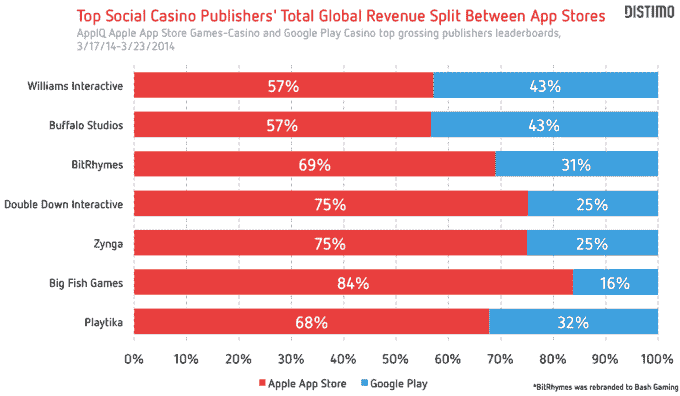

# Distimo TechCrunch 表示，社交赌场游戏是最赚钱的手机游戏类别之一

> 原文：<https://web.archive.org/web/https://techcrunch.com/2014/04/02/socialcasino-distimo/>

# Distimo 表示，社交赌场游戏是最赚钱的手机游戏类别之一

Distimo 的一份新报告称，虽然社交赌场游戏比其他应用程序受到的关注少得多，但它是手机游戏中收入最高的类别之一。

该报告使用 Distimo AppIQ 的数据来了解不同出版商在 iOS 应用商店和 Google Play 中的收入。

尽管他们没有得到 [Supercell](https://web.archive.org/web/20230209151713/http://www.supercell.net/) 、 [King](https://web.archive.org/web/20230209151713/https://king.com/) 、 [GungHo](https://web.archive.org/web/20230209151713/http://www.gunghoonline.com/games/) 和其他票房最高的游戏发行商的关注，社交赌场游戏制造商仍然在 iOS 应用商店和 Google Play 的票房前 100 名应用中占据重要地位。

Distimo 发现，在 iOS 应用商店中，3 月 17 日至 3 月 23 日全球总收入最高的发行商中，有 20 家发行商位列发行至少一款社交赌场游戏的前 100 名。在 Google Play 的类似排行榜上，它找到了 19 家发行商。

七大社交赌场游戏制造商在 App Store 上的收入都超过了 Google Play。事实上，大鱼游戏 84%的总收入来自应用商店。威廉姆斯互动和水牛城工作室在 Google Play 上以 43%的总收入份额并列第一。

在 App Store 上，《Slotmania》的创作者 [Playtika](https://web.archive.org/web/20230209151713/https://playtika.com/) 是排名第一的发行商，在前 10 大发行商中占总收入的 21%。[大鱼游戏](https://web.archive.org/web/20230209151713/http://www.bigfishgames.com/)位居第二，占总收入的 16%。 [Zynga](https://web.archive.org/web/20230209151713/http://www.zynga.com/) 位居第三，占 12%。

Playtika 也是 Distimo Google Play 排行榜上的第一名，在十大发行商中占总收入的 22%。第二大开发商是水牛城工作室(Buffalo Studios )( T7 ),占 11%的份额，这使得第一和第二发行商之间的差距比 ios 应用商店上的差距更明显。

Playtika 是社交赌场游戏的几家顶级发行商之一，已被赌场运营商和游戏制造商收购。它现在归凯撒娱乐公司旗下的凯撒互动娱乐公司所有。凯撒还从电子艺界购买了水牛城工作室、太平洋互动和世界扑克系列手机应用程序的权利。