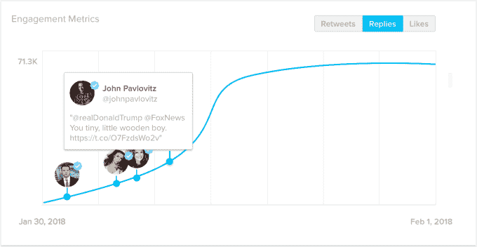

# SocialRank 的新产品帮助营销人员理解为什么推文会像病毒一样传播

> 原文：<https://web.archive.org/web/https://techcrunch.com/2018/02/06/socialrank-for-content/>

# SocialRank 的新产品有助于营销人员理解为什么推文会像病毒一样传播

在过去的几年里， [SocialRank](https://web.archive.org/web/20230328183314/http://socialrank.com/) 的团队一直在为品牌和营销人员寻找方法，让他们更好地了解在社交媒体上关注和参与他们的。到目前为止，他们一直在账户层面上这样做——插入一个账户，你就会得到一份 SocialRank 报告，涵盖你最有价值的追随者等内容。

凭借一款名为 [SocialRank for Content](https://web.archive.org/web/20230328183314/https://socialrank.com/content) 的新产品，该公司正在[将类似的分析应用于推文和 Instagram 帖子](https://web.archive.org/web/20230328183314/https://socialrank.blog/introducing-socialrank-for-content-847d957bc77b)，为用户提供关于谁在何时参与了每条内容的数据。

联合创始人亚历克斯·陶博(Alex Taub)表示，虽然 SocialRank 在 Twitter 和 Instagram 周围提供类似的数据，但他认为每个平台上的用例会有所不同。

在 Twitter 上，这成了用户了解某条推文为何走红的一种方式。换句话说，如果你还没有数百万的关注者，而你发布的东西突然获得了数千个赞和转发，那就很难重建发生了什么。(至少有人告诉我:可悲的是，我自己从未经历过这种情况。)是因为某个特定的人转发了你吗？

有了 SocialRank for Content，你实际上会看到一条时间线，显示你的帖子的参与度。因此，如果事情发生时有一个特定的转折点，你可以看到谁转发了你，并成为你发推的真正跳板。

现在，如果你不是渴望转发的人，这听起来可能有点无聊。但是，如果你是一个需要获得更多关注者和更多参与的营销人员，这些数据可以让你集中精力——如果有一个用户在推广你的内容方面特别有效，那么你知道下次应该向谁寻求帮助。

另一方面，在 Instagram 上，Taub 建议这可以用作评论管理的工具——而不是浪费时间回复每一条评论，你可以根据发布评论的人的关注情况，看到哪些评论应该优先处理。

陶博还认为，在对假粉丝的审查越来越多的时候，这一分析尤为重要。需要明确的是，这不是一个寻找那些追随者的工具(这是 SocialRank 正在单独研究的东西)，但它确实有助于营销人员找到真正的参与，从而实际上导致更多的参与。

SocialRank 目前正在有限的用户群中测试该产品。Taub 说，仍在试验的一个方面是定价，尽管基本想法是，你将根据你正在分析的推文或帖子的数量付费。