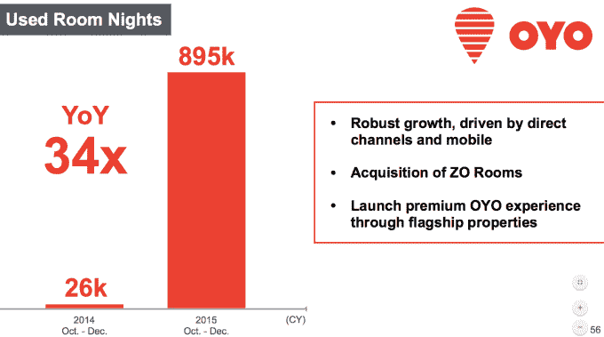

# 软银证实 OYO 客房正在购买竞争对手的经济型酒店网络 ZO 客房技术危机

> 原文：<https://web.archive.org/web/https://techcrunch.com/2016/02/10/softbank-confirms-oyo-rooms-is-buying-rival-budget-hotel-network-zo-rooms/>

# 软银证实 OYO 酒店正在购买竞争对手的经济型酒店网络 ZO 客房

官方消息——有点像——总部位于印度的经济型酒店网络 OYO 酒店集团，到目前为止已经从投资者那里筹集了 1.25 亿美元，正在收购竞争对手 ZO Rooms。

自去年 12 月以来，人们一直在猜测这笔交易，但似乎已经得到了 [OYO 房间投资者软银](https://web.archive.org/web/20230128055631/https://techcrunch.com/2015/08/03/softbank-oyo-rooms/)的证实，该公司在今天发布的最新财务报告中把这笔交易列入了[。](https://web.archive.org/web/20230128055631/http://cdn.softbank.jp/en/corp/set/data/irinfo/presentations/results/pdf/2015/softbank_presentation_2015_003.pdf)

目前没有价格信息或进一步的细节，软银确认的只是 OYO 酒店将收购 ZO Rooms，该公司获得了由 Tiger Global 领导的价值 3200 万美元的 B 系列酒店。此外，印度科技博客 [NextBigWhat 注意到](https://web.archive.org/web/20230128055631/http://www.nextbigwhat.com/zo-rooms-shutdown-297/)ZO Rooms 的网站已经关闭 24 小时了。

当我们联系他们寻求澄清时，两家公司都拒绝置评。

然而，TechCrunch 确实明白，一项官方公告即将发布，可能会在未来两周内发布。此外， [TechCircle 报告](https://web.archive.org/web/20230128055631/http://www.vccircle.com/news/media-entertainment/2016/02/10/oyo-buys-zo-zostel-all-stock-deal-zo-founders-quit)ZO Rooms 可能会因此裁员 200 名员工中的一半。

OYO 客房目前在印度的 165 个城市开展业务，最近还进军了东南亚，这个人口超过 6 亿的地区，像[Rocket Internet-backed Zen Rooms](https://web.archive.org/web/20230128055631/https://techcrunch.com/2015/11/29/zenrooms/)和 [Redoorz](https://web.archive.org/web/20230128055631/https://techcrunch.com/2016/01/15/reddoorz/) 这样的公司正在开创经济型酒店的模式。ZO Rooms 覆盖了印度 30 多个城市，它也进入了东南亚，并打算扩张。

OYO 房间是由 21 岁的泰尔研究员里泰什·阿加瓦尔创建的。去年 4 月，这家初创公司筹集了 2500 万美元，打破了一家由 Thiel Fellow 创办的公司的融资记录，随后于 8 月[完成了 1 亿美元的 B 轮融资](https://web.archive.org/web/20230128055631/https://techcrunch.com/2015/08/03/softbank-oyo-rooms/)。ZO Rooms 也有很好的支持，这也不是老虎环球和软银第一次联手了。这两个组织都是印度最活跃的投资者，他们之前曾联手支持优步的竞争对手 Ola 和印度的超本地送货初创公司 Grofers，以及中国的按需乘车公司滴滴快的。

这种整合很有意思，因为今年印度的投资环境更具挑战性，其他公司纷纷取消雄心勃勃的增长计划。最近几周，按需杂货公司 [Grofers](https://web.archive.org/web/20230128055631/https://techcrunch.com/2016/01/05/indian-hyperlocal-delivery-startup-grofers-pulls-out-of-9-cities/) 和 [PepperTap](https://web.archive.org/web/20230128055631/https://techcrunch.com/2016/02/09/fearing-current-investment-climate-indias-peppertap-scales-back-its-e-grocer-service/) 都撤出了城市，并取消了大规模扩张计划，以节省资金并锁定其商业模式。可能是不断恶化的投资环境迫使 ZO·Room 插手此事，也可能是两家公司及其投资者认为齐心协力是向前发展的最佳方式。