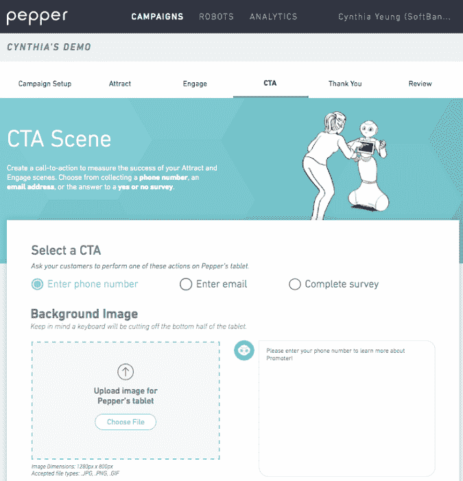

# 软银让定制 Pepper 机器人的问候技能变得更容易 

> 原文：<https://web.archive.org/web/https://techcrunch.com/2017/05/01/softbank-lowers-the-barrier-of-entry-for-its-pepper-robot-with-a-simple-programming-app/>

# 软银让定制机器人 Pepper 的问候技能变得更加容易

到目前为止， [Pepper 机器人](https://web.archive.org/web/20221206121642/https://beta.techcrunch.com/2016/11/22/pepper/)需要编程知识来控制，这一事实已被证明是更广泛采用的一个痛点(嗯，这一点以及它尚未在美国广泛上市的事实)。今天早上，该公司推出了 Promoter，这是一个基于浏览器的解决方案，可以让任何人定制机器人的动作——尽管范围相当有限。

该公司承诺，Promoter 应用程序将是未来几个解决方案中的第一个，它本质上是在响应和填写文本表格之间进行选择的混合，以便在机器人与客户互动时提供相对差异化的体验，在商店前吸引他们的注意力，并试图说服他们放弃平板电脑上的重要联系信息和其他适销信息。

该公司表示，使用该应用程序需要“脸书级别的用户”，我可以通过演示来证实这一点。当然，这限制了机器人能够做出的复杂反应。这更像是选择对各种输入的固定反应。尽管它仍然有一些有趣的技巧，比如根据系统基于视觉数据确定年龄、性别和情绪反应的尝试来定制响应。

至于开箱即用的机器人编程解决方案，这都是非常简单的东西。虽然软银承诺将从其团队中获得更多，但第一个解决方案非常清楚地表明了该公司希望其机器人实现的关键应用:用其新颖性吸引客户，并将他们带到一个商业场所或从他们那里获取信息。

鉴于创造 Pepper 的技术高度复杂，我们很遗憾没有看到它被用在更有趣的场合，而不仅仅是作为商店的迎宾员。该机器人零售套装的起始价格为 25000 美元，这将需要大量的电子邮件注册才能证明其价格合理。

通过 Pepper 的前身 Nao，该公司证明了它有能力制造先进的研究机器人；更先进的[罗密欧](https://web.archive.org/web/20221206121642/https://www.ald.softbankrobotics.com/en/cool-robots/romeo)也是如此。当它在六年后推出 Pepper 时，很明显它有更多的平民主义目标。代替实验室和机器人比赛，人形机器人大部分时间在商场和机场与人打招呼。

该公司承诺未来这种性质的应用将有助于扩展 Pepper 的潜在可用性。软银一直积极向制造商开放机器人，展示其潜在功能，但迄今为止，机器人大多仅限于高度铰接的移动亭。也许在 Pepper 月在美国上市之前，我们会看到更多。