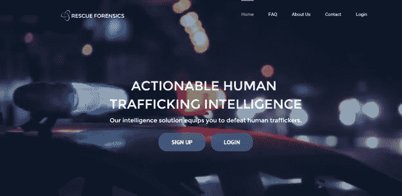

# 软件吞噬性交易:YC 的救援取证帮助执法部门寻找受害者 

> 原文：<https://web.archive.org/web/https://techcrunch.com/2015/02/20/software-eats-sex-trafficking-ycs-rescue-forensics-aids-law-enforcement-in-finding-victims/>

*(抱歉上面标题的粘性。这家公司，[救援取证公司，](https://web.archive.org/web/20221207013414/http://www.rescueforensics.com/)有一个非常迷人的背景故事。)*

大约十年前，[18 岁的瑞安·道尔顿](https://web.archive.org/web/20221207013414/https://www.linkedin.com/pub/ryan-dalton/37/227/b1)正在帮助一个朋友为在墨西哥雷诺萨红灯区工作的妇女建造一个中途之家。有一天，他目睹了一个暴力卡特尔的成员打了一个女人，并对她大喊大叫。

“当时我不知道把这叫做性交易，但我知道这是错误的，”他说。

这是我整个职业生涯的开始。在法学院期间，道尔顿在非营利组织“打破沉默”成立了一个反人口贩运部门，并在听证会上作证，以改变田纳西州关于人口贩运的 29 项法律和修正案。这些年的实地工作让他非常熟悉女性是如何被迫卷入性工作的。

道尔顿解释说，这几乎从来都不是绑架。他说，这不像很多人认为的连姆·尼森电影《刺杀金正恩》。

“这是对爱和信任的滥用，”他说。“这种深度的心理操纵几乎就像斯德哥尔摩综合症。他们不认为这是剥削，即使这些男人拿走他们的钱或虐待他们。”

人贩子会去寻找自卑的女性，然后给她们大量的关注、金钱或关怀。它可能从一段浪漫的关系开始，比如找一个新的男朋友。

“他们寻找生活在贫困中的孩子，离家出走的年轻人或寄养家庭的孩子，他们在生活中没有得到他们需要的来自成年人的关注，”他说。“但在某些时候，人贩子会做一个诱饵和开关。随着时间的推移，他们会培养这个人，直到他们变得顺从，为了得到爱而发生性行为。创伤纽带就产生了。”

他还看到随着互联网的出现，人口贩卖正在发生变化，调查人员需要一整套新的工具来打击涉及未成年女性的性工作。

“人口贩卖不再是在街头进行，警察可以观察和监控，”他说。“都到网上去了。”

法学院毕业后，他和联合创始人[布兰登·哈姆里克](https://web.archive.org/web/20221207013414/https://www.linkedin.com/pub/brandon-hamric/28/70a/722)开始兼职开发工具，可以过滤、跟踪和记录护送名单中涉及未成年人的潜在可疑行为。他们申请了 Y Combinator，并发誓如果他们被录取，他们将辞去工作，作为一家公司全职从事这项工作，称之为[救援取证](https://web.archive.org/web/20221207013414/http://www.rescueforensics.com/)。

基本上，Rescue Forensics 开发了搜索软件，帮助执法官员收集和记录在线证据，这些证据可用于在法庭上起诉人贩子。公司本身不对什么可能构成非法贩运行为做出任何判断。这要由调查人员来决定，因为有成年女性想从事性工作，而不是被贩卖。

但 Rescue Forensics 确实提供了一种记录和管理列表的方法，这些列表可以在 Craigslist 或整个地区的其他列表网站上快速弹出或消失。

道尔顿说，到目前为止，已有 9 名受害者获救。

当他接到关于第一部的电话时，他泪流满面。她 16 岁，从达拉斯搬到圣安东尼奥，然后搬到德克萨斯州的阿马里洛。

“使用救援取证，他们能够跟踪她的行动，插入她的手机，找到她的位置，进行诱捕并营救她，”他说。

哈姆里克和道尔顿免费提供软件。他们现在在美国和欧洲有几百个州和地方机构在使用它。

他们设想开发高级功能，然后利用他们与当地执法人员的密切关系，在其他领域开发更好、更有效的软件工具。到目前为止，他们已经筹集了 8 万美元的种子资金来支付服务器成本和差旅费。

他们计划在完成 winter Y Combinator 项目后搬回田纳西州。在西海岸这里是一个不同的世界，他们的任务是严肃的。

道尔顿说他会去旧金山参加晚宴。“每个人都会啜饮鸡尾酒或莫吉托鸡尾酒。他们会说他们正在建立一个广告网络，”道尔顿说。“当我被问到时，我通常会说‘网络智能’，希望他们不要来烦我。”

“如果他们问更多的问题，每个人的嗡嗡声都会被扼杀，”他打趣道。