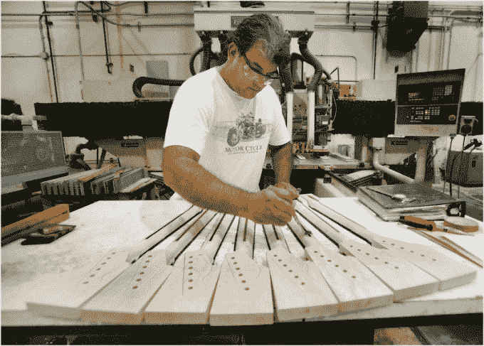
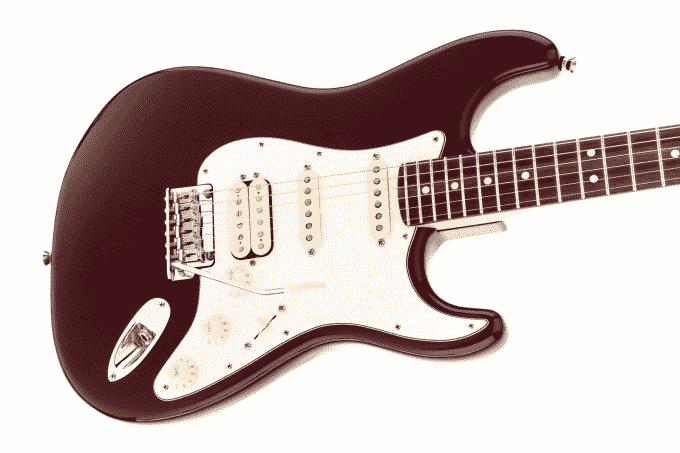

# 挡泥板数字化，让你不会放弃吉他 

> 原文：<https://web.archive.org/web/https://techcrunch.com/2015/09/10/software-is-eating-rocknroll/>

90%试图学习吉他的人在第一年就放弃了。这对乐器行业来说是一个大问题，但对顶级吉他制造商之一——芬达(T0)来说也是一个大机会。如果 Fender 可以使用数字工具，比如它正在开发的一个新的调音师应用程序，来吸引音乐家，那么在他们的一生中，它将向他们出售更多的吉他、扩音器等。

伊森·卡普兰，芬达新任首席数字产品官

这就是为什么今天 [Fender 宣布](https://web.archive.org/web/20230129223515/http://spotlight.fender.com/newsroom/news/497/)聘请音乐技术领域最聪明的人之一 Ethan Kaplan 担任新的首席数字产品官。

卡普兰是华纳兄弟唱片公司的长期技术 SVP，后来帮助创办了演唱会门票巨头的技术部门 Live Nation Labs。在过去的七个月里，他一直担任音频指纹先锋 Gracenote 的总经理。

我看过卡普兰在音乐技术会议上的演讲，他对于什么可行什么不可行的不废话的态度在一个空想家的行业里是令人耳目一新的。很少有人将卡普兰的历史背景与现代理解相结合，这对于了解音乐在技术面前将如何发展是必要的。

卡普兰告诉我，他的目标是通过使用技术来简化“从初学者到中级玩家再到高级玩家的旅程”，从而为芬达的大型乐器销售业务提供补充为了做到这一点，卡普兰说“我们必须倾听玩家的声音”，找出他们需要什么。

芬德最近聘请的首席执行官安迪·穆尼解释说，“我们有一个问题，让购买他们的第一把吉他的消费者终身承诺。”如果芬德成功地保持了音乐家的势头，他们最终会赚很多钱来购买多把吉他和扩音器。穆尼认为:“我们只需要将首次玩家的抛弃率降低 10%，就能让这个行业翻一番。”

我 15 岁的时候试着学吉他，但是很沮丧，因为我找不到用我知道的几个和弦弹奏的超级简单的歌曲。没有从我的乐器中听到真正的歌曲的满足感，我放弃了。大约 10 年后，我再次拿起斧头，我坚持使用它，只是因为我偶然发现了一些我喜欢的歌手“明亮的眼睛”的非常简单的曲调。

穆尼也有类似的经历。从小到大，他一直在“挣扎”，因为他不知道如何演奏他最喜欢的歌曲。20 年后，他才发现这是一个不同的调音。芬德想要解构这些障碍。

最终，该公司希望为吉他琴谱(如何演奏歌曲的基本说明)、曲目下载和更深入的音乐教育开发应用程序。但 Fender 数字化转型的第一步将是 Kaplan 正在开发的一款新的吉他调音应用。

在这拥挤的垂直空间突围并不容易。已经有一些流行的独立开发的调音应用程序，还有像 Gibson 这样的音乐巨头开发的。芬德将不得不努力使自己与众不同。

这就是 Kaplan 的软件和网络知识的用武之地。他正在开发一个身份层，将调谐应用程序与未来的 Fender 数字产品联系起来。通过这种方式，芬德可以了解一位音乐家，然后个性化每次体验。

例如，如果调谐器知道你喜欢哪种音乐，它会推荐不同的调谐配置来尝试。或者，如果它知道你在听什么，或者你知道如何弹奏什么和弦，它可以建议你快速学习歌曲的标签。如果 Fender 的应用程序可以听到你的演奏，或者至少知道你演奏的频率，它可以建议你购买新的吉他琴弦或它的一个效果踏板。从应用程序到应用程序到产品的捷径可以让玩家留在挡泥板生态系统中。

“这不仅仅是制作一个调谐应用程序，然后是另一个应用程序，再一个，”卡普兰说。“这关系到我们如何打造一款能做更多事情的产品，并支持整个旅程，而不仅仅是实用性。它看起来像是将一堆产品捆绑在一起的纽带。”

调谐器之外，景观变得更加混乱，充满了潜在的挡泥板。大多数在线标签都没有被证实是准确的，音乐家们花费数小时浏览 YouTube 上平庸的教程视频来寻求帮助。他们渴望学习所有必要的技能，穆尼说:“我们认为我们是唯一适合连接这些点的人。”

你可能会认为 DJing 和**E**electronic**D**ance**M**usic 的兴起会给 Fender 这样的模拟仪器制造商带来困难。但事实证明，传统乐器的销售仍在增长，尽管速度缓慢。穆尼说，泰勒·斯威夫特正在激励新一代年轻女性拿起一个挡泥板。如果卡普兰的工具可以让斯威夫特的歌曲更容易学习，那些粉丝可能会在他们的愿望清单上的“空白处”放更多的吉他。