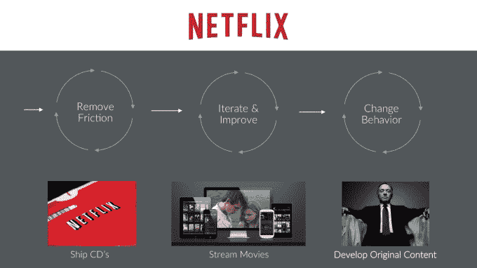
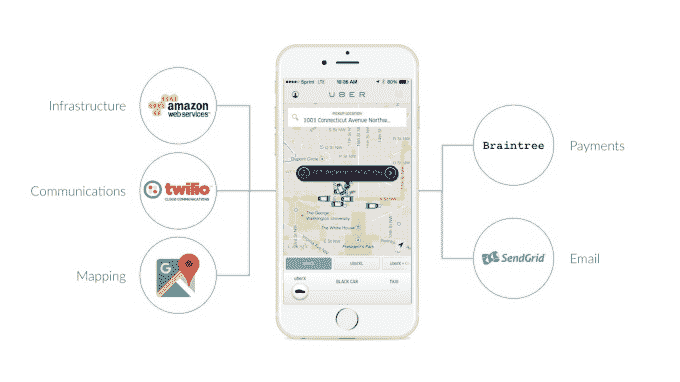

# 软件仍在蚕食世界 

> 原文：<https://web.archive.org/web/https://techcrunch.com/2016/06/07/software-is-eating-the-world-5-years-later/>

Jeetu Patel 是 Box 平台的首席战略官和负责人。

五年前，马克·安德森在华尔街日报写下了他著名的“[为什么软件正在吞噬世界](https://web.archive.org/web/20230217013826/http://www.wsj.com/articles/SB10001424053111903480904576512250915629460)”的文章。如今，“每个公司都需要成为软件公司”的观点几乎被认为是老生常谈。无论你从事什么行业，你都应该重新规划自己的业务，以确保自己不会成为下一个被优步(Alibaba)或 Airbnb 弄得措手不及的本地出租车公司或连锁酒店。尽管不被初创公司或竞争对手“扰乱”的倾向是有益的，但这也不太实际。

对于一个非技术传统行业的公司来说，开始像软件公司一样思考和行动绝对不是小事。这就是为什么我们现在最常联想到“为什么软件正在吞噬世界”的公司都是初创公司，只有少数明显的例外(比如通用电气)。最终，如何实现这种转变并没有蓝图，但我确实认为可以从过去五年中最成功的公司那里学到两个主要的教训或起点:时机和专注。

## 时机就是一切

重要的是要理解安德森的想法在 2011 年是多么有先见之明。当时，互联网无孔不入。亚马逊已经存在了十年，iPhone 诞生了四年，App Store 诞生了三年，为数百万开发者带来了[25 亿美元](https://web.archive.org/web/20230217013826/http://www.apple.com/pr/library/2011/07/07Apples-App-Store-Downloads-Top-15-Billion.html)的收入。脸书有 8 . 45 亿用户，网飞每个季度有 20 亿小时的流媒体内容。大多数人会说，我们终于完全沉浸在技术时代，互联网改变了一切。换句话说，未来就在眼前。

而且，正如马克预测的那样，他们会大错特错。正如他所说:

*“计算机革命已经过去了 60 年，微处理器发明已经过去了 40 年，现代互联网的兴起也已经过去了 20 年，所有通过软件改变行业的技术最终都发挥了作用，并且可以在全球范围内广泛传播。”*

[优步](https://web.archive.org/web/20230217013826/https://www.crunchbase.com/organization/uber)成立于 2009 年，2010 年开始服务。除了一个小型但忠诚的骑手社区和旧金山当地的机场豪华轿车司机，很少有人知道 2011 年的优步是什么，也没有人参与关于“x 的优步”的无休止的对话。类似地，Airbedandbreakfast.com(后来更名为 [Airbnb](https://web.archive.org/web/20230217013826/https://www.crunchbase.com/organization/airbnb) )成立于 2008 年，但仅在 2014 年就达到了[100 万份房源。今天，很难想象如果没有这两种服务，在繁忙的城市中出行会是什么样子。](https://web.archive.org/web/20230217013826/https://twitter.com/bchesky/status/541655860271783937)

> 聪明的玩家不一定从上到下构建出他们对未来的全部愿景。

和安德森一样，优步和 Airbnb 对“软件吞噬世界”的理解是，不可思议的创新往往出现在似乎一切都被改变了、我们已经达到新常态的时刻。优步和 Airbnb 看到了云的世界，iPhone，App Store，AWS 和谷歌地图，并对自己说:“不是我们现在能做什么，而是更好；这是关于我们现在能做什么，这在今天之前是不可能的。”正是这种不连续的飞跃——在新平台兴起的支持下——导致一家公司解散了运输行业或重新塑造了酒店业。

网飞也是一个有趣的案例，尽管它远非 2011 年的初创公司。他们开始将 DVD 运送到人们的家中，以便人们可以观看电影，而不必经历去 Blockbuster 旅行的麻烦，然后演变为在人们家中舒适地提供流媒体电影。

像优步和 Airbnb 一样，网飞环顾了一下可供他们使用的平台和基础设施(先是美国邮政，然后是宽带互联网)，并问他们可以在这些平台上做些什么，这些平台要么是没有人想到的(运送 DVD)，要么是以前不可行的。2013 年，他们经历了从技术提供商和服务到内容创作者的不连续飞跃。

现在，他们认为自己更像是 HBO 这样的电影工作室，创造原创节目，尽管它对来自用户群分析的观看行为有着广泛而独特的理解。

这是一种重复出现的创新模式。聪明的玩家不一定从上到下构建出他们对未来的全部愿景。他们四处寻找能为人们解决问题的灵感(搭车、找地方住、消磨时间)，然后利用他们可用的平台以全新的方式解决问题。

有时候，像网飞一样，这个过程更加渐进(或者，正如本·汤姆森所描述的那样，“T1”)；其他时候，基础设施是为更戏剧性的、不连续的转变而准备的。

当然，拥有愿景是一回事，实现愿景本身就是另一个挑战——因此第二课是…

## 专注于你的核心

对于传统的工业或服务公司来说，向软件公司转型是一项艰巨的任务。你需要在你组织的每一个部分雇佣新人；围绕不同经济学进行重组；重建客户、合作伙伴和供应商的关系和期望；检修基础设施。名单很长，充满了恐怖。

如果你有一个健康的业务，收入来源可以锁定多年，那很好。这意味着你可以现在就开始解决这个问题，并且知道你可能有几年的时间来解决这个问题。这是一个很好的环境，但是即使在这种情况下，测试和迭代的速度和能力也是必需的；要快速行动，你需要集中注意力。正如史蒂夫·乔布斯曾经说过的一句名言，“决定不做什么和决定做什么一样重要。”

> 当谈到技术时，专注于您的核心可以更容易地专注于您的最终客户体验。

一个在实践层面上展示专注力量的好方法是回到优步，它通过解决一个非常现实的问题而取得了巨大的增长，这个问题就是为大众提供一种方便、舒适和相对负担得起的交通服务。优步是如何实现如此快速的增长和扩张的？正如我们刚刚讨论的，他们看到了移动的新现实——每个人，包括司机和骑手，口袋里都有一台联网的计算机——并利用这种新常态作为平台，以一种从未想象或实现的方式将人们聚集在一起。

优步没有自己的车。他们也不直接雇佣自己的司机。因此，有人可能会问，他们拥有的核心资产到底是什么？围绕优步体验的核心应用和生态系统是他们的主要资产和竞争优势。但是为了传递这种体验，他们应用严格的焦点。

在实践层面，当你看到优步世界知名的应用程序的技术组件时，他们决定依靠其他核心平台和技术来驱动许多关键元素。

它们运行在亚马逊提供的基础设施上，因此它们可以在世界各地运行。他们的地图技术是由[谷歌地图](https://web.archive.org/web/20230217013826/https://www.crunchbase.com/product/google-maps)以 API 的形式提供的，所以司机会选择最快的路线，你总是知道你在哪里。他们的消息堆栈由 [Twilio](https://web.archive.org/web/20230217013826/https://www.crunchbase.com/organization/twilio) 提供，确保当你的司机到达时你能收到正确的短信。他们向乘客发送收据等信息的电子邮件服务是建立在 send grid API 上的。

优步把这一切都留给了专注于这些元素的专家，他们把这些元素作为各自的核心业务。相反，优步专注于为客户打造世界级的体验，解决大众的交通问题，一次一辆车。

这种激光聚焦允许他们将全部精力放在他们试图解决的主要问题上，并依靠专家解决对他们的应用程序至关重要的其他重要方面，但这些方面不符合优步需要战略性地建立为核心竞争力的领域。这种方法的好处不仅在于构建初始应用程序，还在于将资源从对堆栈中这些非核心元素的持续维护中解放出来。

值得注意的是，它还在更广泛的生态系统中创造了创新推动力，因为这些非核心元素中的每一个都是提供服务的供应商的核心。这些供应商——或平台——需要在他们的领域快速创新，以确保他们对客户来说是不可或缺的。这是一个良性循环，优步自动从其应用程序的创新中获益。

每家公司都应该将这种计算应用到其数字战略中。下一个问题围绕着如何精确地确定哪些元素是核心的，哪些不是核心的:

*   非核心服务会为你的应用提供创新的动力吗？这可能有几个原因，例如在竞争激烈的市场中，专业供应商的创新速度非常快，而你的公司只需支付一小部分成本就能从中受益。如果出现了创新的顺风，那么使用提供这种服务的专家。例如，通过使用来自 [Braintree](https://web.archive.org/web/20230217013826/https://www.crunchbase.com/organization/braintree-payment-solutions) 的支付堆栈，优步能够从 Braintree 在其平台上实现的所有支付进步中受益。
*   该服务可以被其他供应商替代吗？根据定义，交换服务的能力意味着它不能保证它是你的核心竞争力。例如，优步在谷歌地图和[地图框](https://web.archive.org/web/20230217013826/https://www.crunchbase.com/organization/mapbox)之间切换。
*   该服务能否为我的客户提供中性到渐进式的体验改善？最重要的是，即使答案是它的影响是中性的(专家提供的体验与您自己构建服务所能提供的体验一样好)，继续自己做也没有什么意义。

当涉及到技术时，专注于您的核心可以更容易地专注于您的最终客户体验——这就是一家伟大的软件公司的特质。

根据[星座研究](https://web.archive.org/web/20230217013826/https://www.constellationr.com/content/research-summary-sneak-peeks-constellations-futurist-framework-and-2014-outlook-digital)的数据，超过 52%的曾经位列财富 500 强的公司在 2015 年不再榜上有名。可以有把握地认为，新进入者都将在其核心商业模式中创造了有意义的数字差异化。

因此，核心问题不是每个公司是否都必须根据其业务踏上某种数字化转型之旅，而是它们将如何实现这一转变。通过研究优步、Airbnb 和网飞的教训，我们可以学到很多东西，即敏锐地意识到我们周围的技术生态系统的价值，这种生态系统使世界变得适合颠覆，以及当有这么多事情要做、速度如此重要时专注的优势。

事实上，大多数走上这条道路的公司都会失败。正如 Andreessen 所说，“没有人应该期望在一个成熟的行业建立一个新的高增长、软件驱动的公司是容易的。这非常困难。”

当然，这也是它值得做的原因。