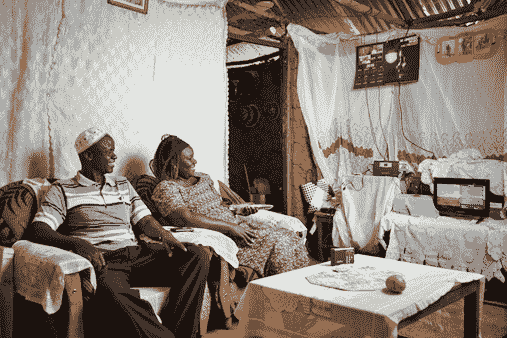
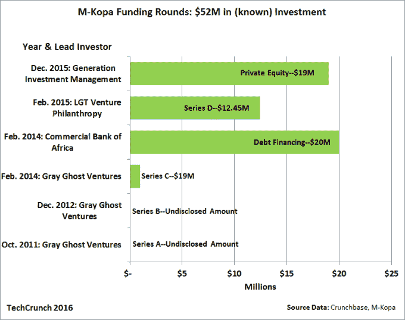

# 太阳能初创公司 M-KOPA 超越了非洲电网

> 原文：<https://web.archive.org/web/https://techcrunch.com/2016/04/28/solar-startup-m-kopa-leapfrogs-africas-electricity-grid/>

在东非，超过 30 万以前没有电的家庭正在用太阳能板为家庭和设备供电，并使用手机支付费用。

他们的电力供应商是 M-KOPA ，一家能源初创公司，其 IPO 雄心已经得到了 5200 万美元风险投资的支持。

该公司由加拿大人杰西·摩尔(Jesse Moore)共同创立，致力于为低收入和没有电的农村客户提供太阳能家庭系统。M-KOPA 的基准套件包括一个太阳能电池板、多设备充电器、灯、收音机和一个现收现付 SIM 卡。

在支付了 35 美元的押金后，那些希望照亮自己房子的人有一年的时间通过低至 0 . 50 美分的手机汇款来支付这笔费用。

该公司的起源可以追溯到沃达丰的联合创始人杰西·摩尔和尼克·休斯的工作。这家欧洲电信巨头是肯尼亚电信公司 [Safaricom](https://web.archive.org/web/20230323184251/http://www.safaricom.co.ke/) 的母公司，该公司提供 [M-Pesa](https://web.archive.org/web/20230323184251/https://techcrunch.com/2015/07/23/the-rise-of-silicon-savannah-and-africas-tech-movement/) 数字金融产品。

“M-KOPA 的萌芽可以追溯到 M-Pesa 的早期。我们开始看到……移动资金将为其他像我们这样的企业提供发展的轨道，”M-KOPA 的首席执行官摩尔说。

在第一轮融资后，M-KOPA 于 2012 年启动，成立了一家美国有限责任公司，以投资为目的，同时在肯尼亚、乌干达和坦桑尼亚开设了子公司。在东非，该公司拥有自己的分销网络，包括 1500 名代理销售人员和 100 个服务中心。

迄今为止，M-KOPA 已经售出 30 多万套家用套件:肯尼亚约 26 万套，乌干达 4 万套，坦桑尼亚 2 万套。Safaricom 和 M-Pesa 仍然是肯尼亚和坦桑尼亚的金融合作伙伴，而 M-KOPA 的乌干达客户可以通过 MTN Money 或 Airtel Money 支付他们的套件。

摩尔认为 M-KOPA 不仅仅是一家公用事业公司。“我们不适合传统的盒子。我们是一家集小额金融、技术和能源公司于一身的混合体，”他说，强调了该合资企业的租赁功能，而“kopa”在斯瓦希里语中实际上是“借”的意思。

M-KOPA 计划在未来几年扩大其国家、客户和产品基础。一个独一无二的机会是围绕新的贷款组合开发更多的租赁产品。

“我们正在为大量客户创建信用记录……(他们)在 M-KOPA 之前无法获得正式的金融服务，”摩尔说。他指出，该公司已与肯尼亚的信用征信局合作，“创造了 75，000 个积极的信用评级”，M-KOPA 本身可以利用这些评级。

展望未来，M-KOPA 希望将新的融资方案与更强大的太阳能充电能力和附加产品包结合起来。二月份，该公司推出了第一台[平板电视](https://web.archive.org/web/20230323184251/http://www.m-kopa.com/press-release/m-kopa-launches-solar-powered-tv/)

摩尔表示，预计太阳能租赁选项将面向互联网接入、智能手机和平板电脑。随着太阳能技术的进步，这可以扩展到冰箱和其他家用电器。

M-KOPA 预计，到 2018 年，它将在非洲大陆拥有 100 万客户。它最近通过其首个许可协议和一个当地移动合作伙伴开始在加纳销售。

“对我们来说，这是一种不同于拥有自己的办公室和员工的方法，但这是我们进一步扩张的测试，”摩尔说。

至于尼日利亚——非洲最大的经济体和人口最多的国家——M-KOPA 的首席执行官指出了“巨大的潜力”,但列出了一些准入限制。“这是国家煤油补贴的结合，这使我们的价格点竞争力下降，我们还没有看到同样的移动货币的吸收，这不是我们模式的阻碍，但肯定是我们更喜欢的东西，”他说。

M-KOPA 的摩尔认为，该公司将吸引更多投资，实现 10 亿美元的估值和未来的 IPO。

“我们正在超越创业阶段，拥有可观的收入，我们肯定会利用上市的可能性来推动我们的业务发展。”M-KOPA 的支持者已经包括阿尔·戈尔在伦敦的[世代投资管理公司](https://web.archive.org/web/20230323184251/https://www.crunchbase.com/organization/generation-investment-management)(1900 万美元)和个人理查德·布兰森爵士和史蒂夫·凯斯。

它的前三轮来自[灰色的幽灵风险投资](https://web.archive.org/web/20230323184251/https://www.crunchbase.com/organization/gray-ghost-ventures#/entity) (GGV)，一个 6000 万美元的影响力风险基金，总部设在佐治亚州的亚特兰大。

“我们很早就看到 M-KOPA 的模式可能会改变低收入人群的游戏规则。它满足了他们的照明需求，解决了融资问题，并释放了家庭资源，投资于其他方面，如小企业或教育，”GGV 投资者关系经理 Jennifer McReynolds 说。

许多 M-KOPA 客户以前每月支付更多的煤油来照明。据 McReynolds 称，GGV 与 M-KOPA 有着积极的关系，作为 M-KOPA 的第一家机构投资者，保持着一个董事会席位。

摩尔认为撒哈拉以南非洲的基础设施缺口是一个机会——该地区 8 亿人口中只有 24%有电——并且相信太阳能不仅仅是传统能源的替代品。“我们应该以不同于 100 年前看待北美等地的方式看待非洲电气化。”

摩尔认为，M-KOPA 扩大规模的潜力是巨大的，因为非洲离网人口的增长将继续超过其传统电力基础设施的扩张。

“从资本和环境的角度来看，太阳能是一个更具成本效益和竞争力的选择，有潜力超越非洲大陆的电网，”他说。