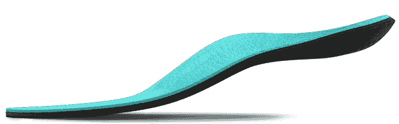

# 3D 打印鞋垫制造商 SOLS 筹集了 1110 万美元，将其产品带给消费者和运动员

> 原文：<https://web.archive.org/web/https://techcrunch.com/2015/02/27/sols-a-maker-of-3d-printed-shoe-insoles-raises-11-1-million-to-bring-its-product-to-consumers-and-athletes/>

# 3D 打印鞋垫制造商 SOLS 筹集了 1110 万美元，将产品带给消费者和运动员

[SOLS](https://web.archive.org/web/20221007033809/http://www.sols.co/) ，一家 3D 打印公司，[至今](https://web.archive.org/web/20221007033809/https://beta.techcrunch.com/2014/04/29/sols-maker-of-3d-printed-shoe-insoles-raises-6-4m-series-a/)，专注于打印医生为脚痛和其他疾病开出的定制鞋垫，现在已经筹集了 1110 万美元的资金，帮助将产品直接带给消费者。此举将使其成为首批使用 3D 打印技术营销定制可穿戴设备的公司之一。

这轮融资距离去年 4 月[SOLS 640 万美元的首轮融资不到一年，包括之前投资者 Founders Fund 和 Lux Capital 的参与，以及 Tenaya Capital 和 Melo7 Tech Partners 的新投资，melo 7 Tech Partners 是由 Carmelo Anthony 和 Stuart Goldfarb 创立的基金。](https://web.archive.org/web/20221007033809/https://beta.techcrunch.com/2014/04/29/sols-maker-of-3d-printed-shoe-insoles-raises-6-4m-series-a/)

此外，该公司今天早上宣布，达拉斯小牛队的总裁兼首席执行官 Terdema Ussery 将加入其董事会。

新投资者和董事会的加入还暗示，SOLS 计划通过定制鞋垫来满足运动员的需求，首先让最终用户通过使用移动应用程序录制视频来“扫描”他们的脚。然后，SOLS 运行一系列处理算法来帮助它创建定制的鞋垫，将这些数据与其他信息结合起来，如你的身高、体重、生活方式、衬垫的使用方式等。

纽约尼克斯队(New York Knicks)的卡梅隆安东尼(Carmelo Anthony)参与了这轮投资，他表示，作为一名运动员，他理解“高性能、技能和适当的生物力学调整之间的关系。他还称 SOLS 是 3D 打印、定制矫正器领域的先驱。

[去年](https://web.archive.org/web/20221007033809/https://beta.techcrunch.com/2014/04/29/sols-maker-of-3d-printed-shoe-insoles-raises-6-4m-series-a/)，SOLS 有几十名医生在美国给病人开插入物的处方，并准备允许这些医生开始以 300 至 700 美元的市场价格转售产品。今天，该公司指出，现在有 300 多名医疗专业人员向他们的病人提供其产品。

有了这笔新资金，SOLS 迄今共筹集了 1930 万美元。