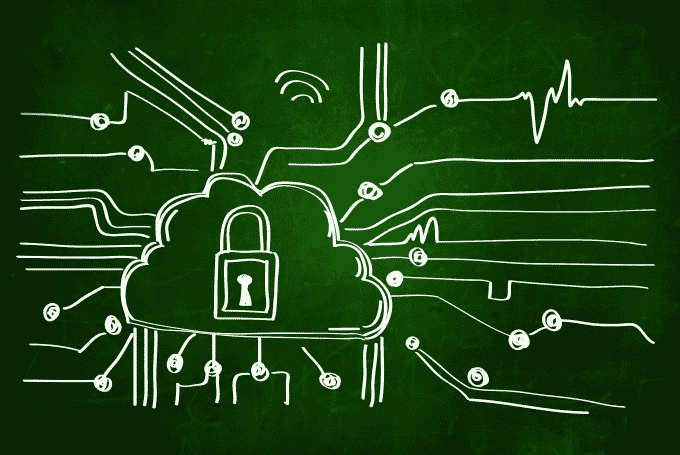

# 解决物联网的持续安全威胁

> 原文：<https://web.archive.org/web/https://techcrunch.com/2015/11/28/solving-the-persistent-security-threats-for-the-internet-of-things/>

本·迪克森是一名软件工程师，也是

[TechTalks](https://web.archive.org/web/20230302212428/https://bdtechtalks.com/)

.

More posts by this contributor

物联网(IoT)的快速扩张以及随之而来的安全问题迅速引起了政府和地区机构以及消费者的关注。

根据 Auth0 的[调查，超过 50%的消费者和 90%的开发者对物联网安全性持怀疑态度。](https://web.archive.org/web/20230302212428/https://auth0.com/blog/2015/11/06/surprised-turns-out-consumers-dont-trust-iot-security/)

安全问题——同样重要的是，消费者在联网设备中感受到的安全风险——是对[数亿美元](https://web.archive.org/web/20230302212428/http://tech.co/trends-iot-investing-2015-2015-09)公司投入各种联网设备的真正威胁。

由于该技术仍处于起步阶段，为其安全性定义一个有限的框架是一项具有挑战性的任务。

“物联网是一个复杂的概念和有机体，不断向自身需求和消费者需求发展。因此，提供硬性的安全规则类似于了解生物的工作方式，”[Secure thinks 的主编珍·马丁森写道。](https://web.archive.org/web/20230302212428/http://securethoughts.com/)

吸取过去的经验教训，技术界正在争先恐后地在局势失控之前堵住漏洞，许多科技行业的初创公司和老牌公司正在利用这个机会之窗来减轻威胁，并决定这种[快速增长](https://web.archive.org/web/20230302212428/http://www.intel.com/content/www/us/en/internet-of-things/infographics/guide-to-iot.html) [现象](https://web.archive.org/web/20230302212428/https://www.abiresearch.com/press/the-internet-of-things-will-drive-wireless-connect/)的命运。

从连接威胁的解决方案到数据保护和潜在受损设备的隔离，初创公司和科技巨头正在开发物联网安全问题领域的解决方案。

**应对网络连接威胁**

物联网设备始终保持连接的特性使其特别容易受到外部攻击者或共享同一网络的受损设备的攻击。

调查显示，在保护通信协议方面存在普遍的疏忽，许多物联网设备仍在遭受著名的心脏出血漏洞——这可能允许黑客发起中间人攻击，窃取密码等敏感信息。

由于构建物联网设备的工程师不一定是网络安全专家，他们留下安全漏洞是很自然的。

ZScaler 的新兴技术首席技术官 Patrick Foxhoven 解释说:“物联网设备通常是由具有不同思维模式的公司开发的——他们在安全性或合规性之前考虑用户体验。这些设备增加了网络的攻击面，IT 需要制定一个计划来保护它们。”

来自 [Auth0 调查](https://web.archive.org/web/20230302212428/https://auth0.com/blog/2015/11/06/surprised-turns-out-consumers-dont-trust-iot-security/)的结果表明，许多开发者在迫于压力将应用推向市场的同时发布了他们的产品。在这种情况下，他们通常会忽略安全问题，并坚持产品的功能完整。

因此，如果有某种方法将物联网设备连接抽象和外包到现成的包中，这项新兴技术面临的许多安全问题都可以被克服。

这是 [GENBAND 的](https://web.archive.org/web/20230302212428/http://www.genband.com/)新产品、 [Kandy](https://web.archive.org/web/20230302212428/https://www.kandy.io/) 通信平台即服务(CPaaS)背后的理念。

据负责该项目的 Paul Pluschkell 称，Kandy“提供了对物联网应用非常重要的多层安全保障。”正如 Pluschkell 解释的那样，Kandy 使用安全协议和加密技术的组合，包括 HTTPS 和安全实时协议(SRTP)，来提供数据隐私、端到端加密和高级认证机制，以确保设备的完整性。

GENBAND 通过简单灵活的 API 和包装器提供其 Kandy 平台，允许系统在不损害或访问彼此底层数据和结构的情况下进行通信。

**设备上的数据保护**

物联网设备的物理和板载安全性通常被忽视。这可能会成为严重的安全问题的根源，因为这些设备中有很大一部分经常没有受到保护，攻击者可以直接访问存储在设备上的数据。

但是不同设备的灵敏度不同。“很多创新和发展都与环境有关，”马丁森说，“天气数据不需要保护，但某人的 GPS 坐标应该得到保护。”和设备数据环境随时间变化。“当我们的烤面包机最终适应获取生物特征读数以获得最佳烘烤效率时，”她说，“安全措施将会形成以保护这些信息。”

设备上保护最明显的解决方案是数据加密，这种方法正在被越来越多的供应商认可，包括[苹果](https://web.archive.org/web/20230302212428/https://nakedsecurity.sophos.com/2015/10/21/apple-tells-judge-its-impossible-to-unlock-a-device-running-ios-8-or-higher/)和[微软](https://web.archive.org/web/20230302212428/http://www.pcworld.com/article/2986346/internet-of-things/microsofts-enterprise-grade-security-is-coming-to-windows-10-iot.html)，他们正在他们新的移动操作系统上实施默认的磁盘加密。

较小的供应商也抓住了设备上加密的想法，并将其作为产品的开箱即用功能。[Sports Performance Tracking](https://web.archive.org/web/20230302212428/https://www.sportsperformancetracking.com/)是一家为接触式运动提供 GPS 性能追踪器的制造商，该公司对其设备上保存的所有数据进行了高度加密。

其他公司，如芬兰 VPN 公司 [Tosibox](https://web.archive.org/web/20230302212428/http://www.tosibox.com/) 正在提供多功能加密解决方案，为远程数据访问机制添加加密控制层，以提高缺乏此类功能的设备上的文件访问安全性。

**器件隔离**

在没有隔离的情况下，物联网设备允许攻击者在获得入口点后在网络中横向移动。通过这种方式，黑客渗透到一个设备中，开始探测整个系统，直到他们找到真正的目标，例如包含敏感客户或业务数据的数据库或存储库。

“如果一个‘东西’受到攻击，”福克斯霍文说，“它可以使网络瘫痪，危及业务。”

像 [Luma](https://web.archive.org/web/20230302212428/https://getluma.com/about/) 这样的公司正在解决这个问题，这是一个 WiFi 家用路由器，本月早些时候由一家同名的科技初创公司推出。除了作为一个普通的 WiFi 路由器，Luma 还配备了一个入侵检测系统(IDS)，可以监控您家庭物联网网络中的流量，并寻找感染迹象或与命令控制(C & C)服务器的通信。这有助于在受损设备成为入侵其他设备的渠道之前识别和隔离受损设备。

在描述 Luma 时，该公司的联合创始人保罗·贾奇(Paul Judge)说“我们观察出站流量，并对网络上的所有设备进行漏洞扫描:连接的冰箱是否在与你的摄像头对话？你的新灯泡的联网门把手？”

F-Secure 采用了不同的方法，推出了 [Sense security monitor](https://web.archive.org/web/20230302212428/https://sense.f-secure.com/) ，这是一种位于家庭路由器和连接设备之间的设备，可以扫描所有进出的流量，以发现异常行为模式、恶意软件和网络钓鱼攻击。

据该公司的执行副总裁萨姆·孔蒂宁称，这款设备及其云基础设施“都是不可破解的”F-Secure 希望，凭借 Sense，消费者将永远不必再购买另一个安全解决方案，这是该公司希望凭借其在安全行业 27 年的经验来实现的目标。

F-Secure 的议程上还有许多其他物联网安全项目，其中一个想法叫做“设备信誉”，这是一个应该扫描网络内所有设备的系统，并向所有者指示他们在哪里缺乏安全。

**还需要做什么？**

我们已经取得了很大的进步，但我们还远远不能说我们已经控制了物联网安全困境。

首先，物联网设备上的更新机制已经成为一种魔方问题。太多的物联网设备供应商有意放弃包括修补和更新固件的方法，担心这样做会打开安全漏洞，被黑客利用。

其他将更新界面和功能植入设备的公司未能实现安全交付机制，这实际上为黑客在物联网设备上安装和执行任意代码留下了空间。再加上网络安全性差，这种漏洞会导致连接设备被远程劫持。

另一个复杂的问题是制造商收集并存储在云服务器上的大量数据。这些服务器对黑客来说是非常有吸引力的目标，无法保护这些存储库会导致公司机密和消费者信息被窃取。

马丁森建议使用用户端加密，随着大数据存储越来越多地受到大规模黑客攻击，这种方法正迅速变得流行起来。这样，即使数据库遭到破坏，用户数据也将保持安全和不可用。“不用担心云安全漏洞的最好方法，”马丁森说，“是让服务器漏洞变得无关紧要。”但由于供应商是云存储数据的主要受益者之一，他们将数据用于广告和销售改善目的，他们是否会实际选择这样的程序仍然是一个疑问的“云”。

**物联网的未来如何**

以[混乱的速度增长](https://web.archive.org/web/20230302212428/http://www.informationweek.com/mobile/mobile-devices/gartner-21-billion-iot-devices-to-invade-by-2020/d/d-id/1323081)，物联网行业在未来的几个月甚至几年肯定会展现出许多惊喜。技术社区的共同努力和决心可以帮助我们享受好的惊喜，避免坏的惊喜。