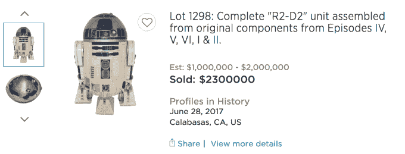
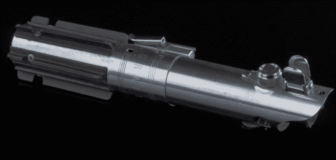

# 有人刚刚以超过 200 万美元的价格收购了 R2-D2 

> 原文：<https://web.archive.org/web/https://techcrunch.com/2017/07/01/someone-just-bought-r2-d2-for-over-2-million-dollars/>

抱歉，卢克——但看起来你的光剑和 R2-D2 都有了新主人。

在一次拍卖中，我想假装是在沙漠中的一只沙虫前举行的，据报道，有人刚刚在 R2-D2 上投入了 200 多万美元。

“但是等等——这是 T2 R2 吗？就像，原来三部曲里用的那个？”

唉，据任何人所知，这个问题的答案永远不可能真的是“是”。在原版电影中，有多个 R2 是为不同的场景设计的——有几个是肯尼·贝克在里面的时候，有几个是动作场景，等等。与此同时，随着剧集的继续，他们中的大部分都被挖空并被重新利用。

那么，这个单元是一个从电影中的许多模型的点点滴滴拼凑在一起的单元，最终产品据说是已知存在的最集体“使用的电影”。它由以下内容组成:

*   在《新的希望》*中，由肯尼·贝克控制的顶部穹顶和关节眼透镜*
*   在*帝国*中使用的两条腿，以及为*第一集*制作的一条腿
*   来自*新希望*的车身上的重点/细节部分

大概不包括:一个公主宣称你是她唯一希望的全息图。

你可以在这里问一个对象的多少部分可以被交换/替换，在某个东西不再是那个对象之前——但是考虑到“那个对象”可以说从来没有以单一的永久形式存在过，这一切都有点没有意义。在这种情况下，丢下大把钞票的人眼中有美。

虽然[在线拍卖页面](https://web.archive.org/web/20221206015511/http://www.invaluable.com/auction-lot/complete-r2-d2-unit-assembled-from-original-com-DBC4C5B95B)(以及顶部的图片)显示最终出价为 230 万美元，但拍卖行在[的脸书页面](https://web.archive.org/web/20221206015511/https://www.facebook.com/ProfilesInHistory/posts/10155285586451276)上报告称，最终价格达到了更高的 275 万美元(后一数字可能是在扣除拍卖费等费用后得出的)。)

与此同时，卢克在《T4:新希望》和《帝国:T7》中使用的光剑——曾经属于阿纳金，后来被他自己打造的光剑取代——以 37.5 万美元的价格售出。这比拍卖行最初希望获得的 15 万至 25 万美元高出不少，尽管在拍摄后的几十年里有一两件作品丢失了。但是，我是说，这是该死的卢克·天行者的光剑。

目前还不知道这两件拍品的买家是谁，但可以肯定地说，他们没有立即把 R2 带回家，给他一个惯常的油浴。不管你是谁，只要知道:我嫉妒。

