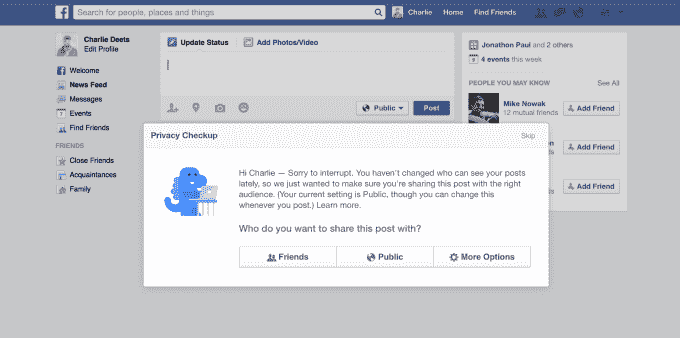

# 脸书停止不负责任地将新用户帖子的隐私默认为“公开”，改为“朋友”

> 原文：<https://web.archive.org/web/https://techcrunch.com/2014/05/22/sometimes-less-open-is-more/>

多年来，由于默认公开新用户的状态更新和照片，新用户面临过度分享的风险，脸书[将默认设置切换为“好友”](https://web.archive.org/web/20221206005319/http://newsroom.fb.com/news/2014/05/making-it-easier-to-share-with-who-you-want/)。它还将开始要求现有用户通过一个“隐私检查”流程，在那里他们可以检查和确认他们的隐私设置。这些变化应该会减少用户意外地将他们的内容和个人信息暴露给比他们想要的更广泛的受众的数量。

脸书隐私产品经理迈克·诺瓦克向我承认，“有时当人们在脸书上分享东西时，他们会觉得这些信息比他们想要的更公开，或者比他们认为更多的人可以看到他们的帖子。我们很多人都有过这样的经历:分享一些东西，却意外地让它(比我们期望的)被更广泛地看到，他把这比作点击“在一封电子邮件上回复所有人”。

**“我们认为过度分享比分享不足更糟糕”**，诺瓦克声称。

## 隐私被破坏的时代

这是自 2009 年以来最严厉的 180 政策，当时脸书首次开始默认新用户的帖子公开可见。然后在 2010 年 4 月，脸书推出了全面的隐私变化[，包括“推荐设置”](https://web.archive.org/web/20221206005319/http://www.insidefacebook.com/2010/05/28/facebooks-new-privacy-controls-give-users-more-choice-and-direct-them-to-be-more-open/)，这被认为是符合数据敏感性的合理默认设置。现有用户有机会切换到推荐的设置，新用户默认使用这些设置。虽然它正确地将个人和联系信息设置为“仅限朋友”，但它却厚颜无耻地将状态更新和照片、家庭和关系、简历和最喜欢的引用等新闻订阅帖子设置为“公开”。

当我在 2010 年报道这些默认和改变时，[我称它们为“危险的”](https://web.archive.org/web/20221206005319/http://www.insidefacebook.com/2010/05/28/facebooks-new-privacy-controls-give-users-more-choice-and-direct-them-to-be-more-open/)，因为不密切关注的用户可能会认为，既然脸书已经推出了与大学好友分享的功能，并且都是为了添加好友，那么他们的帖子就会被那些人看到。这意味着有伤风化的行为、性感的照片、粗俗的笑话或有争议的观点可能会被家庭成员、雇主或随机跟踪者发现。

诺瓦克说:“我们做出这个决定是因为我们认为这对人们来说是正确的，随着时间的推移，我们得到的反馈是过度分享比分享不足更糟糕，这就是为什么我们现在对朋友设置做出这种改变。”

这些推荐设置是脸书“让世界更加开放和互联”使命的噩梦化身。

这源于一种天真的观点，即人们应该没有什么好隐瞒的——如果你是自己的老板，或者在一个进步的行业中拥有高价值的技能，这种观点很容易接受。它忽略了一个事实，即许多人没有如此开放的自由，因为他们不断受到父母、老师和公司的评判，如果他们看到你酗酒、跳舞或发表两极分化的观点，他们会很乐意雇用其他人。我希望有一天，我们都可以进化，不再因为人们如何重新创造或表达自己而歧视他们，而是变得更加开放，但鼓励世界拥抱未来和把人们拖入未来是有区别的。

作为对 Twitter 崛起的回应，这些糟糕的默认设置可以被视为让脸书用户更公开分享的持续努力的开始。[标签](https://web.archive.org/web/20221206005319/https://beta.techcrunch.com/2013/06/12/facebook-hashtag/)、[趋势话题](https://web.archive.org/web/20221206005319/https://beta.techcrunch.com/2014/01/16/facebook-trending/)、[嵌入帖子](https://web.archive.org/web/20221206005319/https://beta.techcrunch.com/2013/07/31/facebook-embeds/)，以及 18 岁以下的[可以公开发帖的选项](https://web.archive.org/web/20221206005319/https://beta.techcrunch.com/2013/10/16/facebook-teens-can-now-post-publicly/)都是这方面的最新产品变化。

当我问诺瓦克，脸书到底为什么要这么做，他说“我们听说人们想要公开分享，我们观察到这是互联网上的一个重要趋势。我们做出这个决定是因为我们认为这对人们来说是正确的。”但事实并非如此。

## 让隐私更加明显

2011 年，脸书被迫与美国联邦贸易委员会和 T2 的爱尔兰数据保护委员会达成和解。这些交易使该公司受到 FCC 长达 20 年的隐私审计，并禁止其未经许可改变现有的隐私设置。

值得庆幸的是，大约在这些和解的时候，脸书已经开始让隐私控制变得更容易理解和访问。最重要的是，它在 2011 年给[的状态编辑器添加了一个内嵌的隐私控制按钮](https://web.archive.org/web/20221206005319/https://www.facebook.com/notes/facebook/making-it-easier-to-share-with-who-you-want/10150251867797131)，这样用户就可以根据每个帖子来选择他们的受众。

上个月，脸书宣布正在改进隐私选择器，使其更加清晰可见。你可以在上面看到新的网页设计，下面是移动应用前后的对比。脸书还重新设计了第三方应用的隐私设置，开始提醒用户公开发布内容，每个人都可以看到这些内容，并宣布可以匿名登录其他应用，让用户在脸书以外的地方有更多的控制权。

但是，新用户的公共状态更新默认设置是在这些解决方案之前，一个更加粗心的隐私时代的坏死的残余部分。很高兴看到这个终于被切除了。

## 越少开放越好

现在，新注册用户的新闻源帖子将默认为“朋友”，但可以随时将他们的受众更改为“公共”、“只有我”或自定义列表。对于隐私来说，这是一个更好的平衡——从一个合理安全的默认值开始，给人们选择。

为了让新用户了解他们的选择，脸书表示，“第一次发帖的人也会看到提醒，提醒他们为自己的第一篇帖子选择受众”，但默认情况下会是朋友，除非他们改变了。用户还可以更改过去帖子的隐私。

对于现有用户来说，脸书的隐私系统或其工作方式没有任何变化，但他们将获得一些额外的教育。

在接下来的几周里，脸书将推出它在 3 月和 4 月测试的蓝色恐龙隐私检查工具。公开发帖的用户可能会看到一个警告，为中断道歉，但提醒他们正在与 12.8 亿脸书用户分享。诺瓦克告诉我，调查显示，80%看过这个隐私提醒的人认为它很有帮助。

现在，它推出了一个更有力的“隐私检查”，提示用户检查他们现有的隐私设置，如本文顶部所示。这包括他们的新闻订阅源帖子受众、他们与之共享数据的应用程序以及他们在个人资料中显示的个人信息。

诺瓦克告诉我，脸书正试图“主动帮助人们建立自己的隐私。我们都听说过这样的反馈:如果人们与更多的人分享信息，这是不好的。这对他们不利，对我们也不利，因为人们觉得控制力下降了。”

希望这是一个迹象，表明脸书在隐私方面翻开了新的一页。本月增加了两项新功能，附近的朋友和使用手机麦克风标记照片和电视节目的音频识别，这两项功能都是以隐私友好的选择加入模式推出的。

如果你以月活跃用户来判断，你可以说脸书的社交网络已经征服了世界大部分地区。但是该公司希望“扎克伯格定律”成为现实，人们继续每年分享两倍的信息。要做到这一点，人们不能仅仅接受脸书是他们不可避免要使用的公用事业。他们相信，脸书宣扬的使命在最后隐含了一个重要条款:“让世界更加开放和互联……**，如果它想成为**。