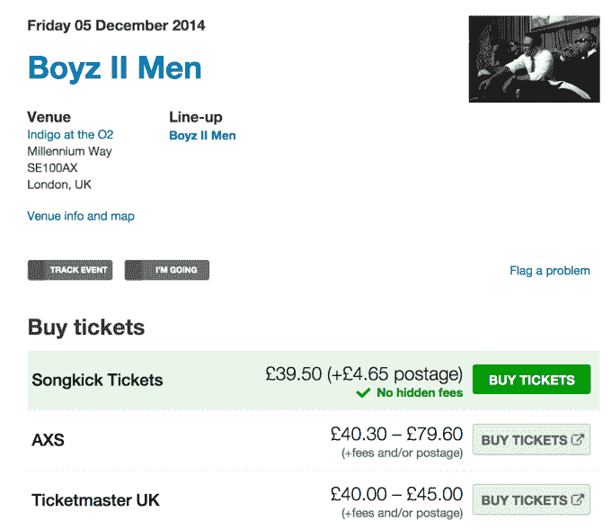

# 演唱会探索巨星 Songkick 开始售票 

> 原文：<https://web.archive.org/web/https://techcrunch.com/2014/11/05/songkick-tickets/>

“普通美国人每年都会去听一场音乐会。Songkick 创始人伊恩·霍加斯告诉我:“如果你把这个数字翻一番，那将对艺术家的生活产生深远的影响。”。问题是“买出租车去演唱会比买票还容易。”这就是为什么 7 年后，1000 万活跃用户之后，音乐会发现应用 Songkick 已经[开始直接销售音乐会门票](https://web.archive.org/web/20230127192234/https://www.songkick.com/metro_areas/24426-uk-london)。这是一个巨大的举动，将让 Songkick 赚取 20 倍于将用户介绍给其他票贩子的收入，因为 Songkick 可以从托管交易中获得 10%至 15%的费用。

只有一个问题:它还不能在美国做到这一点。场馆和 Ticketmaster 等卖家之间的排他性协议使门票不在 Songkick 手中。但仅仅几个月后，Songkick 现在在伦敦销售 25%的演出门票，并努力确保其他市场的库存。Spotify 花了几年时间才在海外建立起必要的影响力，通过点播流媒体打入美国市场。现在 Songkick 想在门票销售方面做同样的事情。

## 开始唱歌

这是这家总部位于伦敦的初创公司漫长旅程的顶点。Songkick 成立于 2007 年，是一个音乐会数据库，其前提是“如果你能更容易地知道你喜欢的乐队会来，人们就会去看更多的演出。”Songkick 达成协议，在 YouTube、Spotify、SoundCloud 和其他网站上展示其演唱会列表。这是第一阶段。

第二阶段是将这些数据个性化，这样你就可以看到你喜欢的艺术家的列表，并获得关于你喜欢的艺术家的提醒，而不是筛选你所在地区的所有表演。你可以选择你最喜欢的音乐家，或者 Songkick 可以进入你的 iTunes、Spotify 和脸书账户，自动提取他们。很少有什么事情比听到他们最喜欢的乐队昨晚出现在他们的城市更让一个音乐迷的心下沉，但他们从来没有听说过这场演出。Songkick 为人们解决了一个真正的问题。

尽管如此，霍加斯并没有计划让 Songkick 成为一家票务公司。他受到机票搜索引擎 Kayak 的启发，Kayak 可以帮助你发现最好的航班，但会让你去航空公司实际购买机票。类似地，Songkick 会链接到你能买到演唱会门票的任何地方，然后收取介绍费。

“但是我们越做越大，越来越多的人问他们是否可以和我们一起卖票，我们开始认为我们应该重新考虑，”霍加斯告诉我。与此同时，首席执行官看到了他所谓的“移动服务的优步化”人们开始期望在同一个应用程序中发现和购买。Songkick 的 iOS 和安卓[应用](https://web.archive.org/web/20230127192234/https://play.google.com/store/apps/details?id=com.songkick&hl=en)需要调整。

## SongTix

强迫人们点击或点击另一个服务来购买门票不仅令人讨厌，而且可能会损害艺术家门票销售的转换率，并使 Songkick 只获得一小部分收入。相反，如果它允许用户添加他们的支付信息，他们就可以结账，而不必注册和与一系列票务公司打交道。因此，第三阶段:歌曲售票。 

它始于伦敦，不仅仅是因为主场优势，还因为伦敦拥有也许是世界上最有活力的音乐会文化。但是场馆并不局限于与自动售票机的独家交易。每个音乐厅都可以向他们想要的任何供应商分配门票，因此许多企业受到激励来帮助他们销售一场演出。由于其累积的探索流量，Songkick 说服场馆给它库存，门票卖得很快……或者……肉馅饼。这毕竟是英国。

现在 25%的伦敦演出通过 Songkick 出售门票。“推销商告诉我们，我们是他们合作的第二大售票商，”霍加斯说。独立乐队 Caribou 通过 Songkick 在布里克斯顿学院举办的 5000 人演唱会售出了 40%的门票。霍加斯笑着说:“我们真的能够移动指针了。”Songkick 仍然列出了其他售票商的链接，因此粉丝可以在他们喜欢的任何地方购买，但其流畅的原生应用购买体验比其他供应商通常混乱的移动网站更方便。

通过首先建立一个巨大的发现用户群，然后在国外推出票务，Songkick 避免了一个困扰美国票务初创公司的问题，如[将调用](https://web.archive.org/web/20230127192234/https://www.getwillcall.com/)和[鼓掌](https://web.archive.org/web/20230127192234/https://www.applauze.com/):获得最热门节目的面值门票。

## 来美国？

在美国，大多数最好的演出都由 TicketMaster 或 Ticketfly 独家售票。TicketMaster 从便利费和其网站上显示的广告中赚了很多钱，因此它非常有动力与 Live Nation(ticket master 在 2010 年方便地与 Live Nation 合并)等场馆和活动生产商保持独家交易。

没有大量的流量在场馆前晃荡，初创公司很难说服场馆他们值得合作。WillCall 最终把自己卖给了 Ticketfly 来解决库存问题。鼓掌已经变得越来越像一个从 StubHub 等网站上的黄牛那里购买加价门票的[门户网站，它通过只显示附近活动的“策划”列表来应对多样化库存的缺乏。](https://web.archive.org/web/20230127192234/https://techcrunch.com/2013/03/05/applauze/)

现在，Songkick 的目标是在海外建立影响力，打入美国票务市场，其 60%的用户在美国。“如果你看看把 Spotify 带到美国需要什么，它在其他地方也有影响力，它需要与脸书合作。现在看。这些唱片公司完全支持它。”

Spotify 向唱片公司支付的巨额预付款肯定不会损害它们允许点播流媒体的意愿。Songkick 可能最终不得不支付类似的预付款，从 TicketMaster 和 Ticketfly 手中抢走门票。在那之前，它将与所有人竞争，从像 [Dice](https://web.archive.org/web/20230127192234/https://techcrunch.com/2014/09/18/dice/) 和 [Eventful](https://web.archive.org/web/20230127192234/https://techcrunch.com/2013/03/27/events-nearby-app-eventful/) 这样的初创公司，到像 TicketMaster 这样的持票人，再到像 StubHub 这样的二级市场。

“我将在我能找到合作伙伴的任何地方扩大规模，并最终在时机成熟时将其引入美国，”霍加斯说。他认为音乐归结为三个 app 只是时间问题。“像潘多拉这样的电台应用，像 Spotify 这样的点播应用，还有像我们这样的演唱会应用。”事实上，他们合作得非常好。

## 流媒体+音乐会= $$$

像酷玩乐队或泰勒·斯威夫特这样的大音乐家偶尔会在媒体上抱怨流媒体版税过低，而 T2 会从 Spotify 这样的服务上撤下他们的音乐。他们希望从 iTunes 上的专辑和 MP3 销售中赚取更多的钱，他们认为流媒体正在蚕食这些收入。但不管版税是否足够高，这都是短视的想法。

首先，专辑和 MP3 的销量直线下降，所以这在几年内不会是一个可行的策略。其次，音乐领域的收入越来越多地来自演唱会门票和铁杆粉丝购买的商品。

“大多数艺术家 70%到 80%的收入来自巡回演出，这种情况还会继续下去，”霍加斯说。艺术家被发掘、将电台热门听众转化为粉丝、将粉丝转化为狂热分子的方式是通过流媒体服务的延伸收听。这是一颗难以下咽的药丸，但技术已经把这个行业从唱片行业变成了音乐行业。没有回头路了。最好的办法是拥抱流媒体和其他技术，打造一大批忠实的支持者，然后开始巡演。

这就是为什么像 [Songkick](https://web.archive.org/web/20230127192234/https://www.songkick.com/) 这样的流媒体应用和音乐会应用有巨大的合作机会。他们一起可以改变普通人的习惯，从每年买几张专辑外加去一场演唱会，到流几十张专辑，成为更多艺术家的粉丝，去一堆演唱会。票务独家交易和流媒体的顽固阻止了这一点。

霍加斯总结道:“这个行业需要走出自己的路，问自己‘什么对消费者最有利？对艺术家来说，什么是最好的？而不是‘什么对现有系统最有利？"