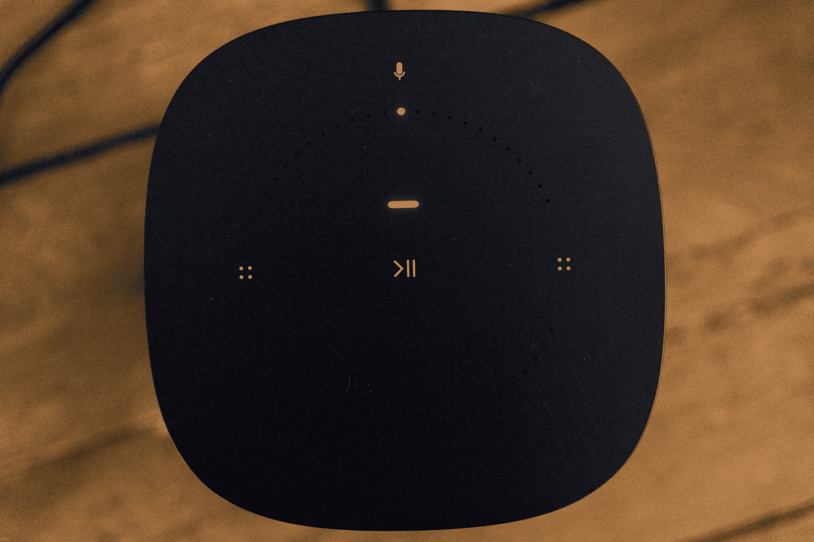

# Sonos One 是那些想要出色声音和智能的人的不二之选

> 原文：<https://web.archive.org/web/https://techcrunch.com/2018/02/20/sonos-one-is-the-speaker-to-beat-for-those-that-want-great-sound-and-smarts/>

连接扬声器的战争即将来临，有一天它们将被详细记录在历史书上，让所有人都记住。但在这里，现在，可能很难穿过围绕选项的各种叙述，选出一个赢家。既然主要玩家的产品已经摆在桌面上，很明显 Sonos 对大多数人来说是最好的选择。

Sonos One 是该公司去年发布的联网扬声器，是一款声音非常棒的 Wi-Fi 扬声器，也内置了对亚马逊 Alexa 的支持，如果不是最好的智能助手，至少也是与谷歌助手并列第一。

在声音方面，Sonos 在制造智能扬声器的三大公司中最有经验，也值得你考虑。在许多方面，Sonos One 只是 Sonos Play 的升级版:1 这在声学上非常相似——但这实际上是一件非常好的事情。Sonos One 就像 Play:1 一样，是一款听起来非常棒的音频设备，尤其是考虑到它的大小和物理尺寸。

过去几周，我一直在使用一对 Sonos Ones，很明显，它们在让房间充满声音方面做得很好，这在一定程度上要归功于 Sonos 的声音整形技术，该技术使用两分钟的设置过程，包括挥舞你的手机，以正确模拟它们为你的空间发出的音频。

就个人而言，Sonos One 已经是大多数人(不需要额外的功率或不会注意到更大扬声器带来的听觉改善)音质的有力竞争者，甚至可以与 Google Home Max 和 HomePod 相抗衡——但 Sonos One 还有另一个巧妙的技巧，因为它可以与第二个 Sonos One 形成立体声对。这提供了真正的声音分离，这意味着左声道和右声道按照它们实际需要的样子再现，而不是通过一些模拟的立体声分离效果(正如 HomePod 评论所示，这可能很酷，但最终无法匹配真正的立体声分离)。

与竞争对手相比，Sonos 的另一个巨大优势是:Sonos One 可以与您的 Sonos 设置的其余部分集成，如果您有一个的话。您可以通过语音控制所有扬声器，并将它们组合在一起，进行整个家庭/每个房间的播放。谷歌的 Home Max 可以与支持 Chromecast 的扬声器配合使用，实现类似的多房间流媒体设置，HomePod 将获得一个更新，增加多房间和立体声同步，但 Sonos One 现在同时提供这两种功能，并使用了一种被证明有效的方法。

还有定价要考虑。Sonos One 和两个套装在一起，现在售价 349 美元，和一个 HomePod 的价格一样。考虑到上面列出的其他优势，这是一个无与伦比的交易，特别是因为这意味着你可以看到你是否喜欢它，或者一次为多个房间配备 Alexa smarts 和高质量的连接声音。

可以肯定的是，有理由考虑其他选择，特别是如果你百分之百地致力于苹果设备和服务的生态系统，但总的来说，对大多数人来说，对于大多数用例来说，Sonos One 是更好的选择。