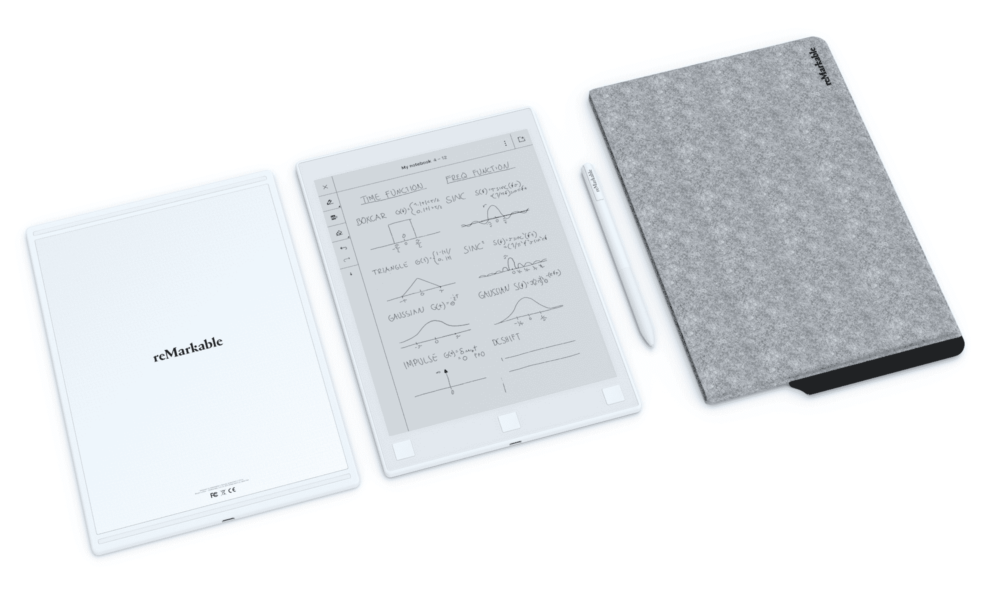

# 索尼和卓越的决斗电纸书是奇怪但令人印象深刻的野兽 

> 原文：<https://web.archive.org/web/http://techcrunch.com/2017/10/05/sony-and-remarkables-dueling-e-paper-tablets-are-strange-but-impressive-beasts/>

低劣的纸张。这是具有讽刺意味的一类，最喜欢它的人是最努力想取代它的人。

一个典型的例子是:索尼和卓越，你可能会发现这两家公司完全不同，但它们都有一个共同的使命，那就是制造一种足以满足几张纸的相同用途的设备。他们经历了混合的成功，每一个都以不同的方式工作和失败；但是这些设备让我对未来的可能性保持乐观——同时顽强地抓住我的笔记本和笔。

这两款平板电脑都依赖于电子纸显示器，最常见于亚马逊的 Kindle 设备，但随着对比度和响应时间的提高，它们在电子阅读器领域之外找到了合适的用途。

两者都支持手写笔和指尖输入；两者都有一个不发光的单色屏幕；两者都非常轻薄(350 克，6-7 毫米厚)；都有自己专用的 app 两者都渴望取代打印文档和在笔记本电脑上浏览 pdf 文件。(两者也都比较贵。)

然而，这两者之间有着明显的差异:索尼的数字纸平板电脑 DPT-RP1(我称之为 DPT)只有 A4 纸的大小，加上它的轻便，使它在某种程度上令人震惊。很难相信这是一个真实的设备。另一方面，引人注目的是，它更小(约 10 英寸 x7 英寸),其下边框上的三个按钮可以进行交互。它同样很轻，但没有散发出“他们是如何制造这个东西”的氛围。至少，现在还没有。

每个设备故事的简短版本:

**索尼 DPT-RP1**

*   13.3 英寸 1650×2200 屏幕
*   16GB 内部存储，PDF 支持
*   $700

这个帅气的魔鬼是我记得几年前在 CES 上处理的一个的续集，它已经被赋予了一个重要的[，如果不是激进的话，升级](https://web.archive.org/web/20230129215058/https://techcrunch.com/2017/05/24/sonys-revamps-its-digital-paper-tablet-with-new-screen-and-interface/)。最新版本的屏幕有了很大的改进，内部存储空间充足(当你主要看文档时，16GB 不会很快填满)，手写和笔记功能更好。

它专门针对那些必须处理大量冗长文档，并且厌倦了在笔记本电脑屏幕、基于 LCD 的平板电脑或小型电子阅读器上这样做的人。想想科学家审查研究，律师查阅案件档案等等。

**卓越**

*   10.3 英寸 1872×1404 屏幕
*   8GB 内部存储，PDF/ePub 支持
*   $600

引人注目的(是的，他们做了骆驼帽的事情)是我喜欢看到的那种众包成功。[一个原创的雄心勃勃的想法](https://web.archive.org/web/20230129215058/https://techcrunch.com/2017/06/01/the-remarkable-tablet-is-original-and-ambitious-unlike-pretty-much-all-the-other-ones/)通过努力工作和独创性实现，最终成为一个可行的产品。

该团队只是迷恋于这样一个想法，即电子阅读器类型的设备应该更具交互性，允许你绘制草图、注释文档并实时分享。为此，他们工作了数年，最终甚至咨询了制造这种显示器的 E Ink 公司，以生产出一种不仅看起来像一张印刷的纸，而且当你在上面写字时感觉也像的屏幕。

现在来判断三个 R 上的两个设备:读、写和 inte **r** 动作。什么？其他三个 R 中只有一个*以 R 开头*

## 阅读

至于提供一个优越的平台来阅读大部分是单色的文件——研究、诉讼、书籍——这两款设备都取得了令人钦佩的成功。两者都没有 [Kindle Oasis](https://web.archive.org/web/20230129215058/https://techcrunch.com/2016/04/30/kindle-oasis-is-beautiful-pricey-and-still-not-a-book/) 或 [Kobo Aura One](https://web.archive.org/web/20230129215058/https://techcrunch.com/2016/08/17/kobo-aura-one-review/) 的屏幕好，但它们已经足够好了——而且无论如何，在 Kindle 上阅读学术论文将是极其痛苦的。

如果我不得不在显示质量上给其中一款设备一点优势，那一定是 DPT。略白的白色和更好的对比度让它更有优势，尽管从技术上来说，卓越的 DPI 更高(226 比 206)。当你靠近看时，屏幕上的一个网格是可见的，但当我从正常距离阅读时，它很少打扰我。在我看来，文本在索尼上的表现稍好一些，尽管还算不上完美。

但人们也必须考虑到索尼的屏幕是巨大的。卓越和它的边框舒适地安装在 DPT 的屏幕区域内。并不是每个人都真的想在这样一个巨大的设备上阅读，不适合这个尺寸的文件可能会放大到滑稽的程度。同样，如果你加大文本尺寸，电子书最终看起来要么像儿童故事，要么如果你不加大文本尺寸，它就像一堵密不透风的文本墙，经常出现回车。

这一反对意见同样适用于杰出人物，但不那么适用。(索尼确实解决了这个问题，它能够在设备本身处于横向模式时同时显示两个纵向模式页面。)

如果让我在一个尺码和另一个尺码之间选择，我会毫不犹豫地选择非凡。它可以放入更多的包中，不会感觉如此笨拙，也不会小到一整页 PDF 看起来都被塞进去；过一会儿你就不会注意到了。

至于构建质量，这两款设备都制作精良，尤其是令人瞩目的是其设备近乎不可破坏。索尼一点也不轻薄，但正如我之前提到的，它的巨大尺寸确实让它感觉像是一种负担，就像你在公园里阅读时路过的摩托车手会夹住角落一样。然而，我确实赞同它的超简约设计，而卓越的银色背面和多个按钮使它成为两者中更时髦的一个。

DPT 另一个值得注意的地方是开/关速度。电子纸设备的一大好处是你可以打开它们，一两秒钟后你就可以回到你的书或文章中。DPT 也不例外，它可以持续充电数周，并且仍然可以瞬间开启。

当它处于睡眠模式时，它会这样做，但在一段相对较短的时间后，它会从睡眠模式完全关闭，这是你无法修改的。从关机到开机需要 15-20 秒或更长时间——如今这简直是永恒！毫无疑问这是为了提高续航，但这也烦得要命。这是一个可以并且可能会在软件更新中调整的东西(或者希望是可调整的)，但是现在这是一个痛苦。

## 写作

在这里，至少我们有一个坚实的赢家。在卓越上书写是一种享受，虽然它还不太像纸上的笔，但它比玻璃上的有源手写笔好得多。

卓越的电子纸屏幕几乎即时的响应时间(大约 50 毫秒)使书写感觉自然，而不是像一个设备赶上你半秒钟前做的事情。这绝对是至关重要的，因为你所看到的反馈会影响你如何书写——当你停止越过那个 T 或拖动那个 y 的下行字母时。该团队痴迷于降低延迟，老实说，在这种显示上取得了比我预期的更大程度的成功。他们告诉我，电子墨水本身给我留下了难以置信的印象。

以上，可圈可点；下面，DPT。

但是，这种线条不仅能快速地跟随手写笔的笔尖，而且如果你选择它，还有一个充满表现力的世界。平板电脑不仅仅跟踪笔尖，还跟踪手写笔的压力和方向。因此，使用铅笔工具，你可以通过将手写笔几乎垂直于屏幕并几乎不接触屏幕来绘制一条细而轻的线条，或者通过向下倾斜并用力按压来绘制宽的笔触。这并不总是有用的，它需要一些时间来适应，但它在电子纸设备上是可行的，这真的很令人惊讶，我可以看到它被许多素描者和笔记者采用。

此外，平板电脑附带了许多模板——网格、线条等。—并支持多个图层，您可以将其导出为 Photoshop 文件。

当然，这给 TechCrunch 的工作人员留下了深刻的印象。我带着它在 Disrupt SF 做笔记(和炫耀)，每个触摸过它并在上面写字的人都爱上了它，问他们如何才能得到一个。这些人每天都看到最先进的技术。

我没有带 DPT，但我认为它会引起更两极分化的反应。它太大了——但一旦你克服了这一点，你就会开始想，用它而不是在笔记本电脑上浏览 SEC 文件或皮尤研究报告该有多好。

你也可以在 DPT 的屏幕上书写，但尽管索尼尽了最大努力，它的响应速度还是比不上卓越。它很接近，当然，比我以前见过的装置好得多，但正如他们所说，接近只适用于马蹄铁和手榴弹。在这种情况下，它足够接近，我不介意对一个长文档做一些注释，但我不能用它来记笔记或绘制任何东西，除了最简单的形状。这种滞后和由此产生的感觉是事情稍微偏离了你的意图，这足以让你注意到它。

不幸的是，两者现在都不支持手写识别，尽管它即将出现。

## 互动

这是这两款设备的致命弱点。事实是，目前，你可以放在上面的内容，你如何编辑和注释它，以及你如何浏览它，都非常有限。

DPT 具有简单的优点。这非常简单:通过相关的桌面应用程序在上面加载项目(可能是 pdf)，它们就会出现在平板电脑的列表中。打开它，你就有了现在熟悉的触摸屏控制:向左或向右滑动以改变页面，或点击屏幕的边缘；轻按中心以打开视图选项，更改笔的样式等。你也可以快速放大一个区域，尽管考虑到这个东西的大小，我从来不觉得有必要这么做。顶部的一个按钮打开一个简单的小菜单，里面有最近的文档和返回主页的选项。

 另一方面，卓越的人从一开始就向你抛出各种各样的东西。你仍然可以从桌面应用程序添加你的文档——在这里，我不妨提一下，你需要在网站上设置一个免费的简单账户来完成这项工作，并实现基于网络的文档同步(这很快，而且似乎无害)。一旦它们在设备上，你就可以通过一个繁忙的主屏幕进行导航，这个主屏幕列出了所有的文档，或者只是 pdf，或者只是电子书，或者是你的笔记本，你可以随心所欲地创建多个:一个用于草图，一个用于工作笔记，一个用于待办事项，等等。

在 documents 中，你可以使用设备底部的三个按钮前进、后退或返回主页。令人失望的是，你不能滑动或点击进入下一页或上一页。我更喜欢 DPT 的简化控制；按钮在专用的电子阅读器上可能很有用，因为翻页是迄今为止最频繁的动作，但卓越意味着像一张纸，按钮似乎与这一想法不一致。

然而，我真正的问题是我对两者都有意见。你对这些文件的处理能力非常有限。阅读它们很棒。但这两款设备都不擅长导出你从设备上取下的动作。例如，如果您找到想要记住的文档的一部分，您能做什么？

在 DPT 上，你可以突出它，但是然后呢？在显著的地方，你用荧光笔做标记，然后呢？DPT 有一个聪明的系统，你可以在特定的页面上放置一个星星或其他符号，然后很容易地重新找到这些点——但是然后呢？卓越可以让你在一瞬间给任何页面添加注释——但是接下来呢？

所有这些行为最终都会留在设备上，或者面临一些复杂的导出过程。为什么我不能在卓越上选择一些文本，并将其复制到应用程序中的剪贴板？为什么我不能拖出一个矩形让它保存截图？为什么我不能让 DPT 上的 PDF 的带星号的段落在原始文档中自动突出显示？

最终，你主要是通过在内容上绘制一个透明层来与内容进行交互。这对某些东西来说很好，但不是特别灵活。您可以围绕其中任何一个构建一个工作流，但它不会很漂亮。

再者，我能接触到的内容极其有限。不支持像 Pocket 或 Evernote 这样的时移服务，即使是以有限的方式。只能读取 pdf 和 ePub 文件，或某些归档文件。这两款设备都有 Wi-Fi，但都没有基本的或纯文本的网络浏览器。我很想拥有这些东西，但目前这些设备的使用案例仅限于“读取你已经拥有的文件，并对它们进行一些有限的更改。”

## 特种设备万岁

与 Surface 或 iPad Pro 等产品相比，DPT 和卓越似乎有些局限。但这就是重点。

你不应该在你的 DPT 上写小说，或者玩一些复杂的 3D 游戏。这些设备设计有一些非常具体的目的，它们很好地实现了这些目的——正如你所看到的。它们轻便、耐用、舒适，而且使用起来非常简单。

事实上，这是一个非常新的产品类别，或者至少是一个长期被忽视的类别(RIP Kindle DX)，我认为大大小小的公司都有兴趣做一些不同的事情，这是非常棒的。

另一方面，他们仍然在弄清楚这些产品到底应该有什么功能。索尼有一个坚定的想法，并正在科学和法律市场发挥作用，在这些市场中，长文档是常见的，少数标记工具就足够了。卓越有更广阔的视野和实现它的技术解决方案:更多更快的交互，与现有服务更好的集成。

虽然我可以说索尼已经实现了它的目标，但这个目标是有意限制的，因此它只吸引了很少一部分人。卓越对更多的人有潜在的吸引力——我认为是几个数量级——但它还没有实现它的愿景。

幸运的是，卓越意识到了这一点，主要是想发布一个工作产品。明年的路线图上有许多有趣的功能，这些功能将使设备更加通用和可靠。

这款非凡的电子阅读器已经售出数万台，索尼也没有放弃 DPT，尽管让其他电子阅读器消亡是有希望的。在我的房子里有一个地方可以放置这样的设备，我越来越希望有更多这样的设备。