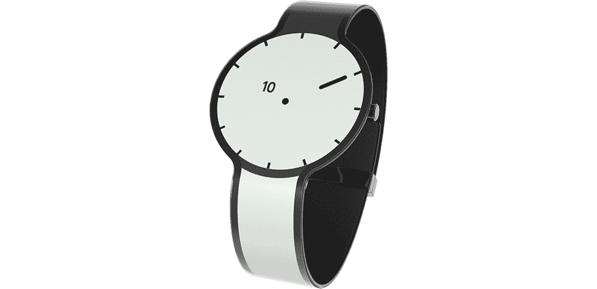

# 索尼电子墨水手表旨在让低功耗屏幕成为时尚面料的下一个亮点

> 原文：<https://web.archive.org/web/http://techcrunch.com/2014/11/28/sony-e-ink-watch-aims-to-make-low-power-screens-the-next-big-thing-in-fashion-fabric/>

# 索尼电子墨水手表旨在让低功耗屏幕成为时尚面料的下一个亮点

【YouTube https://www.youtube.com/watch?v=fLBCVhZ4J7E&w=1023&h=575]

几乎每个科技硬件制造商基本上都在推出智能手表，但索尼正在研究如何通过一个新的特别项目来重新发明基本的计时设备，尽管几个月前就出现在众筹网站上，但这个项目只是刚刚才被披露与日本电子巨头有关。这款名为 FES Watch 的手表在表面和环绕式表带上都使用了电子纸，最初它没有使用索尼的名字，以观察在没有品牌影响力的情况下，它在公共论坛上的表现如何。

相反，FES Watch 被宣传为一家名为 Fashion Entertainments 的公司的产品，但该公司实际上是一个由索尼员工组成的团队，他们正在研究如何利用电子纸来制造时尚商品。《华尔街日报》报道称，它希望将电子纸视为时尚领域的一种面料，适用于制作手表、领结、帽子配件或任何其他磨损物品。时尚娱乐部门由索尼智能手机部门的新负责人 Hiroki Totoki 领导，是索尼首席执行官平井一夫构想的内部创业计划的一部分。

FES Watch 项目已经在众筹网站上筹集了超过 17，000 美元，这意味着它已经超过了目标，应该可以投入生产了。隐藏索尼参与的决定意味着时尚娱乐可以更好地了解这个想法将如何发展，而不会因为与索尼的品牌名称相关联而产生任何影响。通常，初创公司表示，他们去众筹网站不一定是为了筹集资金，而是为了测试市场可行性，并在产品发布前收集反馈，或者帮助他们筹集传统的风险投资资金，因此尽管索尼的举动并非前所未有，但它可能是采用这种策略的最大公司。

将电子纸变成一种织物有许多潜在的好处——包括能够瞬间改变你穿着的东西的图案和设计，包括使用更新的彩色电子墨水技术的彩色选项。这种材料的极低功耗意味着它应该能够在不充电的情况下持续很长时间，使用它制作的物品可以很容易地通过简单的运动传感器根据运动和基本行为改变它们的外观。智能功能(即通知和与智能手机的通信)也是可能的，但该项目的精神是让事情变得简单，以便电子纸被视为织物或建筑材料，而不是技术。

预购客户将在明年 5 月后获得他们的设备，但目前还没有 FES 手表的全面上市。不过，这肯定会引起轰动，所以希望索尼能更广泛地提供这种服务。