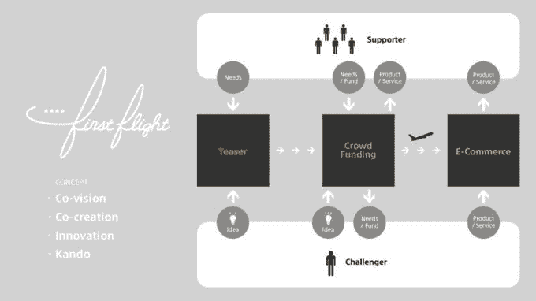
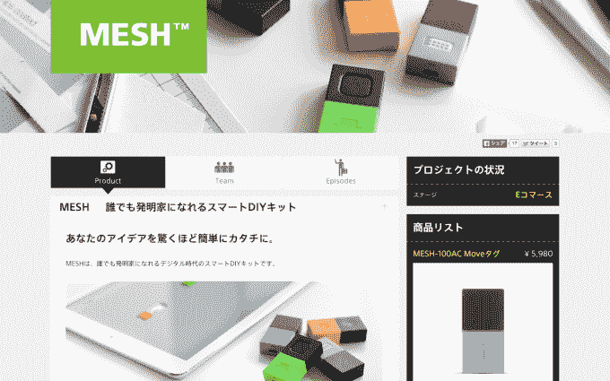

# 索尼为其日本员工的项目推出众筹网站 

> 原文：<https://web.archive.org/web/https://techcrunch.com/2015/06/30/sony-first-flight/>

# 索尼推出了一个面向日本员工项目的众筹网站

索尼过去曾涉足众筹——利用网站发布电子墨水手表和 T2 网格传感器套件，最近 T4 发布了备受期待的莎木 3，但是现在这家日本公司在这个领域大展拳脚，T6 发布了自己的众筹项目网站 T7。

第一次飞行是日本独有的服务(目前)，展示索尼员工开发的创意和产品。该网站是索尼种子加速计划现有计划的延伸，该计划旨在支持和培育公司内部的新商业创意。企业文化经常扼杀完全不同的思维或创新想法，这是索尼的游戏，让事情变得轻松，鼓励新鲜感。

“First Flight 旨在通过创新提供感动人心的体验。它将使每个初创企业及其客户能够分享他们的想法和灵感，然后通过直接和互动的交流，共同将这些想法付诸实践，”索尼在一份颇具企业色彩的声明中表示。

该网站旨在将一个项目从想法阶段，到资金和商业在同一个平台上。

为了纪念它的推出，索尼将从今天开始在首飞中出售三个初步完成的项目。

它们是前面提到的[手表](https://web.archive.org/web/20230129221221/https://first-flight.sony.com/pj/3/%E6%9F%84%E3%81%8C%E5%A4%89%E3%82%8F%E3%82%8B%E6%99%82%E8%A8%88%E3%80%80FES%20Watch)和[传感器套件](https://web.archive.org/web/20230129221221/https://first-flight.sony.com/pj/4/MESH%20-%20%E8%AA%B0%E3%81%A7%E3%82%82%E7%99%BA%E6%98%8E%E5%AE%B6%E3%81%AB%E3%81%AA%E3%82%8C%E3%82%8BDIY%E3%82%AD%E3%83%83%E3%83%88)，以及[一个可以与家用设备一起使用的电子纸遥控器](https://web.archive.org/web/20230129221221/https://first-flight.sony.com/pj/2/HUIS%20REMOTE%20CONTROLLER)，包括一个可定制的显示器。

目前还没有消息表明首航何时或者是否会获得英语支持和国际关注。如果该项目在日本获得成功，那么我们可能会看到它在全球范围内推广，但您可能会怀疑该项目的物流和其他部分在日本更容易实现。尤其是因为首飞不太可能带来巨大的新收入流。