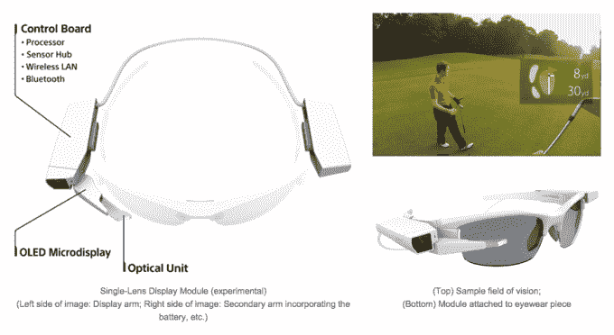

# 索尼推出用于运动的夹式智能玻璃模块 

> 原文：<https://web.archive.org/web/http://techcrunch.com/2014/12/17/sony-glasses-attach/>

更多索尼新闻。在 CES 之前的一份声明中，也许是希望将人们的注意力从索尼影业电子邮件黑客攻击的有毒影响上转移开，或者更有可能的是，希望在 1 月份的消费电子产品争夺战之前吸引一点宣传——索尼今天[宣布了自己对谷歌眼镜的看法。](https://web.archive.org/web/20230129090023/http://www.sony.net/SonyInfo/News/Press/201412/14-118E/index.html)

或者更确切地说，它详细介绍了一种“采用有机发光二极管技术的紧凑、轻便的单镜头显示模块”。所以基本上是一个模块，可以夹在你现有的眼镜上，让它们变得“智能”。(其实不是说 smartify，谢天谢地。)

索尼表示，其眼镜式模块旨在夹住“不同设计”的眼镜——它继续提到“时尚眼镜、护目镜、太阳镜或其他类型的眼镜”——以通过彩色有机发光二极管微型显示器和连接的摄像头来增强标准眼镜。

索尼正在设想将该模块附加到各种运动用例上，如高尔夫、自行车、跑步或网球，同时也看到了企业市场的潜力——例如连接到工厂的内部基础设施系统，为工人提供免提指令。你可以想象亚马逊仓库拣货员是如何装备好的——当他们等待机器人取代 T5 时。

索尼还表示，它认为该模块有可能与行动相机配对，使佩戴者可以通过他们的眼镜观看远程显示或检查从远处拍摄的图像的视角。后一种情况听起来很无聊，但我猜你永远不会知道。

索尼指出，该模块重量很轻(约 40 克)，不使用时可以拆卸，以提高佩戴者的舒适度。大概是为了避免他们在球场外成为社会弃儿。

在这一点上，可以说索尼的模块主要是概念，当然不是完善的消费产品。所以一定要把这个放在索尼实验下(还记得那些智能手机镜头上的[夹子](https://web.archive.org/web/20230129090023/https://techcrunch.com/2013/09/04/meet-the-sony-qx10-and-qx100-smart-lenses-that-turn-phones-into-true-cameras/)，有人吗？).

价格标签将是一个关键细节——还没有提到成本，这就是问题所在。谷歌眼镜未能吸引主流注意力，高昂的价格肯定是其问题的一部分。另一部分是在公共场合炫耀一台面部电脑的内在怪癖。至少索尼的模块可以从你的规格上拆下来。

索尼表示，其智能眼镜模块的原型将在 CES 上展出，其名称为 SmartEyeglass Attach！该公司希望在这里吸引其他设备制造商的兴趣。

它指出它是:

> …希望向各种潜在客户提供该产品，从眼镜制造商(其产品为体育或娱乐等特定用途量身定制),到考虑将其产品与可穿戴设备配对的电子产品制造商，再到利用可穿戴设备提供商业解决方案的公司。

它还表示，它的目标是“在未来一年内”开始大规模生产这种显示模块。这里有很多非特定的蒸汽器皿标记。

紧凑的显示技术显然是索尼最引以为豪的，它包括一个 0.23 英寸的高分辨率彩色有机发光二极管微显示器，分辨率为 640 x 400 像素，能够显示“丰富、生动的色彩”——即使在阳光充足的户外条件下(这显然是让体育用例飞行所必需的)。

该公司还笼统地谈到，该模块是它为可穿戴设备市场的发展做出贡献的一种方式。并表示将向合作组织提供 SDK，以鼓励为其单镜头显示模块开发“新的商业解决方案”。

所以，换句话说，有意愿就有可穿戴设备。

**2014 年:1900 万台可穿戴设备**

在今天发布的一份可穿戴设备市场报告中，分析师 Berg Insight 表示，2014 年可穿戴设备(包括智能眼镜)的出货量达到 1900 万，高于去年的 590 万，可穿戴设备的年复合增长率为 54.7%。该分析师预测，2019 年出货量将达到 1.682 亿部。

可穿戴设备显然涵盖了多种设备类型，包括智能手表、健身和活动追踪器、人员监控和安全设备以及医疗设备。到目前为止，智能眼镜无疑是可穿戴设备的边缘产品——伯格指出，这种设备的出货量迄今为止“非常有限”。

然而，该分析师确实表示，它认为智能眼镜在特定市场(如企业和医疗)以及消费市场的细分市场中有很好的使用案例，并预测智能眼镜将在未来五年成为第三大类联网可穿戴设备。因此，也许索尼的实验性夹式模块有所发现。

Berg 分析师 Johan Svanberg 在一份讨论智能眼镜潜力的声明中表示:“机会很多，例如，改进的成像能力加上免提操作、实时通信和增强现实功能将使智能眼镜成为动作相机市场的有力竞争者。”

对于更多人来说，一款可以在特定场景下佩戴，然后打包收好的眼镜式设备可能会比谷歌品牌的无处不在的人脸电脑更合适、更有用。时间会证明一切。