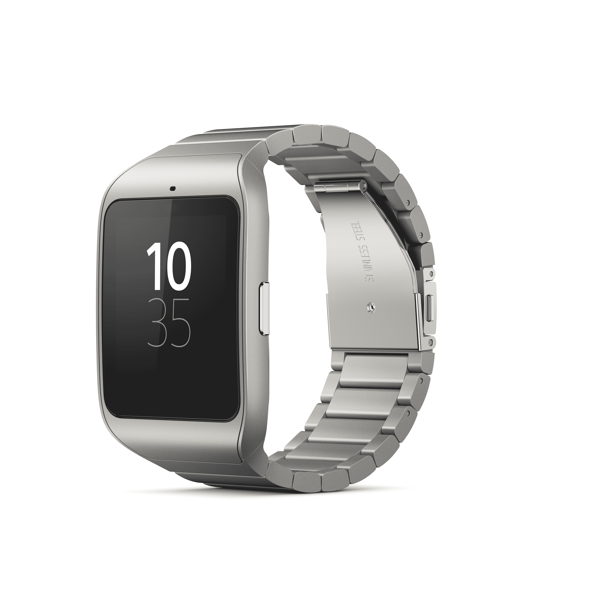

# 索尼制造了智能手表 3 Slicker，开放了其 Lifelog API，并推出了一款可穿戴跑步蔻驰 

> 原文：<https://web.archive.org/web/https://techcrunch.com/2015/01/05/sony-makes-the-smartwatch-3-slicker-opens-its-lifelog-api-and-debuts-a-wearable-running-coach/>

索尼的智能穿戴系列是其移动技术的关键焦点领域之一，在过去几届 CES 活动中，这一领域的范围和雄心都有所增长。今年，它将推出更多可穿戴硬件，并寻求帮助扩展可用软件和用例的方法，远远超出迄今为止可用的软件和用例。

## 索尼智能手表 3

索尼智能手表 3 已经是目前最令人印象深刻的 Android Wear 设备之一，但当我[测试一款 out](https://web.archive.org/web/20221207182500/https://beta.techcrunch.com/2014/12/18/sony-smartwatch-3-review/) 时，我的主要抱怨是它的设计最终没有什么创意。当竞争对手试图用自己的设计脱颖而出时，索尼似乎在追求“无害”。然而，在 CES 上，他们推出了一款新的智能手表，带有不锈钢的链接式表带，使这款可穿戴设备更适合健身房或赛道以外的生活。

除此之外，不锈钢智能手表 3 拥有与其前代产品相同的规格和功能，包括 1.6 英寸见方的 320×320 显示屏，IP68 防水等级，内置 GPS 和标准 microUSB 端口充电。此外，由于智能手表 3 是一款模块化设备，用户应该能够将表带作为售后选项。

说到这些，索尼还推出了一款新的智能手表 3 支架小工具，它可以与任何使用标准引脚安装的 24 毫米宽的标准表带配合使用。

## 生活日志网络客户端和 API 发布

索尼去年的 CES 活动推出了智能手环 lifelogging 可穿戴设备，以及 Android 版 Lifelog 配套应用。由于 HTML5 版本使用了索尼的新开放 API，Lifelog 软件现在可以通过网络访问。Lifelog 应用程序可以通过您现有的索尼娱乐网络凭证访问，该网站是响应性的，因此它可以与您用来访问它的任何设备一起工作。

索尼 Lifelog 开放 API 将允许其他开发人员使用你的兼容索尼可穿戴设备收集的数据来开发应用程序，以便跟踪可以超越基本的报告，并进入更实用的功能集。Lifelog API 的一些例子包括即将推出的 IFTTT 食谱、Habit Monster 日常改善和开发，以及 Withings 智能身体分析仪集成，以将体重、身体质量指数和体脂百分比信息添加到 Lifelog 的数据集中。

## 索尼智能 B 型教练机

索尼的可穿戴设备努力超越了手腕硬件，进入了智能眼镜开发者版等头戴设备。现在，该公司正在扩大这些项目，也与附件！为一套普通眼镜提供屏幕的模块，以及新的智能 B-Trainer 原型，这是一种完全防水的一体化音频耳机，内置完整的传感器套件。它是为跑步者创建的，让他们在所有条件下使用它，它提供语音教练，音乐，智能播放列表创建等等。

垂直专用的头戴设备可能是帮助这种新类别的设备在普通消费者市场获得更多吸引力的最佳方式——谷歌眼镜在工业和其他非常专业的用途上也更幸运，针对跑步者的宣传肯定是针对非常有动力购买装备和配件的群体。