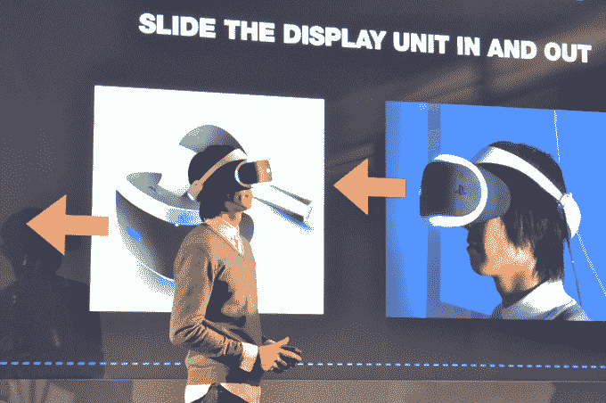

# 索尼将于 2016 年上半年推出 Project Morpheus VR 耳机 

> 原文：<https://web.archive.org/web/https://techcrunch.com/2015/03/03/sony-shows-off-a-new-morpheus-vr-headset-promises-to-ship-it-in-first-half-of-2016/>

# 索尼将在 2016 年上半年出货其 Project Morpheus VR 耳机

我们正在旧金山 W 酒店一个相当简陋的小房间里进行直播，索尼正在向少数记者展示其 Project Morpheus VR 耳机的最新原型。

从外观上看，最新的原型看起来…差不多。

不过，在这一点上，虚拟现实耳机内部的东西才是最重要的。如果内部没有结实的硬件，那种“存在感”就会消失。

**原型 2 的变化如下:**

–5 英寸的 LCD 已经升级为 5.7 英寸屏幕的有机发光二极管显示器，分辨率为 1920 xrgbx 1080
–它现在有 100 度的视野(原始:90 度 FOV)
–120hz 刷新率(从 60hz 提高)。更高的刷新率意味着更少的模糊，更好的沉浸感，更少的晕车。
–他们增加了三个 LED 追踪器，总数达到 9 个
–他们将延迟降至 18 毫秒以下
–耳机可以滑入和滑出，而无需完全取出，允许您调整它以获得舒适性，并窥视周围的外部世界。

当他们结束演示时，索尼又透露了一条消息: **Project Morpheus 将于 2016 年上半年向消费者推出。**

