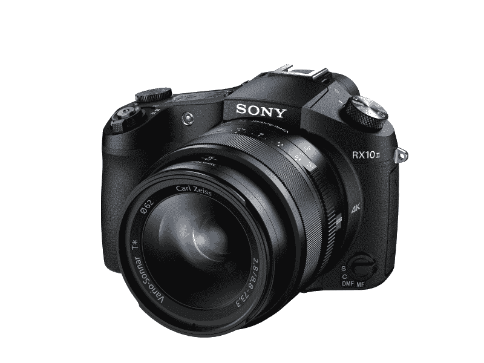

# 索尼的紧凑型 RX-100 IV 和 RX-10 II 相机功能强大 

> 原文：<https://web.archive.org/web/https://techcrunch.com/2015/06/10/sonys-compact-rx-100-iv-and-rx-10-ii-cameras-pack-a-big-punch/>

索尼今天展示了几款新相机，包括 RX-100 IV 和 RX-10 II。新的紧凑型相机在小包装中提供了强大的传感器，延续了索尼撼动消费者和专业摄影类别的悠久传统。新相机是一个特殊的传感器，索尼称这是“第一个带有 DRAM 芯片的堆叠 1.0 型 CMOS 传感器”，它应该可以转化为非常快的性能，并可以实现令人惊叹的慢动作视频捕捉和 4K 视频捕捉。

RX100 长期以来一直是消费相机行业的技术佼佼者，它是第一款提供全 1 英寸传感器的便携式相机，用于低噪声、高质量的图像捕捉。这款第四代 RX100 又是便携式的，拥有一个超亮的 F1.8 至 F2.8 光圈镜头，当转换为 35mm 模拟等效镜头时，变焦范围为 24-70mm。

RX10 II 更结实一些，但不比它的前辈更结实，它包括一个 24-200 倍的变焦镜头，以扩大视野。这两款相机都有固定镜头，这意味着你不能更换玻璃，但它们旨在为不想使用多镜头系统的人提供单一服务的灵活选择。

背面的数字取景器现在是索尼公司的 XGA·有机发光二极管 Tru-Finder 变种，它提供了高对比度和更逼真的色彩渲染。他们还拥有一个新的更快的智能自动对焦系统，索尼表示，该系统可以在短短 0.09 秒内锁定一个主题。两者都内置了 NFC 和 Wi-Fi。

两者的预购销售将于 6 月 17 日开始，RX-100 IV 的起价为“大约”1000 美元，RX-10 II 的起价为 1300 美元。该公司尚未宣布实际的发货日期。

索尼 RX10 II 相机(美通社/索尼电子)

索尼继续推动消费者专用相机的极限，这些相机看起来可能是广大用户的理想旅行/工作相机。这些价格标签并不便宜，但这种新的传感器技术可能会提供足够的优势，包括 4K 记录(尽管 RX-10 II 和 RX-100 IV 的最大记录长度分别为 29 分钟和 5 分钟)，以及超慢速 mo 视频，可以以惊人的 960fps、480fps 或 240fps(作为参考，目前 iPhone 6 上可能的最大减速)。

可以说，专用相机市场是一个正在萎缩的领域，但这些看起来像是剩余利基市场的领导者。