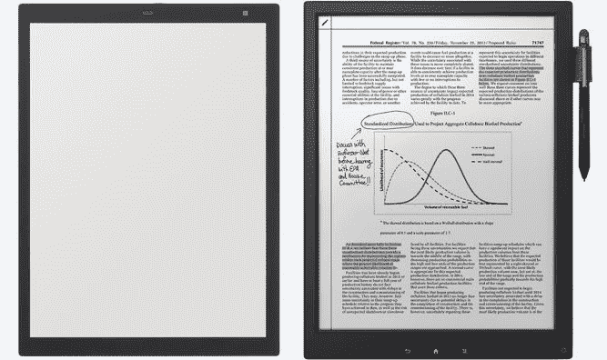

# 索尼用新屏幕和界面改造其数字平板电脑 

> 原文：<https://web.archive.org/web/https://techcrunch.com/2017/05/24/sonys-revamps-its-digital-paper-tablet-with-new-screen-and-interface/>

# 索尼用新的屏幕和界面改造了它的数字纸平板电脑

索尼的巨大的 13 英寸数字平板电脑，本质上是一个你可以在上面写字的巨大的 Kindle，仍然是一个非常罕见的景象，但我一直对它情有独钟。因此，我很高兴该公司在这种独特的设备类型上加倍努力，并通过一种新的模式做出了一些重大改进。

DPT-RP1 取代了 DPT S1——很吸引人的名字，对吧？—并做了一些用户肯定会喜欢的改变。屏幕本身采用了 E Ink 的 [Mobius](https://web.archive.org/web/20230123060812/http://www.eink.com/display_products_mobius.html) 显示技术，已经从 1200×1600 提升到 1650×2200，这应该会使文本更加清晰(206 DPI——相当不错)。不过，分辨率的提高似乎并没有影响电池寿命:像其他电子纸显示器一样，它超长，至少一两周。

触摸屏层也得到了改善，以及表面的纹理；电子纸显示器的反应不是很灵敏，所以任何可以改善这种体验的方法都是受欢迎的。这大概使新的笔记和注释功能的设备。

当然，硬件本身已经涂上了一层新的油漆:它的重量一样，但设计已经清理干净，边框稍微薄了一些。

左边是新的。

让它看起来很简洁，我觉得。不过，你必须找到另一个地方来存放你的手写笔。

有一点没变，就是这些吸盘很贵。但这款新的数字纸平板电脑售价 700 美元，仍比之前的产品便宜。

然而，像 Surface 系列这样的可变形电脑和像[卓越](https://web.archive.org/web/20230123060812/https://techcrunch.com/2016/11/30/remarkable/)这样的新贵电子纸产品正在寻找索尼的午餐。我们会试着弄一个这样的东西，然后告诉你是否应该在办公室里放几个。