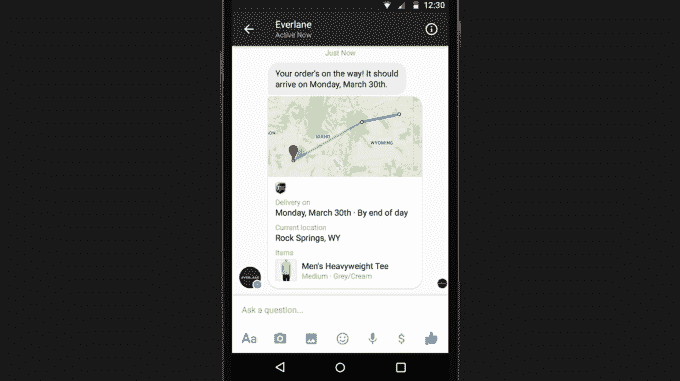
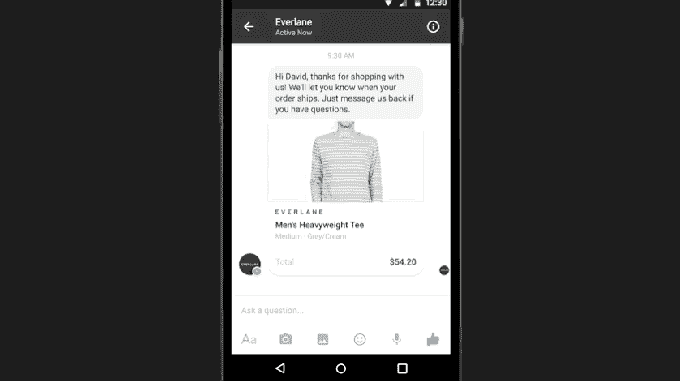

# 很快 Facebook Messenger 将让你接触到企业

> 原文：<https://web.archive.org/web/https://techcrunch.com/2015/03/25/soon-facebook-messenger-will-let-you-reach-out-to-businesses/>

# 不久，Facebook Messenger 将让你接触到企业

在脸书 F8 会议的开幕主题演讲中，马克·扎克伯格刚刚宣布，你很快就可以从独立的 Facebook Messenger 应用程序中接触到企业。

你将能够通过嵌入图像和位置数据的快速消息进行交流，而不是向公司的支持热线发送电子邮件来更改订单或检查跟踪进度。

正如 TechCrunch 的 Jon Russell 在 Twitter 上指出的那样，Line 等亚洲通讯应用一直在利用这一功能将他们的通讯工具从简单的聊天应用转变为带来可观收入的平台:

虽然这是一个既定的模式，但我们还没有看到一家公司成功地将这一战略带到西方市场。凭借其超过 10 亿的用户，脸书可能拥有足够多的受众来启动其他公司如 Path 未能执行的概念。