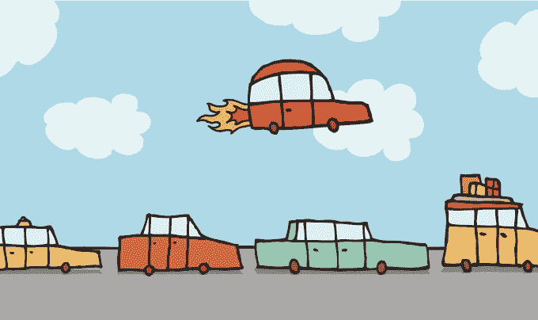

# 抱歉，埃隆，无人驾驶载客无人机将会颠覆未来的交通工具 

> 原文：<https://web.archive.org/web/https://techcrunch.com/2017/01/22/sorry-elon-driverless-passenger-drones-will-be-the-vehicular-disruption-of-the-future/>

亚当·辛戈尔达撰稿人

亚当·辛格达是

[Taboola](https://web.archive.org/web/20221225035925/https://www.taboola.com/)

.

亨利·福特有一句名言，如果你问人们想要什么，他们不会说“汽车”。他们会说——“一匹更快的马。”

我认为无人驾驶汽车相当于今天跑得更快的马。现存事物的延续，而不是真正的分类断裂。可预测但不够革命性。

这让我想到了埃隆·马斯克，他可能是我们最热情、最引人注目的自主英雄。

作为一个汽车爱好者，我钦佩他。作为一名科技企业家，我尊重他。毫无疑问，埃隆在大多数时候都是正确的。(至于[太阳能城](https://web.archive.org/web/20221225035925/http://www.solarcity.com/)，我将等待未来的阳光来评判，但我是一个信徒)。

因此，我讨厌偏离他对无人驾驶汽车的愿景。是的，以后我们不会自己开车了。机器将为我们做这件事——但是让我告诉你——那些机器将从上面俯视州际公路系统。

我相信我们会跳过无人驾驶汽车，直接进入无人驾驶无人机。

图片:CurvaBezi/Getty Images

不要误解我——我意识到无人驾驶汽车可以带来许多好处——更少的事故，从 A 地到 B 地的更低成本，也许最重要的是，节省时间。

仅在美国，开车通勤的平均时间是单程 24 分钟。这意味着普通通勤者仅上下班一项就要花费约 20 万分钟在路上。加上我们开车进行的所有其他旅行——购物、约会和旅行目的地，我们花在驾驶上的时间，而不是我们选择关注的其他创造性活动的时间，是惊人的。

但所有这些好处，不仅可以解决个人的问题，还可以解决一系列社会挑战，如果我们从汽车直接转向无人机的话。

如果不是无人驾驶汽车，而是我们将自己垂直延伸到 500 米，无人驾驶无人驾驶飞机停在头顶上，随时准备接我们，带我们到我们想要的目的地，会怎么样？

让我现在打断你，承认我深深的偏见。

虽然我热爱汽车，但我也是一名[无人机狂热爱好者](https://web.archive.org/web/20221225035925/http://www.businessinsider.com/taboola-office-tour-drone-video-2015-7)。我喜欢将自己延伸到天空中，发现我永远看不到的 4k 分辨率的风景。我曾经操作一架 DJI 幻影 3 无人机，然后是 4，现在我正在等待[我的 Mavic](https://web.archive.org/web/20221225035925/https://techcrunch.com/2016/11/04/dji-mavic-pro-0-birdhouse-1/) 无人机被交付(就像任何其他好事一样，[被延迟](https://web.archive.org/web/20221225035925/https://techcrunch.com/2016/11/11/dji-delay-2/)，当然)。

显然我不是唯一痴迷无人机的人。根据来自美国 Taboola 网络的数据，人们每天阅读无人机的次数约为 25 万次。

开发自主无人机在技术上实际上比地面自主车辆更容易，地面自主车辆必须考虑行人、低质量道路和意想不到的物体。

无人驾驶无人机不仅更安全，而且大规模生产可能更便宜，因为它需要的技术不那么复杂。我想象无人驾驶无人机就像乘电梯一样简单，只是一个水平的——你点击一个按钮，无人机就飞到那里去了。或许，就连优步也可以释放一支无人驾驶无人机大军，在我们头顶上空漂浮，随时准备“待命”。(他们只需用应用内湍流报告取代 Waze)

随着 500 米的空域突然由我们支配，与我们作为智人在过去 20 万年中一直专注于生活的 50 英尺的垂直房地产相比，停车问题、交通拥堵和道路建设等问题将成为历史。

规则是站在我这边的。当你购买一架无人机时，大多数情况下，它都有一个预先配置的限制，即它们可以飞到 500 米高。这已经足够高了。

今年早些时候，我实际上坐在一架[个人乘客无人机](https://web.archive.org/web/20221225035925/https://www.instagram.com/p/BGtz8calvOR/?taken-by=singolda)中，我承认这有点令人害怕，但也很兴奋能够看到未来。

是时候我们开始想得更高，展开翅膀，登上无人驾驶载客无人机，跳过无人驾驶汽车了。和更快的马。

也许杰森一家早就想好了。