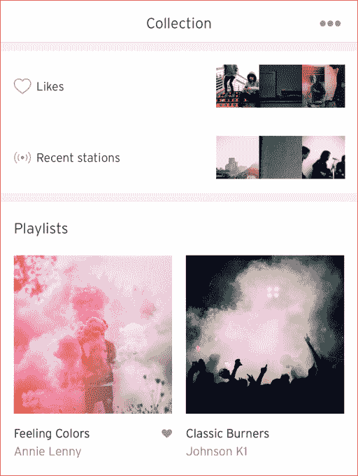

# 随着在 iOS 和 Android 上推出“电台”, SoundCloud 拥有了自己的电台功能 

> 原文：<https://web.archive.org/web/https://techcrunch.com/2016/02/02/soundcloud-gets-its-own-radio-feature-with-launch-of-stations-on-ios-and-android/>

# SoundCloud 在 iOS 和 Android 上推出了自己的电台功能

鉴于[苹果决定将其策划的 iTunes 广播电台置于付费墙之后，时机恰当，](https://web.archive.org/web/20230103155350/https://techcrunch.com/2016/01/29/free-ad-supported-itunes-radio-shuts-down-today/)音乐流媒体服务 SoundCloud 今天[推出了](https://web.archive.org/web/20230103155350/https://blog.soundcloud.com/2016/02/02/introducing-stations/)自己的持续、倾斜收听服务，推出了“电台”与 Pandora 等其他广播服务类似，电台允许用户根据曲目、搜索词或其他内容流来收听源源不断的音乐。

该公司在其[公告](https://web.archive.org/web/20230103155350/https://blog.soundcloud.com/2016/02/02/introducing-stations/)中解释说，这一想法是为了提供一种“发现你从未在其他地方听过的歌曲的新方法”,让你更容易在其服务上找到与你的喜好相关的其他音乐。

SoundCloud 已经理解了歌曲之间的关系和相似之处，它通过其“相关曲目”功能强调了这一点，但它尚未利用这些数据来提供更简化的聆听体验。这使得使用 SoundCloud 寻找符合你兴趣的新音乐变得更加困难——这对于一个以发现新兴或未被发现的人才而闻名的服务来说是一个问题。

这个功能一直是用户最大的需求之一。在今天之前，发现新歌实际上需要相当多的工作。

为了创建您的第一个 SoundCloud 电台，用户将在搜索术语、曲目、内容流或您的收藏后弹出一个菜单，然后点击“开始电台”选项。之后，该电台将与你的喜好和播放列表一起，成为你收藏的一部分。该公司还指出，目前其服务上有超过 1 亿首歌曲可供选择。

电台的推出正值 SoundCloud 试图找到赚钱的方法。该公司从 2015 年初[的债务融资中筹集了约 3200 万€，并于最近证实，它计划于今年晚些时候在全球市场推出付费订阅](https://web.archive.org/web/20230103155350/https://techcrunch.com/2016/01/13/soundcloud-universal-music-interview/)和广告。

当然，在 SoundCloud 可以对高级服务收费之前，它需要建立一个基线服务，至少与流媒体音乐市场的其他服务持平。这当然可以包括电台之类的广播功能 Pandora、Apple Music、Spotify、Play Music 和其他公司都提供这种功能。

SoundCloud 表示，电台功能现已在其 iOS 应用程序和 T2 安卓应用程序中上线。

[gallery ids="1271551，1271552，1271553"]