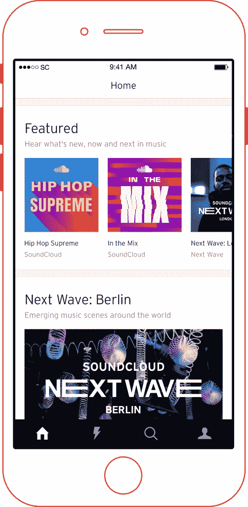
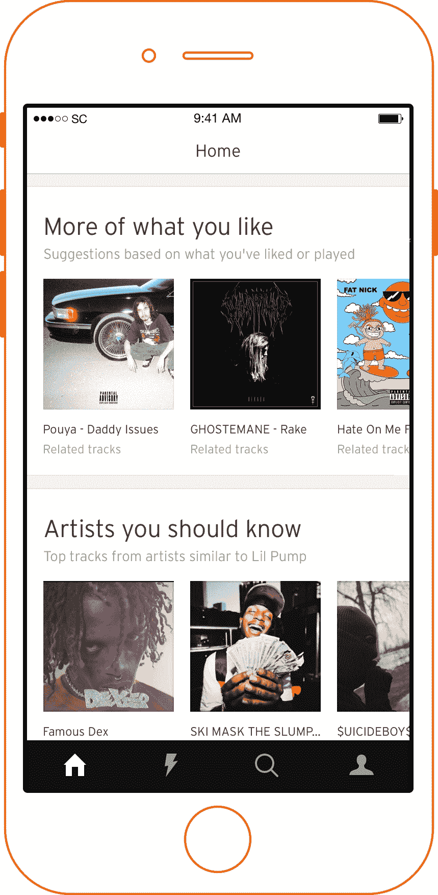

# SoundCloud 通过个性化播放列表恢复主屏幕 

> 原文：<https://web.archive.org/web/https://techcrunch.com/2017/12/13/soundcloud-resuscitates-home-screen-with-personalized-playlists/>

# SoundCloud 通过个性化播放列表恢复主屏幕

在裁员 40%并获得 1.69 亿美元紧急资金后，SoundCloud 的第一次[产品推广](https://web.archive.org/web/20221025222734/https://blog.soundcloud.com/2017/12/14/introducing-new-soundcloud-home-experience/)是朝着正确方向迈出的急需的一步。它的主页充满了个性化的播放列表和顶级流派的精选，而不是像它的 feed 那样的其他内容。他们希望 SoundCloud 能让新用户立即接触到，并为长期忠实用户提供一个更可靠的发现新歌的地方。

在我最近深入研究 SoundCloud 的战略的[中，我概述了它与 Spotify 的区别，即专注于其 5 美元的免费广告访问独立音乐、合法的灰色混音和你在其他地方找不到的 DJ 组合，以及帮助艺术家通过商业赚取版税以外的钱。根据这一战略，今天的重新设计让 SoundCloud 突出了其用户上传歌曲的独特档案中的最佳部分。](https://web.archive.org/web/20221025222734/https://beta.techcrunch.com/2017/12/12/be-the-modern-fan-club/)

SoundCloud 的新任首席执行官 Kerry Trainor 告诉我,“新的 SoundCloud home 是一种更具策划性和个性化的方式，可以首先发现优秀的创作者——比主流排行榜提前几年。”。

***阅读 TechCrunch 的专题文章[要修复 SoundCloud，它必须成为反 Spotify](https://web.archive.org/web/20221025222734/https://beta.techcrunch.com/2017/12/12/be-the-modern-fan-club/)***

听众现在将收到特色播放列表，包括 Hip Hop Supreme 和 DJ mixset-focused In The Mix，Spotify Discover Weekly 风格的个性化曲目列表 Upload，以及通过算法生成的更多你喜欢的和你应该知道的艺术家。还有新的热门排行榜和前 50 名排行榜播放列表，新专辑发行的新鲜新闻，以及编辑选择的集合，如 SoundCloud Next Wave 和 Playback。

主屏幕刷新是一个迫切需要的改变。昨天我打开 SoundCloud，看到两个大广告充满了我的屏幕。

经过多年的低迷表现后，资金和更精简的运营给了 SoundCloud 一些跑道，现在轮到 Trainor 给 SoundCloud 一些动力了。界面变化是一个简单的开始，尽管 SoundCloud 围绕独立创作者的更深层次的重新定位将是重要的，而其竞争对手缺乏这一点。

“SoundCloud 与众不同的是我们超过 1.7 亿首歌曲的目录，new home 让我们提升和庆祝推动 SoundCloud 体验的不可思议的才华，”Trainor 说。随着 Spotify、苹果、谷歌的 YouTube、亚马逊和 Pandora 的相互争斗，音乐空间变得拥挤不堪。SoundCloud 的成功在于成为别人不成为的人。

*想了解更多关于 SoundCloud 的信息，[看看我们的帖子，它可以通过三种方式反弹，成为“反 Spotify”](https://web.archive.org/web/20221025222734/https://beta.techcrunch.com/2017/12/12/be-the-modern-fan-club/)*